# SHIFT Game — Sequence Diagrams
**Graduate Project — Helwan University, CS Department | v1.0 | 2026**
*Derived from: SHIFT_SRS_v1.0, SHIFT_ER_Diagram_v2.2, SHIFT_UseCases_v1.0*

---

## Table of Contents

1. [Document Overview & Participant Legend](#1-document-overview--participant-legend)
2. [SD-AUTH — Authentication & Session Management](#2-sd-auth--authentication--session-management)
   - 2.1 [SD-AUTH-01 — Player Registration](#21-sd-auth-01--player-registration)
   - 2.2 [SD-AUTH-02 — Player / Admin Login](#22-sd-auth-02--player--admin-login)
   - 2.3 [SD-AUTH-03 — JWT Token Refresh](#23-sd-auth-03--jwt-token-refresh)
   - 2.4 [SD-AUTH-04 — Logout & Token Revocation](#24-sd-auth-04--logout--token-revocation)
3. [SD-GAME — Core Gameplay & Narrative Engine](#3-sd-game--core-gameplay--narrative-engine)
   - 3.1 [SD-GAME-01 — Start / Resume Shift](#31-sd-game-01--start--resume-shift)
   - 3.2 [SD-GAME-02 — Read Story Beat](#32-sd-game-02--read-story-beat)
   - 3.3 [SD-GAME-03 — Make a Narrative Choice with Deferred Consequence](#33-sd-game-03--make-a-narrative-choice-with-deferred-consequence)
   - 3.4 [SD-GAME-04 — Deferred Consequence Injection at Shift Start](#34-sd-game-04--deferred-consequence-injection-at-shift-start)
   - 3.5 [SD-GAME-05 — Save Desktop State](#35-sd-game-05--save-desktop-state)
   - 3.6 [SD-GAME-06 — Reset / Restart Game Progress](#36-sd-game-06--reset--restart-game-progress)
4. [SD-CODE — Practice Gates & Code Submission](#4-sd-code--practice-gates--code-submission)
   - 4.1 [SD-CODE-01 — View Practice Task & Request Hint](#41-sd-code-01--view-practice-task--request-hint)
   - 4.2 [SD-CODE-02 — Submit Code for Evaluation (Pass Path)](#42-sd-code-02--submit-code-for-evaluation-pass-path)
   - 4.3 [SD-CODE-03 — Submit Code (Fail / Max Attempts Path)](#43-sd-code-03--submit-code-fail--max-attempts-path)
5. [SD-SIDE — AI Side Tasks](#5-sd-side--ai-side-tasks)
   - 5.1 [SD-SIDE-01 — AI Side Task Generation & Assignment](#51-sd-side-01--ai-side-task-generation--assignment)
   - 5.2 [SD-SIDE-02 — Submit Side Task Code (Pass Path)](#52-sd-side-02--submit-side-task-code-pass-path)
   - 5.3 [SD-SIDE-03 — Abandon Side Task](#53-sd-side-03--abandon-side-task)
6. [SD-ECO — Economy & Virtual Shop](#6-sd-eco--economy--virtual-shop)
   - 6.1 [SD-ECO-01 — Earn EGP (Salary & Bonus on Shift Completion)](#61-sd-eco-01--earn-egp-salary--bonus-on-shift-completion)
   - 6.2 [SD-ECO-02 — Purchase Shop Item](#62-sd-eco-02--purchase-shop-item)
   - 6.3 [SD-ECO-03 — Upgrade Sahm AI Tier](#63-sd-eco-03--upgrade-sahm-ai-tier)
7. [SD-SAHM — Sahm AI Assistant](#7-sd-sahm--sahm-ai-assistant)
   - 7.1 [SD-SAHM-01 — Request Code Hint (Within Daily Limit)](#71-sd-sahm-01--request-code-hint-within-daily-limit)
   - 7.2 [SD-SAHM-02 — Daily Hint Limit Exceeded](#72-sd-sahm-02--daily-hint-limit-exceeded)
   - 7.3 [SD-SAHM-03 — Midnight Daily Hint Counter Reset](#73-sd-sahm-03--midnight-daily-hint-counter-reset)
8. [SD-ASSESS — Stealth Assessment & Mastery](#8-sd-assess--stealth-assessment--mastery)
   - 8.1 [SD-ASSESS-01 — Emit Assessment Event (Choice Submission)](#81-sd-assess-01--emit-assessment-event-choice-submission)
   - 8.2 [SD-ASSESS-02 — Compute Concept Mastery Snapshot](#82-sd-assess-02--compute-concept-mastery-snapshot)
   - 8.3 [SD-ASSESS-03 — AI Task Calibration via Mastery Feed](#83-sd-assess-03--ai-task-calibration-via-mastery-feed)
9. [SD-ADMIN — Admin Panel](#9-sd-admin--admin-panel)
   - 9.1 [SD-ADMIN-01 — View Assessment Dashboard & Export Data](#91-sd-admin-01--view-assessment-dashboard--export-data)
   - 9.2 [SD-ADMIN-02 — Manage Narrative Content (Shifts / Beats / Choices)](#92-sd-admin-02--manage-narrative-content-shifts--beats--choices)
   - 9.3 [SD-ADMIN-03 — Soft-Delete Student Account (Super Admin)](#93-sd-admin-03--soft-delete-student-account-super-admin)
   - 9.4 [SD-ADMIN-04 — Teacher Sheet Management & AI Task Reframing](#94-sd-admin-04--teacher-sheet-management--ai-task-reframing)
10. [SD-PROMO — Rank Promotion Ceremony](#10-sd-promo--rank-promotion-ceremony)
11. [SD-CROSS — Cross-Cutting: Full Shift Lifecycle](#11-sd-cross--cross-cutting-full-shift-lifecycle)
12. [SD-APP — LoopOS Desktop Applications Suite](#12-sd-app--loopos-desktop-applications-suite)
    - 12.1 [SD-APP-01 — WhatsUpp Chat Interaction & Rich Messaging](#121-sd-app-01--whatsupp-chat-interaction--rich-messaging)
    - 12.2 [SD-APP-02 — MailLoop Email & HR Rank Promotion Notification](#122-sd-app-02--mailloop-email--hr-rank-promotion-notification)
    - 12.3 [SD-APP-03 — LoopCode IDE Assemble Mode (Drag-and-Drop) & File Explorer](#123-sd-app-03--loopcode-ide-assemble-mode-drag-and-drop--file-explorer)
    - 12.4 [SD-APP-04 — LoopFiles Media Viewers & LoopTerminal Command History](#124-sd-app-04--loopfiles-media-viewers--loopterminal-command-history)
    - 12.5 [SD-APP-05 — LoopCall Video Stream & System Notification Stack](#125-sd-app-05--loopcall-video-stream--system-notification-stack)
13. [Data Contract Quick-Reference](#13-data-contract-quick-reference)

---

## 1. Document Overview & Participant Legend

### Purpose

This document provides **complete, database-grounded sequence diagrams** for all major system flows in SHIFT. Each diagram traces the exact sequence of calls between actors, application layers, and database tables as defined in the SRS (v1.0), Use Case Specifications (v1.0), and ER Diagram (v2.2). Diagrams are written in **Mermaid `sequenceDiagram` syntax** and are tool-renderable.

### Participant Abbreviations Used Across All Diagrams

| Alias | Full Name | Layer |
|---|---|---|
| `Student` | Student (Player) | Human Actor |
| `Instructor` | Instructor / Teaching Assistant | Human Actor |
| `Admin` | Admin Panel User | Human Actor |
| `SuperAdmin` | Super Admin (Developer) | Human Actor |
| `Browser` | React 18 Frontend — LoopOS Desktop | Presentation |
| `API` | ASP.NET Core 8 Backend (Monolith) | Application |
| `AuthSvc` | ASP.NET Identity Auth Service | Application |
| `NarrSvc` | Narrative / Content Service | Application |
| `CodeSvc` | Code Submission & Evaluation Service | Application |
| `EconSvc` | Economy & Transaction Service | Application |
| `AssessSvc` | Stealth Assessment Background Service | Application |
| `AIPipe` | Python AI Orchestration Service | Application |
| `GeminiAI` | Google Gemini 1.5 Flash / OpenRouter LLM | External |
| `CodeRunner` | Sandboxed Docker Code Execution Engine | External |
| `DB` | SQL Server Database (unified `dbo` schema) | Data |

### Tier Classification Reference

| Tier | Meaning | EGP Effect |
|---|---|---|
| `Ideal` | Optimal professional choice | Large positive delta |
| `Acceptable` | Reasonable but imperfect | Small positive delta |
| `Debt` | Functional but fragile, causes future problems | Small negative delta |
| `Mistake` | Wrong choice, fails immediately | Large negative delta |

---

## 2. SD-AUTH — Authentication & Session Management

### 2.1 SD-AUTH-01 — Player Registration

**Use Cases:** UC-AUTH-01 (Register Account), UC-AUTH-05 (Enter Class Code)
**SRS:** F-AUTH-001, F-AUTH-002
**Tables:** `ApplicationUser`, `Player`, `PlayerEconomy`, `RefreshToken`, `ClassCode`

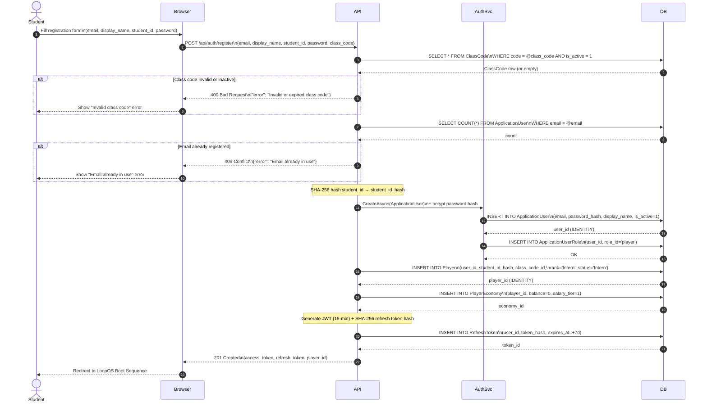
```mermaid
sequenceDiagram
    autonumber
    actor Student
    participant Browser
    participant API
    participant AuthSvc
    participant DB

    Student->>Browser: Fill registration form\n(email, display_name, student_id, password)
    Browser->>API: POST /api/auth/register\n{email, display_name, student_id, password, class_code}

    API->>DB: SELECT * FROM ClassCode\nWHERE code = @class_code AND is_active = 1
    DB-->>API: ClassCode row (or empty)

    alt Class code invalid or inactive
        API-->>Browser: 400 Bad Request\n{"error": "Invalid or expired class code"}
        Browser-->>Student: Show "Invalid class code" error
    end

    API->>DB: SELECT COUNT(*) FROM ApplicationUser\nWHERE email = @email
    DB-->>API: count

    alt Email already registered
        API-->>Browser: 409 Conflict\n{"error": "Email already in use"}
        Browser-->>Student: Show "Email already in use" error
    end

    Note over API: SHA-256 hash student_id → student_id_hash

    API->>AuthSvc: CreateAsync(ApplicationUser)\n+ bcrypt password hash
    AuthSvc->>DB: INSERT INTO ApplicationUser\n(email, password_hash, display_name, is_active=1)
    DB-->>AuthSvc: user_id (IDENTITY)
    AuthSvc->>DB: INSERT INTO ApplicationUserRole\n(user_id, role_id='player')
    DB-->>AuthSvc: OK

    API->>DB: INSERT INTO Player\n(user_id, student_id_hash, class_code_id,\nrank='Intern', status='Intern')
    DB-->>API: player_id (IDENTITY)

    API->>DB: INSERT INTO PlayerEconomy\n(player_id, balance=0, salary_tier=1)
    DB-->>API: economy_id

    Note over API: Generate JWT (15-min) + SHA-256 refresh token hash

    API->>DB: INSERT INTO RefreshToken\n(user_id, token_hash, expires_at=+7d)
    DB-->>API: token_id

    API-->>Browser: 201 Created\n{access_token, refresh_token, player_id}
    Browser-->>Student: Redirect to LoopOS Boot Sequence
```

---

### 2.2 SD-AUTH-02 — Player / Admin Login

**Use Cases:** UC-AUTH-02
**SRS:** F-AUTH-001, F-AUTH-004, Security §7.1
**Tables:** `ApplicationUser`, `RefreshToken`

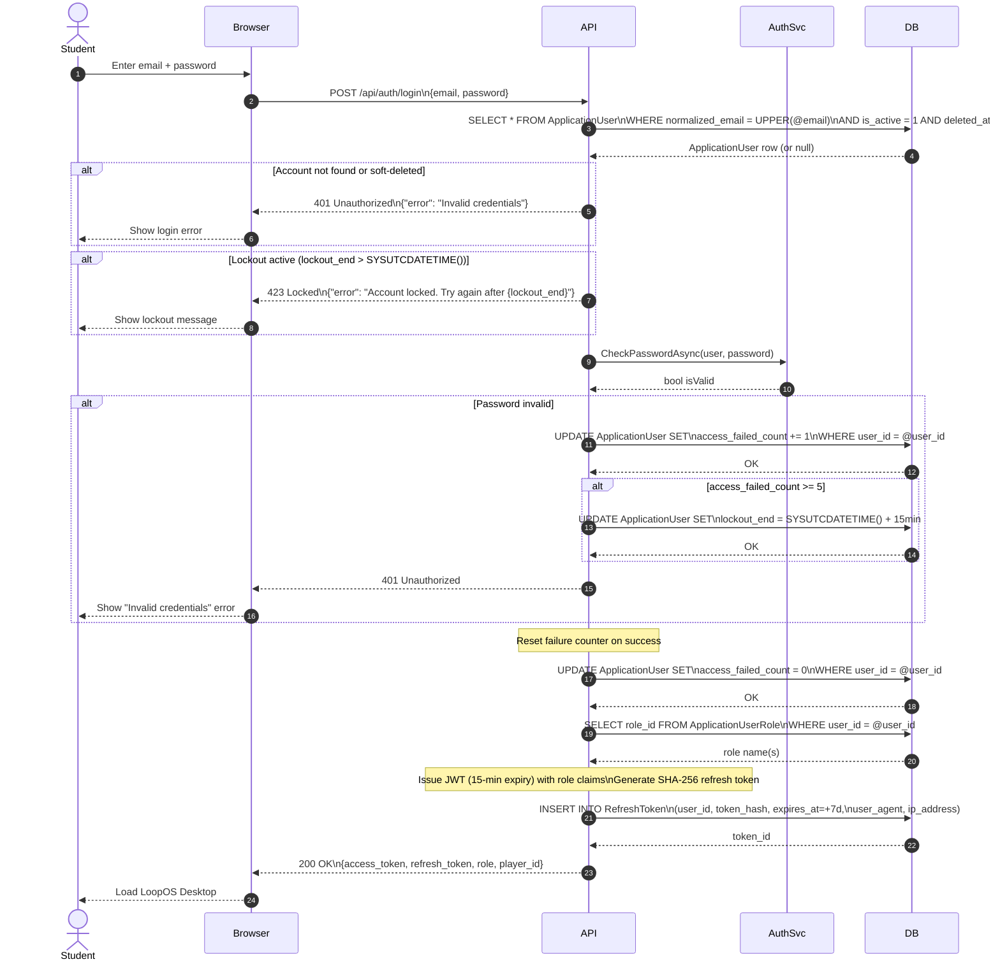
```mermaid
sequenceDiagram
    autonumber
    actor Student
    participant Browser
    participant API
    participant AuthSvc
    participant DB

    Student->>Browser: Enter email + password
    Browser->>API: POST /api/auth/login\n{email, password}

    API->>DB: SELECT * FROM ApplicationUser\nWHERE normalized_email = UPPER(@email)\nAND is_active = 1 AND deleted_at IS NULL
    DB-->>API: ApplicationUser row (or null)

    alt Account not found or soft-deleted
        API-->>Browser: 401 Unauthorized\n{"error": "Invalid credentials"}
        Browser-->>Student: Show login error
    end

    alt Lockout active (lockout_end > SYSUTCDATETIME())
        API-->>Browser: 423 Locked\n{"error": "Account locked. Try again after {lockout_end}"}
        Browser-->>Student: Show lockout message
    end

    API->>AuthSvc: CheckPasswordAsync(user, password)
    AuthSvc-->>API: bool isValid

    alt Password invalid
        API->>DB: UPDATE ApplicationUser SET\naccess_failed_count += 1\nWHERE user_id = @user_id
        DB-->>API: OK

        alt access_failed_count >= 5
            API->>DB: UPDATE ApplicationUser SET\nlockout_end = SYSUTCDATETIME() + 15min
            DB-->>API: OK
        end

        API-->>Browser: 401 Unauthorized
        Browser-->>Student: Show "Invalid credentials" error
    end

    Note over API: Reset failure counter on success

    API->>DB: UPDATE ApplicationUser SET\naccess_failed_count = 0\nWHERE user_id = @user_id
    DB-->>API: OK

    API->>DB: SELECT role_id FROM ApplicationUserRole\nWHERE user_id = @user_id
    DB-->>API: role name(s)

    Note over API: Issue JWT (15-min expiry) with role claims\nGenerate SHA-256 refresh token

    API->>DB: INSERT INTO RefreshToken\n(user_id, token_hash, expires_at=+7d,\nuser_agent, ip_address)
    DB-->>API: token_id

    API-->>Browser: 200 OK\n{access_token, refresh_token, role, player_id}
    Browser-->>Student: Load LoopOS Desktop
```

---

### 2.3 SD-AUTH-03 — JWT Token Refresh

**Use Cases:** UC-AUTH-03
**SRS:** F-AUTH-003
**Tables:** `RefreshToken`, `ApplicationUser`

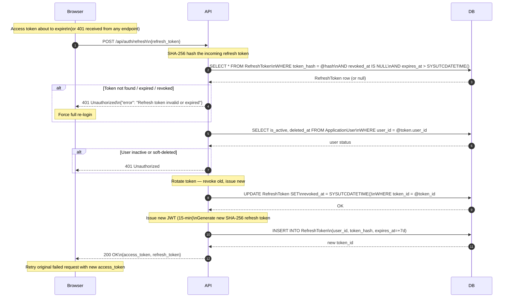
```mermaid
sequenceDiagram
    autonumber
    participant Browser
    participant API
    participant DB

    Note over Browser: Access token about to expire\n(or 401 received from any endpoint)

    Browser->>API: POST /api/auth/refresh\n{refresh_token}

    Note over API: SHA-256 hash the incoming refresh token

    API->>DB: SELECT * FROM RefreshToken\nWHERE token_hash = @hash\nAND revoked_at IS NULL\nAND expires_at > SYSUTCDATETIME()
    DB-->>API: RefreshToken row (or null)

    alt Token not found / expired / revoked
        API-->>Browser: 401 Unauthorized\n{"error": "Refresh token invalid or expired"}
        Note over Browser: Force full re-login
    end

    API->>DB: SELECT is_active, deleted_at FROM ApplicationUser\nWHERE user_id = @token.user_id
    DB-->>API: user status

    alt User inactive or soft-deleted
        API-->>Browser: 401 Unauthorized
    end

    Note over API: Rotate token — revoke old, issue new

    API->>DB: UPDATE RefreshToken SET\nrevoked_at = SYSUTCDATETIME()\nWHERE token_id = @token_id
    DB-->>API: OK

    Note over API: Issue new JWT (15-min)\nGenerate new SHA-256 refresh token

    API->>DB: INSERT INTO RefreshToken\n(user_id, token_hash, expires_at=+7d)
    DB-->>API: new token_id

    API-->>Browser: 200 OK\n{access_token, refresh_token}
    Note over Browser: Retry original failed request with new access_token
```

---

### 2.4 SD-AUTH-04 — Logout & Token Revocation

**Use Cases:** UC-AUTH-04
**SRS:** F-AUTH-003
**Tables:** `RefreshToken`

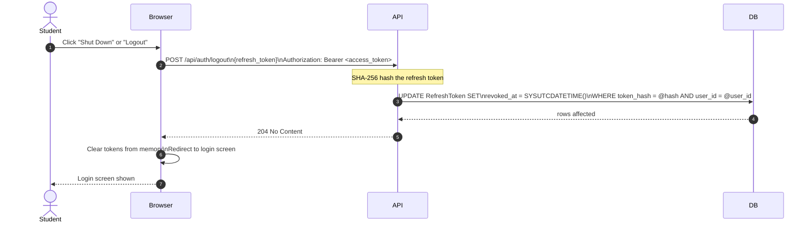
```mermaid
sequenceDiagram
    autonumber
    actor Student
    participant Browser
    participant API
    participant DB

    Student->>Browser: Click "Shut Down" or "Logout"
    Browser->>API: POST /api/auth/logout\n{refresh_token}\nAuthorization: Bearer <access_token>

    Note over API: SHA-256 hash the refresh token

    API->>DB: UPDATE RefreshToken SET\nrevoked_at = SYSUTCDATETIME()\nWHERE token_hash = @hash AND user_id = @user_id
    DB-->>API: rows affected

    API-->>Browser: 204 No Content
    Browser->>Browser: Clear tokens from memory\nRedirect to login screen
    Browser-->>Student: Login screen shown
```

---

## 3. SD-GAME — Core Gameplay & Narrative Engine

### 3.1 SD-GAME-01 — Start / Resume Shift

**Use Cases:** UC-GAME-01 (Start/Resume Shift)
**SRS:** F-NARR-001, F-DESK-002, F-DESK-004
**Tables:** `Shift`, `PlayerShiftProgress`, `PlayerSave`, `ConsequenceQueue`, `Consequence`, `StoryBeat`

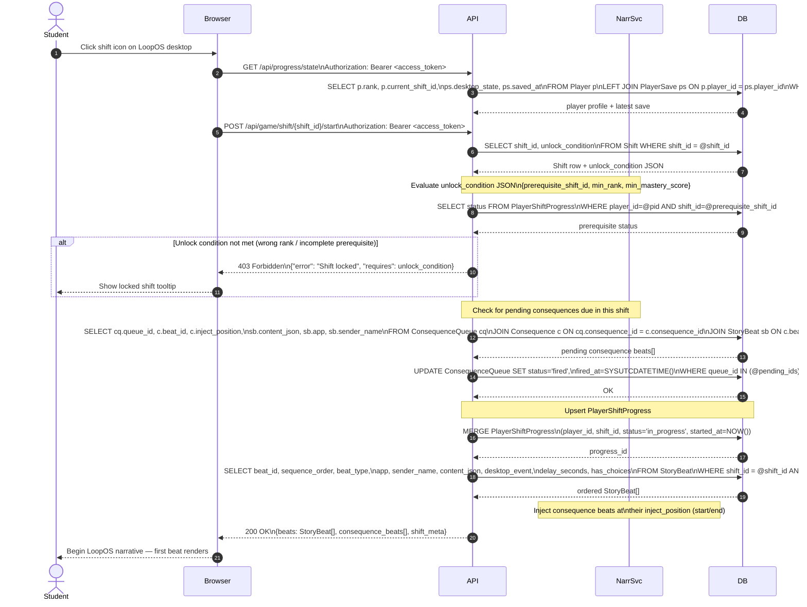
```mermaid
sequenceDiagram
    autonumber
    actor Student
    participant Browser
    participant API
    participant NarrSvc
    participant DB

    Student->>Browser: Click shift icon on LoopOS desktop
    Browser->>API: GET /api/progress/state\nAuthorization: Bearer <access_token>

    API->>DB: SELECT p.rank, p.current_shift_id,\nps.desktop_state, ps.saved_at\nFROM Player p\nLEFT JOIN PlayerSave ps ON p.player_id = ps.player_id\nWHERE p.user_id = @user_id
    DB-->>API: player profile + latest save

    Browser->>API: POST /api/game/shift/{shift_id}/start\nAuthorization: Bearer <access_token>

    API->>DB: SELECT shift_id, unlock_condition\nFROM Shift WHERE shift_id = @shift_id
    DB-->>API: Shift row + unlock_condition JSON

    Note over API,NarrSvc: Evaluate unlock_condition JSON\n{prerequisite_shift_id, min_rank, min_mastery_score}

    API->>DB: SELECT status FROM PlayerShiftProgress\nWHERE player_id=@pid AND shift_id=@prerequisite_shift_id
    DB-->>API: prerequisite status

    alt Unlock condition not met (wrong rank / incomplete prerequisite)
        API-->>Browser: 403 Forbidden\n{"error": "Shift locked", "requires": unlock_condition}
        Browser-->>Student: Show locked shift tooltip
    end

    Note over API,NarrSvc: Check for pending consequences due in this shift

    API->>DB: SELECT cq.queue_id, c.beat_id, c.inject_position,\nsb.content_json, sb.app, sb.sender_name\nFROM ConsequenceQueue cq\nJOIN Consequence c ON cq.consequence_id = c.consequence_id\nJOIN StoryBeat sb ON c.beat_id = sb.beat_id\nWHERE cq.player_id = @pid AND cq.status = 'pending'\nAND sb.shift_id = @shift_id
    DB-->>API: pending consequence beats[]

    API->>DB: UPDATE ConsequenceQueue SET status='fired',\nfired_at=SYSUTCDATETIME()\nWHERE queue_id IN (@pending_ids)
    DB-->>API: OK

    Note over API,DB: Upsert PlayerShiftProgress

    API->>DB: MERGE PlayerShiftProgress\n(player_id, shift_id, status='in_progress', started_at=NOW())
    DB-->>API: progress_id

    API->>DB: SELECT beat_id, sequence_order, beat_type,\napp, sender_name, content_json, desktop_event,\ndelay_seconds, has_choices\nFROM StoryBeat\nWHERE shift_id = @shift_id AND beat_type = 'narrative'\nORDER BY sequence_order ASC
    DB-->>API: ordered StoryBeat[]

    Note over NarrSvc: Inject consequence beats at\ntheir inject_position (start/end)

    API-->>Browser: 200 OK\n{beats: StoryBeat[], consequence_beats[], shift_meta}
    Browser-->>Student: Begin LoopOS narrative — first beat renders
```

---

### 3.2 SD-GAME-02 — Read Story Beat

**Use Cases:** UC-GAME-02
**SRS:** F-NARR-001, F-NARR-004, F-APP-001, F-APP-002
**Tables:** `StoryBeat`, `AssessmentEvent`

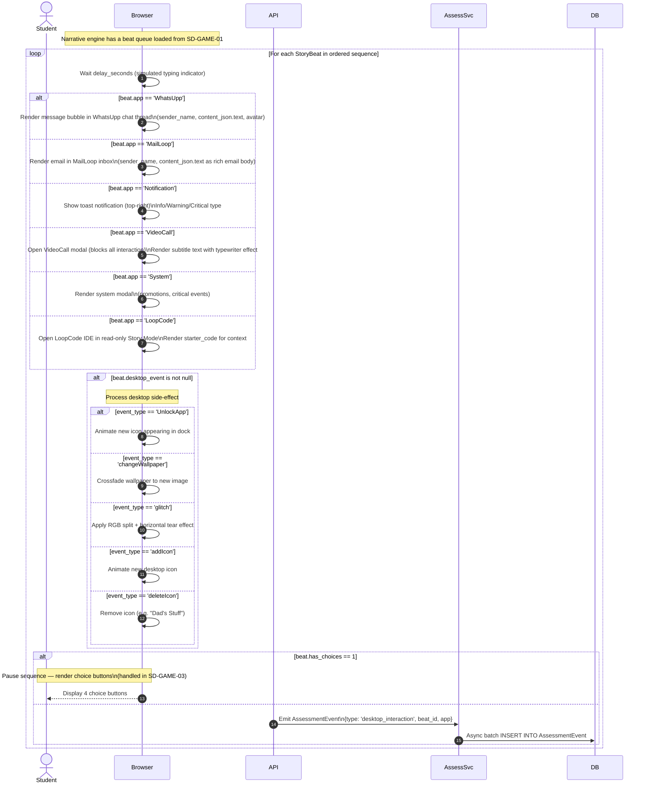
```mermaid
sequenceDiagram
    autonumber
    actor Student
    participant Browser
    participant API
    participant AssessSvc
    participant DB

    Note over Browser: Narrative engine has a beat queue loaded from SD-GAME-01

    loop For each StoryBeat in ordered sequence
        Browser->>Browser: Wait delay_seconds (simulated typing indicator)

        alt beat.app == 'WhatsUpp'
            Browser->>Browser: Render message bubble in WhatsUpp chat thread\n(sender_name, content_json.text, avatar)
        else beat.app == 'MailLoop'
            Browser->>Browser: Render email in MailLoop inbox\n(sender_name, content_json.text as rich email body)
        else beat.app == 'Notification'
            Browser->>Browser: Show toast notification (top-right)\nInfo/Warning/Critical type
        else beat.app == 'VideoCall'
            Browser->>Browser: Open VideoCall modal (blocks all interaction)\nRender subtitle text with typewriter effect
        else beat.app == 'System'
            Browser->>Browser: Render system modal\n(promotions, critical events)
        else beat.app == 'LoopCode'
            Browser->>Browser: Open LoopCode IDE in read-only Story Mode\nRender starter_code for context
        end

        alt beat.desktop_event is not null
            Note over Browser: Process desktop side-effect
            alt event_type == 'UnlockApp'
                Browser->>Browser: Animate new icon appearing in dock
            else event_type == 'changeWallpaper'
                Browser->>Browser: Crossfade wallpaper to new image
            else event_type == 'glitch'
                Browser->>Browser: Apply RGB split + horizontal tear effect
            else event_type == 'addIcon'
                Browser->>Browser: Animate new desktop icon
            else event_type == 'deleteIcon'
                Browser->>Browser: Remove icon (e.g. "Dad's Stuff")
            end
        end

        alt beat.has_choices == 1
            Note over Browser,Student: Pause sequence — render choice buttons\n(handled in SD-GAME-03)
            Browser-->>Student: Display 4 choice buttons
        else
            API->>AssessSvc: Emit AssessmentEvent\n{type: 'desktop_interaction', beat_id, app}
            AssessSvc->>DB: Async batch INSERT INTO AssessmentEvent
        end
    end
```

---

### 3.3 SD-GAME-03 — Make a Narrative Choice with Deferred Consequence

**Use Cases:** UC-GAME-03, UC-GAME-04
**SRS:** F-NARR-002, F-NARR-003
**Tables:** `Choice`, `PlayerChoice`, `PlayerEconomy`, `Transaction`, `ConsequenceQueue`, `Consequence`, `AssessmentEvent`

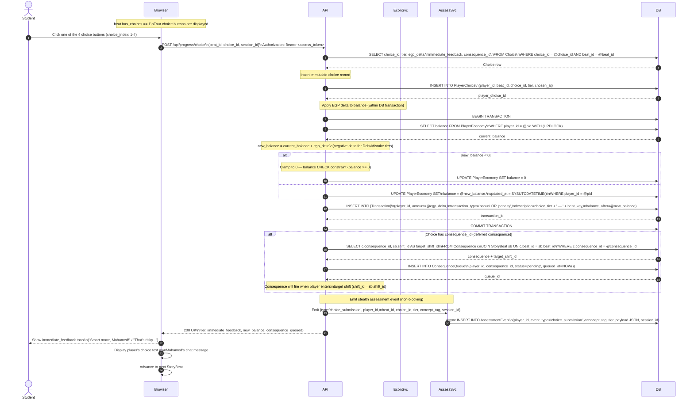
```mermaid
sequenceDiagram
    autonumber
    actor Student
    participant Browser
    participant API
    participant EconSvc
    participant AssessSvc
    participant DB

    Note over Browser: beat.has_choices == 1\nFour choice buttons are displayed

    Student->>Browser: Click one of the 4 choice buttons (choice_index: 1-4)

    Browser->>API: POST /api/progress/choice\n{beat_id, choice_id, session_id}\nAuthorization: Bearer <access_token>

    API->>DB: SELECT choice_id, tier, egp_delta,\nimmediate_feedback, consequence_id\nFROM Choice\nWHERE choice_id = @choice_id AND beat_id = @beat_id
    DB-->>API: Choice row

    Note over API: Insert immutable choice record

    API->>DB: INSERT INTO PlayerChoice\n(player_id, beat_id, choice_id, tier, chosen_at)
    DB-->>API: player_choice_id

    Note over API,EconSvc: Apply EGP delta to balance (within DB transaction)

    API->>DB: BEGIN TRANSACTION
    API->>DB: SELECT balance FROM PlayerEconomy\nWHERE player_id = @pid WITH (UPDLOCK)
    DB-->>API: current_balance

    Note over API: new_balance = current_balance + egp_delta\n(negative delta for Debt/Mistake tiers)

    alt new_balance < 0
        Note over API: Clamp to 0 — balance CHECK constraint (balance >= 0)
        API->>DB: UPDATE PlayerEconomy SET balance = 0
    else
        API->>DB: UPDATE PlayerEconomy SET\nbalance = @new_balance,\nupdated_at = SYSUTCDATETIME()\nWHERE player_id = @pid
    end

    API->>DB: INSERT INTO [Transaction]\n(player_id, amount=@egp_delta,\ntransaction_type='bonus' OR 'penalty',\ndescription=choice_tier + ' — ' + beat_key,\nbalance_after=@new_balance)
    DB-->>API: transaction_id

    API->>DB: COMMIT TRANSACTION

    alt Choice has consequence_id (deferred consequence)
        API->>DB: SELECT c.consequence_id, sb.shift_id AS target_shift_id\nFROM Consequence c\nJOIN StoryBeat sb ON c.beat_id = sb.beat_id\nWHERE c.consequence_id = @consequence_id
        DB-->>API: consequence + target_shift_id

        API->>DB: INSERT INTO ConsequenceQueue\n(player_id, consequence_id, status='pending', queued_at=NOW())
        DB-->>API: queue_id

        Note over API: Consequence will fire when player enters\ntarget shift (shift_id = sb.shift_id)
    end

    Note over API,AssessSvc: Emit stealth assessment event (non-blocking)

    API->>AssessSvc: Emit {type:'choice_submission', player_id,\nbeat_id, choice_id, tier, concept_tag, session_id}
    AssessSvc->>DB: Async INSERT INTO AssessmentEvent\n(player_id, event_type='choice_submission',\nconcept_tag, tier, payload JSON, session_id)

    API-->>Browser: 200 OK\n{tier, immediate_feedback, new_balance, consequence_queued}

    Browser-->>Student: Show immediate_feedback toast\n("Smart move, Mohamed!" / "That's risky...")
    Browser->>Browser: Display player's choice text as\nMohamed's chat message
    Browser->>Browser: Advance to next StoryBeat
```

---

### 3.4 SD-GAME-04 — Deferred Consequence Injection at Shift Start

> This diagram shows in detail how the ConsequenceQueue is resolved when a player enters a shift. It expands on step 10 in SD-GAME-01.

**Use Cases:** UC-GAME-04
**SRS:** F-NARR-003
**Tables:** `ConsequenceQueue`, `Consequence`, `StoryBeat`

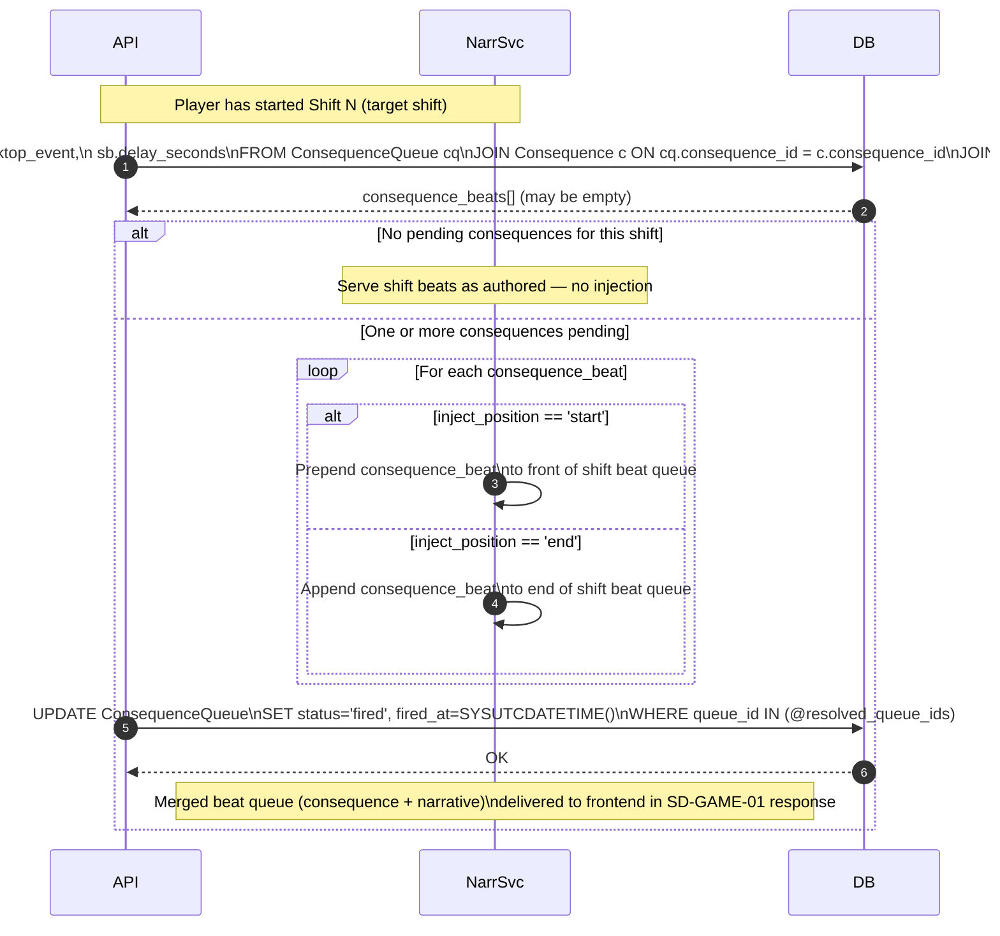
```mermaid
sequenceDiagram
    autonumber
    participant API
    participant NarrSvc
    participant DB

    Note over API,NarrSvc: Player has started Shift N (target shift)

    API->>DB: SELECT\n  cq.queue_id,\n  cq.consequence_id,\n  c.beat_id,\n  c.inject_position,\n  sb.app,\n  sb.sender_name,\n  sb.content_json,\n  sb.desktop_event,\n  sb.delay_seconds\nFROM ConsequenceQueue cq\nJOIN Consequence c   ON cq.consequence_id = c.consequence_id\nJOIN StoryBeat sb   ON c.beat_id = sb.beat_id\nWHERE cq.player_id = @player_id\n  AND cq.status     = 'pending'\n  AND sb.shift_id   = @shift_id
    DB-->>API: consequence_beats[] (may be empty)

    alt No pending consequences for this shift
        Note over NarrSvc: Serve shift beats as authored — no injection
    else One or more consequences pending
        loop For each consequence_beat
            alt inject_position == 'start'
                NarrSvc->>NarrSvc: Prepend consequence_beat\nto front of shift beat queue
            else inject_position == 'end'
                NarrSvc->>NarrSvc: Append consequence_beat\nto end of shift beat queue
            end
        end

        API->>DB: UPDATE ConsequenceQueue\nSET status='fired', fired_at=SYSUTCDATETIME()\nWHERE queue_id IN (@resolved_queue_ids)
        DB-->>API: OK

        Note over NarrSvc: Merged beat queue (consequence + narrative)\ndelivered to frontend in SD-GAME-01 response
    end
```

---

### 3.5 SD-GAME-05 — Save Desktop State

**Use Cases:** UC-GAME-06 (Save Desktop State)
**SRS:** F-DESK-004
**Tables:** `PlayerSave`

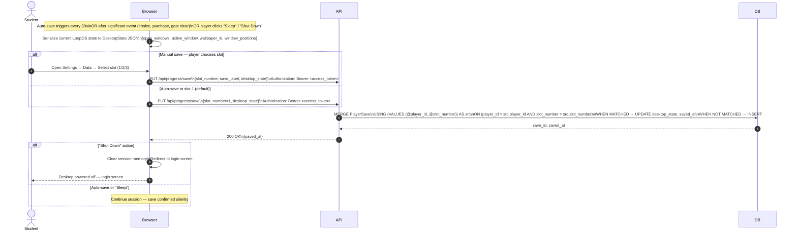
```mermaid
sequenceDiagram
    autonumber
    actor Student
    participant Browser
    participant API
    participant DB

    Note over Browser: Auto-save triggers every 30s\nOR after significant event (choice, purchase, gate clear)\nOR player clicks "Sleep" / "Shut Down"

    Browser->>Browser: Serialize current LoopOS state to DesktopState JSON\n{open_windows, active_window, wallpaper_id, window_positions}

    alt Manual save — player chooses slot
        Student->>Browser: Open Settings → Data → Select slot (1/2/3)
        Browser->>API: PUT /api/progress/save\n{slot_number, save_label, desktop_state}\nAuthorization: Bearer <access_token>
    else Auto-save to slot 1 (default)
        Browser->>API: PUT /api/progress/save\n{slot_number=1, desktop_state}\nAuthorization: Bearer <access_token>
    end

    API->>DB: MERGE PlayerSave\nUSING (VALUES (@player_id, @slot_number)) AS src\nON (player_id = src.player_id AND slot_number = src.slot_number)\nWHEN MATCHED → UPDATE desktop_state, saved_at\nWHEN NOT MATCHED → INSERT
    DB-->>API: save_id, saved_at

    API-->>Browser: 200 OK\n{saved_at}

    alt "Shut Down" action
        Browser->>Browser: Clear session memory\nRedirect to login screen
        Browser-->>Student: Desktop powered off — login screen
    else Auto-save or "Sleep"
        Note over Browser: Continue session — save confirmed silently
    end
```

---

### 3.6 SD-GAME-06 — Reset / Restart Game Progress

**Use Cases:** UC-GAME-11 (Reset / Restart Game Progress)
**SRS:** F-GAME-006, F-AUTH-004
**Tables:** `Player`, `PlayerShiftProgress`, `PlayerChoice`, `ConsequenceQueue`, `PlayerSideTask`, `PlayerInventory`, `PlayerEconomy`, `Transaction`, `PlayerSave`

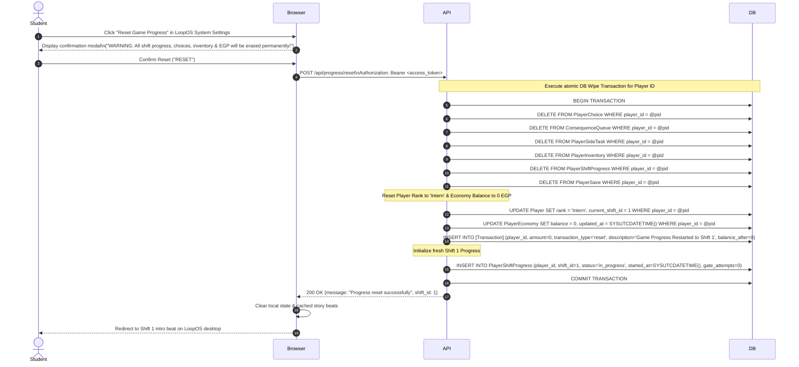
```mermaid
sequenceDiagram
    autonumber
    actor Student
    participant Browser
    participant API
    participant DB

    Student->>Browser: Click "Reset Game Progress" in LoopOS System Settings
    Browser-->>Student: Display confirmation modal\n("WARNING: All shift progress, choices, inventory & EGP will be erased permanently!")
    
    Student->>Browser: Confirm Reset ("RESET")
    Browser->>API: POST /api/progress/reset\nAuthorization: Bearer <access_token>

    Note over API,DB: Execute atomic DB Wipe Transaction for Player ID
    API->>DB: BEGIN TRANSACTION

    API->>DB: DELETE FROM PlayerChoice WHERE player_id = @pid
    API->>DB: DELETE FROM ConsequenceQueue WHERE player_id = @pid
    API->>DB: DELETE FROM PlayerSideTask WHERE player_id = @pid
    API->>DB: DELETE FROM PlayerInventory WHERE player_id = @pid
    API->>DB: DELETE FROM PlayerShiftProgress WHERE player_id = @pid
    API->>DB: DELETE FROM PlayerSave WHERE player_id = @pid

    Note over API: Reset Player Rank to 'Intern' & Economy Balance to 0 EGP
    API->>DB: UPDATE Player SET rank = 'Intern', current_shift_id = 1 WHERE player_id = @pid
    API->>DB: UPDATE PlayerEconomy SET balance = 0, updated_at = SYSUTCDATETIME() WHERE player_id = @pid
    API->>DB: INSERT INTO [Transaction] (player_id, amount=0, transaction_type='reset', description='Game Progress Restarted to Shift 1', balance_after=0)

    Note over API: Initialize fresh Shift 1 Progress
    API->>DB: INSERT INTO PlayerShiftProgress (player_id, shift_id=1, status='in_progress', started_at=SYSUTCDATETIME(), gate_attempts=0)

    API->>DB: COMMIT TRANSACTION

    API-->>Browser: 200 OK {message: "Progress reset successfully", shift_id: 1}
    Browser->>Browser: Clear local state & cached story beats
    Browser-->>Student: Redirect to Shift 1 intro beat on LoopOS desktop
```

---

## 4. SD-CODE — Practice Gates & Code Submission

### 4.1 SD-CODE-01 — View Practice Task & Request Hint

**Use Cases:** UC-CODE-01 (View Practice Task), UC-CODE-05 (Request Hint)
**SRS:** F-PRAC-001, F-APP-003, F-APP-004
**Tables:** `PracticeTask`, `TestCase`, `SahmSubscription`, `AssessmentEvent`

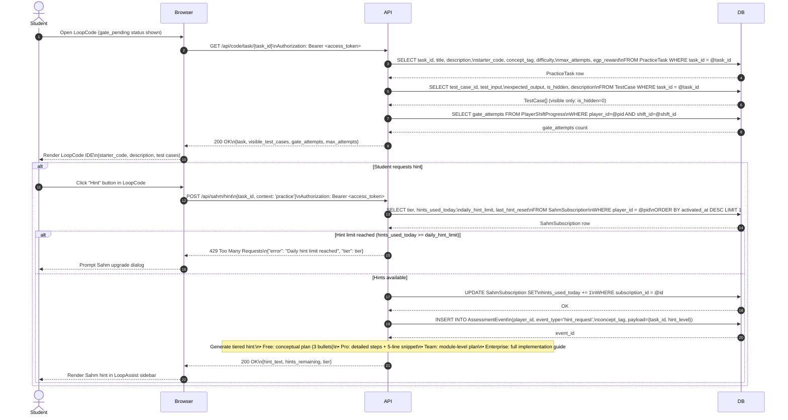
```mermaid
sequenceDiagram
    autonumber
    actor Student
    participant Browser
    participant API
    participant DB

    Student->>Browser: Open LoopCode (gate_pending status shown)
    Browser->>API: GET /api/code/task/{task_id}\nAuthorization: Bearer <access_token>

    API->>DB: SELECT task_id, title, description,\nstarter_code, concept_tag, difficulty,\nmax_attempts, egp_reward\nFROM PracticeTask WHERE task_id = @task_id
    DB-->>API: PracticeTask row

    API->>DB: SELECT test_case_id, test_input,\nexpected_output, is_hidden, description\nFROM TestCase WHERE task_id = @task_id
    DB-->>API: TestCase[] (visible only: is_hidden=0)

    API->>DB: SELECT gate_attempts FROM PlayerShiftProgress\nWHERE player_id=@pid AND shift_id=@shift_id
    DB-->>API: gate_attempts count

    API-->>Browser: 200 OK\n{task, visible_test_cases, gate_attempts, max_attempts}
    Browser-->>Student: Render LoopCode IDE\n(starter_code, description, test cases)

    alt Student requests hint
        Student->>Browser: Click "Hint" button in LoopCode
        Browser->>API: POST /api/sahm/hint\n{task_id, context: 'practice'}\nAuthorization: Bearer <access_token>

        API->>DB: SELECT tier, hints_used_today,\ndaily_hint_limit, last_hint_reset\nFROM SahmSubscription\nWHERE player_id = @pid\nORDER BY activated_at DESC LIMIT 1
        DB-->>API: SahmSubscription row

        alt Hint limit reached (hints_used_today >= daily_hint_limit)
            API-->>Browser: 429 Too Many Requests\n{"error": "Daily hint limit reached", "tier": tier}
            Browser-->>Student: Prompt Sahm upgrade dialog
        else Hints available
            API->>DB: UPDATE SahmSubscription SET\nhints_used_today += 1\nWHERE subscription_id = @id
            DB-->>API: OK

            API->>DB: INSERT INTO AssessmentEvent\n(player_id, event_type='hint_request',\nconcept_tag, payload={task_id, hint_level})
            DB-->>API: event_id

            Note over API: Generate tiered hint:\n• Free: conceptual plan (3 bullets)\n• Pro: detailed steps + 5-line snippet\n• Team: module-level plan\n• Enterprise: full implementation guide
            API-->>Browser: 200 OK\n{hint_text, hints_remaining, tier}
            Browser-->>Student: Render Sahm hint in LoopAssist sidebar
        end
    end
```

---

### 4.2 SD-CODE-02 — Submit Code for Evaluation (Pass Path)

**Use Cases:** UC-CODE-03 (Submit Code), UC-CODE-07 (Pass Practice Gate)
**SRS:** F-PRAC-001, F-PRAC-002, F-AUTH-002
**Tables:** `PracticeAttempt`, `PlayerShiftProgress`, `PlayerEconomy`, `Transaction`, `AssessmentEvent`, `TestCase`

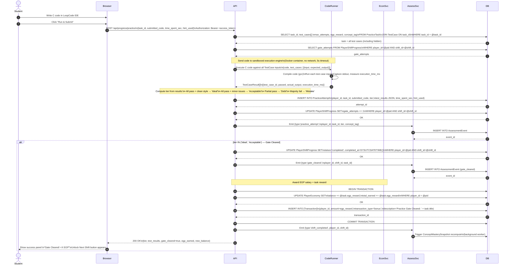
```mermaid
sequenceDiagram
    autonumber
    actor Student
    participant Browser
    participant API
    participant CodeRunner
    participant EconSvc
    participant AssessSvc
    participant DB

    Student->>Browser: Write C code in LoopCode IDE
    Student->>Browser: Click "Run & Submit"

    Browser->>API: POST /api/progress/practice\n{task_id, submitted_code, time_spent_sec, hint_used}\nAuthorization: Bearer <access_token>

    API->>DB: SELECT task_id, test_cases[],\nmax_attempts, egp_reward, concept_tag\nFROM PracticeTask\nJOIN TestCase ON task_id\nWHERE task_id = @task_id
    DB-->>API: task + all test cases (including hidden)

    API->>DB: SELECT gate_attempts FROM PlayerShiftProgress\nWHERE player_id=@pid AND shift_id=@shift_id
    DB-->>API: gate_attempts

    Note over API,CodeRunner: Send code to sandboxed execution engine\n(Docker container, no network, 5s timeout)

    API->>CodeRunner: Execute C code against all TestCase inputs\n{code, test_cases: [{input, expected_output}]}

    CodeRunner->>CodeRunner: Compile code (gcc)\nRun each test case input\nCapture stdout, measure execution_time_ms

    CodeRunner-->>API: TestCaseResult[]\n[{test_case_id, passed, actual_output, execution_time_ms}]

    Note over API: Compute tier from results:\n• All pass + clean style → 'Ideal'\n• All pass + minor issues → 'Acceptable'\n• Partial pass → 'Debt'\n• Majority fail → 'Mistake'

    API->>DB: INSERT INTO PracticeAttempt\n(player_id, task_id, submitted_code, tier,\ntest_results JSON, time_spent_sec, hint_used)
    DB-->>API: attempt_id

    API->>DB: UPDATE PlayerShiftProgress SET\ngate_attempts += 1\nWHERE player_id=@pid AND shift_id=@shift_id
    DB-->>API: OK

    API->>AssessSvc: Emit {type:'practice_attempt',\nplayer_id, task_id, tier, concept_tag}
    AssessSvc->>DB: INSERT INTO AssessmentEvent
    DB-->>AssessSvc: event_id

    alt tier IN ('Ideal', 'Acceptable') — Gate Cleared
        API->>DB: UPDATE PlayerShiftProgress SET\nstatus='completed', completed_at=SYSUTCDATETIME()\nWHERE player_id=@pid AND shift_id=@shift_id
        DB-->>API: OK

        API->>AssessSvc: Emit {type:'gate_cleared',\nplayer_id, shift_id, task_id}
        AssessSvc->>DB: INSERT INTO AssessmentEvent (gate_cleared)
        DB-->>AssessSvc: event_id

        Note over API,EconSvc: Award EGP salary + task reward

        API->>DB: BEGIN TRANSACTION
        API->>DB: UPDATE PlayerEconomy SET\nbalance += @task.egp_reward,\ntotal_earned += @task.egp_reward\nWHERE player_id = @pid
        DB-->>API: OK

        API->>DB: INSERT INTO [Transaction]\n(player_id, amount=egp_reward,\ntransaction_type='bonus',\ndescription='Practice Gate Cleared: ' + task.title)
        DB-->>API: transaction_id
        API->>DB: COMMIT TRANSACTION

        API->>AssessSvc: Emit {type:'shift_completed', player_id, shift_id}
        AssessSvc->>DB: Trigger ConceptMasterySnapshot recompute\n(background worker)

        API-->>Browser: 200 OK\n{tier, test_results, gate_cleared=true, egp_earned, new_balance}
        Browser-->>Student: Show success panel:\n"Gate Cleared! +X EGP"\nUnlock Next Shift button appears
    end
```

---

### 4.3 SD-CODE-03 — Submit Code (Fail / Max Attempts Path)

**Use Cases:** UC-CODE-04 (View Test Results), UC-CODE-06 (Retry), UC-CODE-08 (Fail Gate)
**SRS:** F-PRAC-001, F-PRAC-002
**Tables:** `PracticeAttempt`, `PlayerShiftProgress`

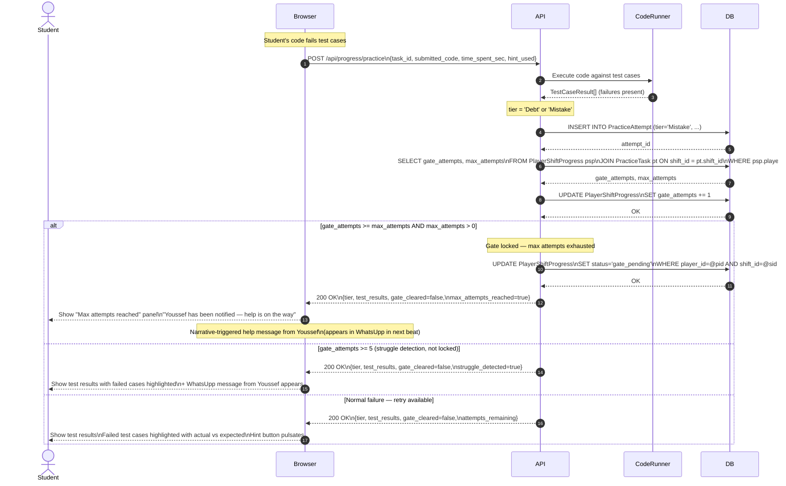
```mermaid
sequenceDiagram
    autonumber
    actor Student
    participant Browser
    participant API
    participant CodeRunner
    participant DB

    Note over Browser: Student's code fails test cases

    Browser->>API: POST /api/progress/practice\n{task_id, submitted_code, time_spent_sec, hint_used}

    API->>CodeRunner: Execute code against test cases
    CodeRunner-->>API: TestCaseResult[] (failures present)

    Note over API: tier = 'Debt' or 'Mistake'

    API->>DB: INSERT INTO PracticeAttempt (tier='Mistake', ...)
    DB-->>API: attempt_id

    API->>DB: SELECT gate_attempts, max_attempts\nFROM PlayerShiftProgress psp\nJOIN PracticeTask pt ON shift_id = pt.shift_id\nWHERE psp.player_id=@pid AND psp.shift_id=@sid
    DB-->>API: gate_attempts, max_attempts

    API->>DB: UPDATE PlayerShiftProgress\nSET gate_attempts += 1
    DB-->>API: OK

    alt gate_attempts >= max_attempts AND max_attempts > 0
        Note over API: Gate locked — max attempts exhausted
        API->>DB: UPDATE PlayerShiftProgress\nSET status='gate_pending'\nWHERE player_id=@pid AND shift_id=@sid
        DB-->>API: OK

        API-->>Browser: 200 OK\n{tier, test_results, gate_cleared=false,\nmax_attempts_reached=true}
        Browser-->>Student: Show "Max attempts reached" panel\n"Youssef has been notified — help is on the way"
        Note over Browser: Narrative-triggered help message from Youssef\n(appears in WhatsUpp in next beat)
    else gate_attempts >= 5 (struggle detection, not locked)
        API-->>Browser: 200 OK\n{tier, test_results, gate_cleared=false,\nstruggle_detected=true}
        Browser-->>Student: Show test results with failed cases highlighted\n+ WhatsUpp message from Youssef appears
    else Normal failure — retry available
        API-->>Browser: 200 OK\n{tier, test_results, gate_cleared=false,\nattempts_remaining}
        Browser-->>Student: Show test results\nFailed test cases highlighted with actual vs expected\nHint button pulsates
    end
```

---

## 5. SD-SIDE — AI Side Tasks

### 5.1 SD-SIDE-01 — AI Side Task Generation & Assignment

**Use Cases:** UC-SIDE-01 (Receive AI Side Task), UC-SIDE-08 (AI Generates Task Slots)
**SRS:** F-SIDE-001, F-AI-001 through F-AI-005
**Tables:** `SideTaskTemplate`, `AiGenerationLog`, `PlayerSideTask`, `ConceptMasterySnapshot`

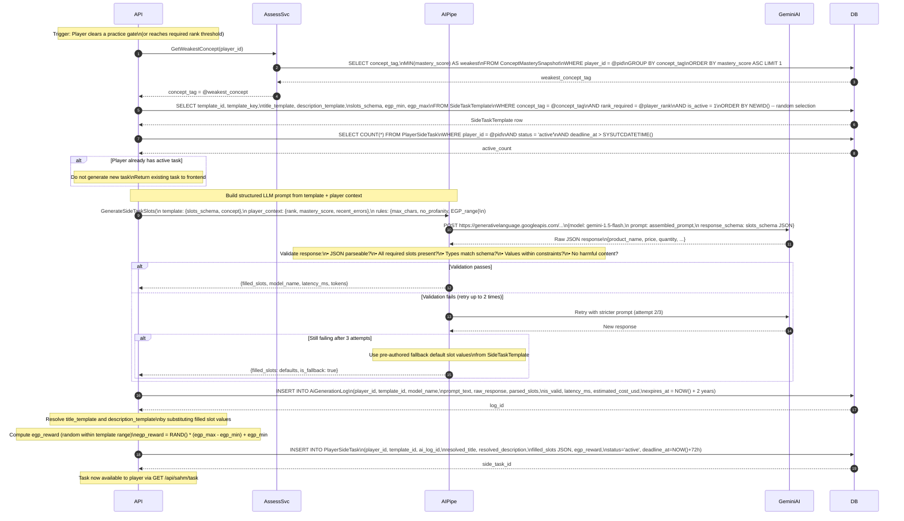
```mermaid
sequenceDiagram
    autonumber
    participant API
    participant AssessSvc
    participant AIPipe
    participant GeminiAI
    participant DB

    Note over API: Trigger: Player clears a practice gate\n(or reaches required rank threshold)

    API->>AssessSvc: GetWeakestConcept(player_id)
    AssessSvc->>DB: SELECT concept_tag,\nMIN(mastery_score) AS weakest\nFROM ConceptMasterySnapshot\nWHERE player_id = @pid\nGROUP BY concept_tag\nORDER BY mastery_score ASC LIMIT 1
    DB-->>AssessSvc: weakest_concept_tag
    AssessSvc-->>API: concept_tag = @weakest_concept

    API->>DB: SELECT template_id, template_key,\ntitle_template, description_template,\nslots_schema, egp_min, egp_max\nFROM SideTaskTemplate\nWHERE concept_tag = @concept_tag\nAND rank_required = @player_rank\nAND is_active = 1\nORDER BY NEWID() -- random selection
    DB-->>API: SideTaskTemplate row

    API->>DB: SELECT COUNT(*) FROM PlayerSideTask\nWHERE player_id = @pid\nAND status = 'active'\nAND deadline_at > SYSUTCDATETIME()
    DB-->>API: active_count

    alt Player already has active task
        Note over API: Do not generate new task\nReturn existing task to frontend
    end

    Note over API,AIPipe: Build structured LLM prompt from template + player context

    API->>AIPipe: GenerateSideTaskSlots(\n  template: {slots_schema, concept},\n  player_context: {rank, mastery_score, recent_errors},\n  rules: {max_chars, no_profanity, EGP_range}\n)

    AIPipe->>GeminiAI: POST https://generativelanguage.googleapis.com/...\n{model: gemini-1.5-flash,\n prompt: assembled_prompt,\n response_schema: slots_schema JSON}

    GeminiAI-->>AIPipe: Raw JSON response\n{product_name, price, quantity, ...}

    Note over AIPipe: Validate response:\n• JSON parseable?\n• All required slots present?\n• Types match schema?\n• Values within constraints?\n• No harmful content?

    alt Validation passes
        AIPipe-->>API: {filled_slots, model_name, latency_ms, tokens}
    else Validation fails (retry up to 2 times)
        AIPipe->>GeminiAI: Retry with stricter prompt (attempt 2/3)
        GeminiAI-->>AIPipe: New response

        alt Still failing after 3 attempts
            Note over AIPipe: Use pre-authored fallback default slot values\nfrom SideTaskTemplate
            AIPipe-->>API: {filled_slots: defaults, is_fallback: true}
        end
    end

    API->>DB: INSERT INTO AiGenerationLog\n(player_id, template_id, model_name,\nprompt_text, raw_response, parsed_slots,\nis_valid, latency_ms, estimated_cost_usd,\nexpires_at = NOW() + 2 years)
    DB-->>API: log_id

    Note over API: Resolve title_template and description_template\nby substituting filled slot values

    Note over API: Compute egp_reward (random within template range)\negp_reward = RAND() * (egp_max - egp_min) + egp_min

    API->>DB: INSERT INTO PlayerSideTask\n(player_id, template_id, ai_log_id,\nresolved_title, resolved_description,\nfilled_slots JSON, egp_reward,\nstatus='active', deadline_at=NOW()+72h)
    DB-->>API: side_task_id

    Note over API: Task now available to player via GET /api/sahm/task
```

---

### 5.2 SD-SIDE-02 — Submit Side Task Code (Pass Path)

**Use Cases:** UC-SIDE-03 (Submit Code Solution), UC-SIDE-04 (View Test Results), UC-SIDE-05 (Earn EGP Reward)
**SRS:** F-SIDE-003
**Tables:** `SideTaskSubmission`, `PlayerSideTask`, `PlayerEconomy`, `Transaction`, `AssessmentEvent`, `TestCase`

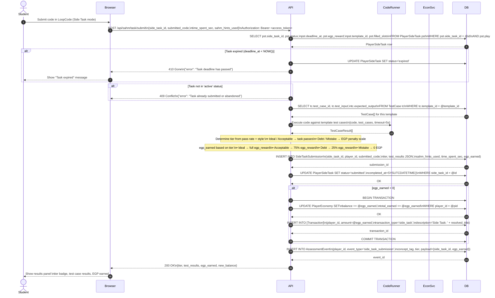
```mermaid
sequenceDiagram
    autonumber
    actor Student
    participant Browser
    participant API
    participant CodeRunner
    participant EconSvc
    participant DB

    Student->>Browser: Submit code in LoopCode (Side Task mode)
    Browser->>API: POST /api/sahm/task/submit\n{side_task_id, submitted_code,\ntime_spent_sec, sahm_hints_used}\nAuthorization: Bearer <access_token>

    API->>DB: SELECT pst.side_task_id, pst.status,\npst.deadline_at, pst.egp_reward,\npst.template_id, pst.filled_slots\nFROM PlayerSideTask pst\nWHERE pst.side_task_id = @id\nAND pst.player_id = @pid
    DB-->>API: PlayerSideTask row

    alt Task expired (deadline_at < NOW())
        API->>DB: UPDATE PlayerSideTask SET status='expired'
        API-->>Browser: 410 Gone\n{"error": "Task deadline has passed"}
        Browser-->>Student: Show "Task expired" message
    end

    alt Task not in 'active' status
        API-->>Browser: 409 Conflict\n{"error": "Task already submitted or abandoned"}
    end

    API->>DB: SELECT tc.test_case_id, tc.test_input,\ntc.expected_output\nFROM TestCase tc\nWHERE tc.template_id = @template_id
    DB-->>API: TestCase[] for this template

    API->>CodeRunner: Execute code against template test cases\n{code, test_cases, timeout=5s}
    CodeRunner-->>API: TestCaseResult[]

    Note over API: Determine tier from pass rate + style:\n• Ideal / Acceptable → task passes\n• Debt / Mistake → EGP penalty scale

    Note over API: egp_earned based on tier:\n• Ideal → full egp_reward\n• Acceptable → 75% egp_reward\n• Debt → 25% egp_reward\n• Mistake → 0 EGP

    API->>DB: INSERT INTO SideTaskSubmission\n(side_task_id, player_id, submitted_code,\ntier, test_results JSON,\nsahm_hints_used, time_spent_sec, egp_earned)
    DB-->>API: submission_id

    API->>DB: UPDATE PlayerSideTask SET status='submitted',\ncompleted_at=SYSUTCDATETIME()\nWHERE side_task_id = @id
    DB-->>API: OK

    alt egp_earned > 0
        API->>DB: BEGIN TRANSACTION
        API->>DB: UPDATE PlayerEconomy SET\nbalance += @egp_earned,\ntotal_earned += @egp_earned\nWHERE player_id = @pid
        DB-->>API: OK
        API->>DB: INSERT INTO [Transaction]\n(player_id, amount=@egp_earned,\ntransaction_type='side_task',\ndescription='Side Task: ' + resolved_title)
        DB-->>API: transaction_id
        API->>DB: COMMIT TRANSACTION
    end

    API->>DB: INSERT INTO AssessmentEvent\n(player_id, event_type='side_task_submission',\nconcept_tag, tier, payload={side_task_id, egp_earned})
    DB-->>API: event_id

    API-->>Browser: 200 OK\n{tier, test_results, egp_earned, new_balance}
    Browser-->>Student: Show results panel:\ntier badge, test case results, EGP earned
```

---

### 5.3 SD-SIDE-03 — Abandon Side Task

**Use Cases:** UC-SIDE-06 (Abandon Side Task), UC-SIDE-07 (Side Task Expires)
**SRS:** F-SIDE-004
**Tables:** `PlayerSideTask`, `PlayerEconomy`, `Transaction`

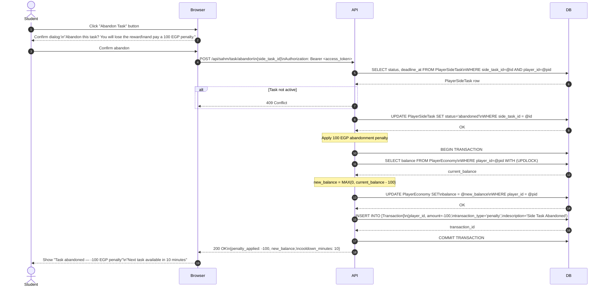
```mermaid
sequenceDiagram
    autonumber
    actor Student
    participant Browser
    participant API
    participant DB

    Student->>Browser: Click "Abandon Task" button
    Browser-->>Student: Confirm dialog:\n"Abandon this task? You will lose the reward\nand pay a 100 EGP penalty."

    Student->>Browser: Confirm abandon

    Browser->>API: POST /api/sahm/task/abandon\n{side_task_id}\nAuthorization: Bearer <access_token>

    API->>DB: SELECT status, deadline_at FROM PlayerSideTask\nWHERE side_task_id=@id AND player_id=@pid
    DB-->>API: PlayerSideTask row

    alt Task not active
        API-->>Browser: 409 Conflict
    end

    API->>DB: UPDATE PlayerSideTask SET status='abandoned'\nWHERE side_task_id = @id
    DB-->>API: OK

    Note over API: Apply 100 EGP abandonment penalty

    API->>DB: BEGIN TRANSACTION
    API->>DB: SELECT balance FROM PlayerEconomy\nWHERE player_id=@pid WITH (UPDLOCK)
    DB-->>API: current_balance

    Note over API: new_balance = MAX(0, current_balance - 100)

    API->>DB: UPDATE PlayerEconomy SET\nbalance = @new_balance\nWHERE player_id = @pid
    DB-->>API: OK

    API->>DB: INSERT INTO [Transaction]\n(player_id, amount=-100,\ntransaction_type='penalty',\ndescription='Side Task Abandoned')
    DB-->>API: transaction_id
    API->>DB: COMMIT TRANSACTION

    API-->>Browser: 200 OK\n{penalty_applied: -100, new_balance,\ncooldown_minutes: 10}
    Browser-->>Student: Show "Task abandoned — -100 EGP penalty"\n"Next task available in 10 minutes"
```

---

## 6. SD-ECO — Economy & Virtual Shop

### 6.1 SD-ECO-01 — Earn EGP (Salary & Bonus on Shift Completion)

**Use Cases:** UC-ECO-02 (Earn Salary), UC-ECO-03 (Earn Bonus)
**SRS:** F-ECON-001
**Tables:** `PlayerEconomy`, `Transaction`, `Player`

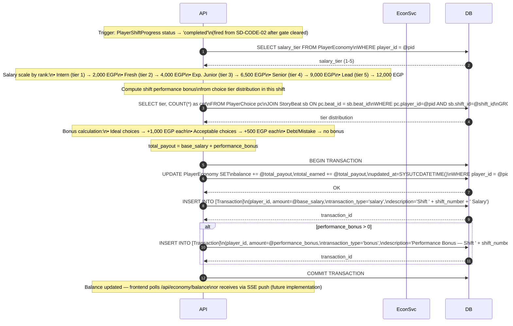
```mermaid
sequenceDiagram
    autonumber
    participant API
    participant EconSvc
    participant DB

    Note over API: Trigger: PlayerShiftProgress status → 'completed'\n(fired from SD-CODE-02 after gate cleared)

    API->>DB: SELECT salary_tier FROM PlayerEconomy\nWHERE player_id = @pid
    DB-->>API: salary_tier (1-5)

    Note over API: Salary scale by rank:\n• Intern (tier 1) → 2,000 EGP\n• Fresh (tier 2) → 4,000 EGP\n• Exp. Junior (tier 3) → 6,500 EGP\n• Senior (tier 4) → 9,000 EGP\n• Lead (tier 5) → 12,000 EGP

    Note over API: Compute shift performance bonus\nfrom choice tier distribution in this shift

    API->>DB: SELECT tier, COUNT(*) as cnt\nFROM PlayerChoice pc\nJOIN StoryBeat sb ON pc.beat_id = sb.beat_id\nWHERE pc.player_id=@pid AND sb.shift_id=@shift_id\nGROUP BY tier
    DB-->>API: tier distribution

    Note over API: Bonus calculation:\n• Ideal choices → +1,000 EGP each\n• Acceptable choices → +500 EGP each\n• Debt/Mistake → no bonus

    Note over API: total_payout = base_salary + performance_bonus

    API->>DB: BEGIN TRANSACTION
    API->>DB: UPDATE PlayerEconomy SET\nbalance += @total_payout,\ntotal_earned += @total_payout,\nupdated_at=SYSUTCDATETIME()\nWHERE player_id = @pid
    DB-->>API: OK

    API->>DB: INSERT INTO [Transaction]\n(player_id, amount=@base_salary,\ntransaction_type='salary',\ndescription='Shift ' + shift_number + ' Salary')
    DB-->>API: transaction_id

    alt performance_bonus > 0
        API->>DB: INSERT INTO [Transaction]\n(player_id, amount=@performance_bonus,\ntransaction_type='bonus',\ndescription='Performance Bonus — Shift ' + shift_number)
        DB-->>API: transaction_id
    end

    API->>DB: COMMIT TRANSACTION

    Note over API: Balance updated — frontend polls /api/economy/balance\nor receives via SSE push (future implementation)
```

---

### 6.2 SD-ECO-02 — Purchase Shop Item

**Use Cases:** UC-ECO-06 (Purchase Shop Item)
**SRS:** F-ECON-002, F-ECON-004, F-INV-003
**Tables:** `ShopItem`, `PlayerInventory`, `PlayerEconomy`, `Transaction`

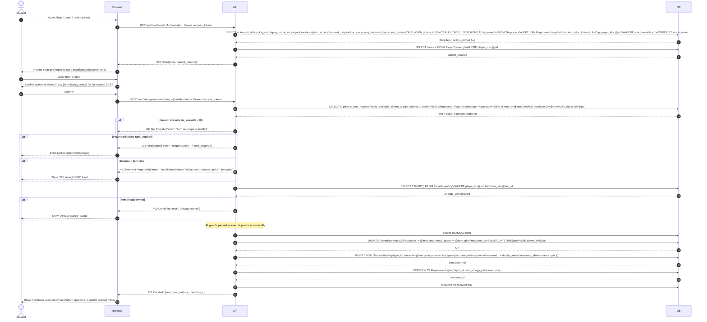
```mermaid
sequenceDiagram
    autonumber
    actor Student
    participant Browser
    participant API
    participant DB

    Student->>Browser: Open Shop (LoopOS desktop icon)
    Browser->>API: GET /api/shop/items\nAuthorization: Bearer <access_token>

    API->>DB: SELECT si.item_id, si.item_key,\nsi.display_name, si.category,\nsi.description, si.price,\nsi.rank_required, si.is_one_way,\nsi.asset_key, si.sort_order,\nCASE WHEN pi.item_id IS NOT NULL THEN 1 ELSE 0 END AS is_owned\nFROM ShopItem si\nLEFT JOIN PlayerInventory pi\n  ON si.item_id = pi.item_id AND pi.player_id = @pid\nWHERE si.is_available = 1\nORDER BY si.sort_order
    DB-->>API: ShopItem[] with is_owned flag

    API->>DB: SELECT balance FROM PlayerEconomy\nWHERE player_id = @pid
    DB-->>API: current_balance

    API-->>Browser: 200 OK\n{items, current_balance}
    Browser-->>Student: Render shop grid\n(greyed out if insufficient balance or rank)

    Student->>Browser: Click "Buy" on item
    Browser-->>Student: Confirm purchase dialog\n"Buy {item.display_name} for {item.price} EGP?"
    Student->>Browser: Confirm

    Browser->>API: POST /api/shop/purchase\n{item_id}\nAuthorization: Bearer <access_token>

    API->>DB: SELECT si.price, si.rank_required,\nsi.is_available, si.item_id,\npe.balance, p.rank\nFROM ShopItem si, PlayerEconomy pe, Player p\nWHERE si.item_id=@item_id\nAND pe.player_id=@pid AND p.player_id=@pid
    DB-->>API: item + player economy snapshot

    alt Item not available (is_available = 0)
        API-->>Browser: 404 Not Found\n{"error": "Item no longer available"}
    end

    alt Player rank below rank_required
        API-->>Browser: 403 Forbidden\n{"error": "Requires rank: " + rank_required}
        Browser-->>Student: Show rank requirement message
    end

    alt balance < item.price
        API-->>Browser: 402 Payment Required\n{"error": "Insufficient balance",\n"balance": balance, "price": item.price}
        Browser-->>Student: Show "Not enough EGP" toast
    end

    API->>DB: SELECT COUNT(*) FROM PlayerInventory\nWHERE player_id=@pid AND item_id=@item_id
    DB-->>API: already_owned count

    alt Item already owned
        API-->>Browser: 409 Conflict\n{"error": "Already owned"}
        Browser-->>Student: Show "Already owned" badge
    end

    Note over API: All guards passed — execute purchase atomically

    API->>DB: BEGIN TRANSACTION
    API->>DB: UPDATE PlayerEconomy SET\nbalance -= @item.price,\ntotal_spent += @item.price,\nupdated_at=SYSUTCDATETIME()\nWHERE player_id=@pid
    DB-->>API: OK

    API->>DB: INSERT INTO [Transaction]\n(player_id, amount=-@item.price,\ntransaction_type='purchase',\ndescription='Purchased: ' + display_name,\nbalance_after=balance - price)
    DB-->>API: transaction_id

    API->>DB: INSERT INTO PlayerInventory\n(player_id, item_id, egp_paid=item.price)
    DB-->>API: inventory_id

    API->>DB: COMMIT TRANSACTION

    API-->>Browser: 201 Created\n{item, new_balance, inventory_id}
    Browser-->>Student: Show "Purchase successful!" toast\nItem appears in LoopOS desktop / dock
```

---

### 6.3 SD-ECO-03 — Upgrade Sahm AI Tier

**Use Cases:** UC-ECO-09 (Upgrade Sahm via Shop), UC-SAHM-05 (Upgrade Sahm Tier)
**SRS:** F-SIDE-002, F-ECON-002, F-ECON-004
**Tables:** `ShopItem`, `SahmSubscription`, `PlayerInventory`, `PlayerEconomy`, `Transaction`

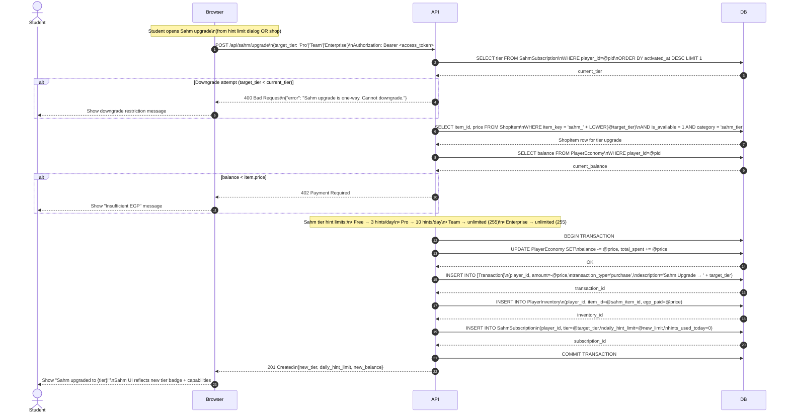
```mermaid
sequenceDiagram
    autonumber
    actor Student
    participant Browser
    participant API
    participant DB

    Note over Browser: Student opens Sahm upgrade\n(from hint limit dialog OR shop)

    Browser->>API: POST /api/sahm/upgrade\n{target_tier: 'Pro'|'Team'|'Enterprise'}\nAuthorization: Bearer <access_token>

    API->>DB: SELECT tier FROM SahmSubscription\nWHERE player_id=@pid\nORDER BY activated_at DESC LIMIT 1
    DB-->>API: current_tier

    alt Downgrade attempt (target_tier < current_tier)
        API-->>Browser: 400 Bad Request\n{"error": "Sahm upgrade is one-way. Cannot downgrade."}
        Browser-->>Student: Show downgrade restriction message
    end

    API->>DB: SELECT item_id, price FROM ShopItem\nWHERE item_key = 'sahm_' + LOWER(@target_tier)\nAND is_available = 1 AND category = 'sahm_tier'
    DB-->>API: ShopItem row for tier upgrade

    API->>DB: SELECT balance FROM PlayerEconomy\nWHERE player_id=@pid
    DB-->>API: current_balance

    alt balance < item.price
        API-->>Browser: 402 Payment Required
        Browser-->>Student: Show "Insufficient EGP" message
    end

    Note over API: Sahm tier hint limits:\n• Free → 3 hints/day\n• Pro → 10 hints/day\n• Team → unlimited (255)\n• Enterprise → unlimited (255)

    API->>DB: BEGIN TRANSACTION
    API->>DB: UPDATE PlayerEconomy SET\nbalance -= @price, total_spent += @price
    DB-->>API: OK

    API->>DB: INSERT INTO [Transaction]\n(player_id, amount=-@price,\ntransaction_type='purchase',\ndescription='Sahm Upgrade → ' + target_tier)
    DB-->>API: transaction_id

    API->>DB: INSERT INTO PlayerInventory\n(player_id, item_id=@sahm_item_id, egp_paid=@price)
    DB-->>API: inventory_id

    API->>DB: INSERT INTO SahmSubscription\n(player_id, tier=@target_tier,\ndaily_hint_limit=@new_limit,\nhints_used_today=0)
    DB-->>API: subscription_id

    API->>DB: COMMIT TRANSACTION

    API-->>Browser: 201 Created\n{new_tier, daily_hint_limit, new_balance}
    Browser-->>Student: Show "Sahm upgraded to {tier}!"\nSahm UI reflects new tier badge + capabilities
```

---

## 7. SD-SAHM — Sahm AI Assistant

### 7.1 SD-SAHM-01 — Request Code Hint (Within Daily Limit)

**Use Cases:** UC-SAHM-02 (Request Code Hint — Practice), UC-SAHM-03 (Request Code Hint — Side Task)
**SRS:** F-SIDE-002
**Tables:** `SahmSubscription`, `AssessmentEvent`

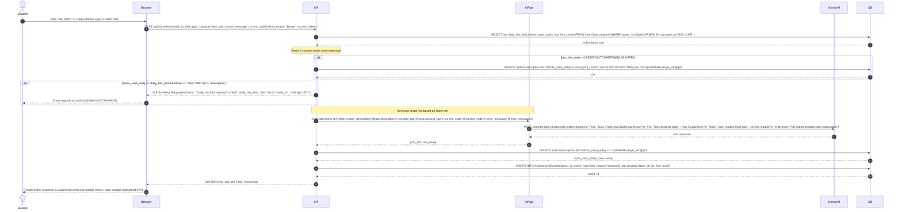
```mermaid
sequenceDiagram
    autonumber
    actor Student
    participant Browser
    participant API
    participant AIPipe
    participant GeminiAI
    participant DB

    Student->>Browser: Click "Ask Sahm" in LoopCode\nor type in Sahm chat
    Browser->>API: POST /api/sahm/hint\n{task_id, task_type: 'practice'|'side_task',\nerror_message, current_code}\nAuthorization: Bearer <access_token>

    API->>DB: SELECT tier, daily_hint_limit,\nhints_used_today, last_hint_reset\nFROM SahmSubscription\nWHERE player_id=@pid\nORDER BY activated_at DESC LIMIT 1
    DB-->>API: subscription row

    Note over API: Check if counter needs reset (new day)

    alt last_hint_reset < CAST(SYSUTCDATETIME() AS DATE)
        API->>DB: UPDATE SahmSubscription SET\nhints_used_today=0,\nlast_hint_reset=CAST(SYSUTCDATETIME() AS DATE)\nWHERE player_id=@pid
        DB-->>API: OK
    end

    alt hints_used_today >= daily_hint_limit\nAND tier != 'Team' AND tier != 'Enterprise'
        API-->>Browser: 429 Too Many Requests\n{"error": "Daily hint limit reached",\n"limit": daily_hint_limit, "tier": tier,\n"resets_at": "midnight UTC"}
        Browser-->>Student: Show upgrade prompt\n(handled in SD-SAHM-02)
    end

    Note over API,AIPipe: Generate tiered hint based on Sahm tier

    API->>AIPipe: GenerateHint(\n  tier=@tier,\n  task_description=@task.description,\n  concept_tag=@task.concept_tag,\n  current_code=@current_code,\n  error_message=@error_message\n)

    AIPipe->>GeminiAI: POST prompt\n(tier-constrained system prompt:\n• Free: "Give 3 high-level bullet points only"\n• Pro: "Give detailed steps + max 5 code lines"\n• Team: "Give module-level plan + 20-line module"\n• Enterprise: "Full implementation with explanation")

    GeminiAI-->>AIPipe: Hint response
    AIPipe-->>API: {hint_text, hint_level}

    API->>DB: UPDATE SahmSubscription SET\nhints_used_today += 1\nWHERE player_id=@pid
    DB-->>API: hints_used_today (new value)

    API->>DB: INSERT INTO AssessmentEvent\n(player_id, event_type='hint_request',\nconcept_tag, payload={task_id, tier, hint_level})
    DB-->>API: event_id

    API-->>Browser: 200 OK\n{hint_text, tier, hints_remaining}
    Browser-->>Student: Render Sahm response in LoopAssist chat\n(tier badge shown, code snippet highlighted if Pro+)
```

---

### 7.2 SD-SAHM-02 — Daily Hint Limit Exceeded

**Use Cases:** UC-SAHM-04 (Check Daily Hint Limit → exceeds → UC-SAHM-05 Upgrade)
**SRS:** F-SIDE-002
**Tables:** `SahmSubscription`, `ShopItem`

```mermaid
sequenceDiagram
    autonumber
    actor Student
    participant Browser
    participant API
    participant DB

    Note over Browser: Student requests hint but daily_hint_limit reached\n(received 429 from SD-SAHM-01)

    Browser-->>Student: Show Sahm limit dialog:\n"You've used all {limit} hints for today.\nUpgrade to get more!"\n[Upgrade to Pro] [Upgrade to Team] [Wait until midnight]

    Student->>Browser: Click "Upgrade to Pro" (or Team/Enterprise)

    Note over Browser: Routes to SD-ECO-03 (Upgrade Sahm AI Tier)
    Note over Browser: If Student clicks "Wait until midnight"...

    Browser-->>Student: Show countdown timer to midnight UTC\n"Hints reset in HH:MM:SS"

    Note over Browser: Timer counts down\nAt midnight: hints_used_today resets (via SD-SAHM-03)
```

---

### 7.3 SD-SAHM-03 — Midnight Daily Hint Counter Reset

**Use Cases:** UC-SAHM-06 (Reset Daily Hint Counter)
**SRS:** F-SIDE-002
**Tables:** `SahmSubscription`

```mermaid
sequenceDiagram
    autonumber
    participant Scheduler
    participant API
    participant DB

    Note over Scheduler: .NET hosted service fires at 00:00:00 UTC daily

    Scheduler->>API: Trigger: DailyHintResetJob

    API->>DB: UPDATE SahmSubscription SET\nhints_used_today = 0,\nlast_hint_reset = CAST(SYSUTCDATETIME() AS DATE)\nWHERE last_hint_reset < CAST(SYSUTCDATETIME() AS DATE)
    DB-->>API: rows_updated

    Note over API: Reset is also applied lazily per-player\non first hint request of new day\n(double-safety in SD-SAHM-01)

    API->>API: Log: "Daily hint reset: {rows_updated} subscriptions reset"
```

---

## 8. SD-ASSESS — Stealth Assessment & Mastery

### 8.1 SD-ASSESS-01 — Emit Assessment Event (Choice Submission)

**Use Cases:** UC-ASSESS-01 (Emit Assessment Event)
**SRS:** F-PRAC-004, §ECD
**Tables:** `AssessmentEvent`

```mermaid
sequenceDiagram
    autonumber
    participant API
    participant AssessSvc
    participant DB

    Note over API: Gameplay action completes (choice, attempt, hint, etc.)\nEmit event type: 'choice_submission'

    API->>AssessSvc: Emit AssessmentEvent {\n  player_id,\n  event_type: 'choice_submission',\n  concept_tag: beat.concept_tag,\n  tier: choice.tier,\n  session_id: GUID,\n  payload: {\n    beat_id, choice_id,\n    time_taken_seconds,\n    previous_attempts\n  }\n}

    Note over AssessSvc: Event placed on .NET System.Threading.Channels\n(non-blocking — does NOT delay HTTP response)

    AssessSvc->>AssessSvc: Background worker dequeues event batch\n(batches up to 50 events or every 2 seconds)

    AssessSvc->>DB: INSERT INTO AssessmentEvent\n(player_id, event_type, concept_tag,\ntier, payload JSON, session_id, recorded_at)\nVALUES (@batch_rows)
    DB-->>AssessSvc: event_id(s) inserted

    Note over AssessSvc: Supported event_type values:\n• choice_submission\n• practice_attempt\n• hint_request\n• side_task_submission\n• desktop_interaction\n• consequence_trigger\n• gate_cleared\n• shift_completed
```

---

### 8.2 SD-ASSESS-02 — Compute Concept Mastery Snapshot

**Use Cases:** UC-ASSESS-02 (Compute Concept Mastery Score), UC-ASSESS-03 (Snapshot per Shift)
**SRS:** F-PRAC-004
**Tables:** `AssessmentEvent`, `ConceptMasterySnapshot`

```mermaid
sequenceDiagram
    autonumber
    participant AssessSvc
    participant DB

    Note over AssessSvc: Trigger: shift_completed event received\nOR scheduled background run (every 15 minutes)

    AssessSvc->>DB: SELECT event_type, concept_tag, tier,\nrecorded_at, payload\nFROM AssessmentEvent\nWHERE player_id = @pid\nAND recorded_at > @last_snapshot_time\nORDER BY recorded_at ASC
    DB-->>AssessSvc: recent AssessmentEvent[]

    Note over AssessSvc: ECD-based mastery computation per concept_tag:\n\n1. Evidence weight by event_type:\n   • gate_cleared → weight 3.0\n   • practice_attempt (Ideal) → weight 2.5\n   • practice_attempt (Acceptable) → weight 2.0\n   • practice_attempt (Debt/Mistake) → weight 0.5\n   • choice_submission (Ideal) → weight 1.5\n   • hint_request → weight -0.3 (negative signal)\n   • side_task_submission → weight 2.0\n\n2. Recency decay (older events weighted less)\n3. mastery_score = sigmoid(weighted_sum)\n   normalized to [0.0, 1.0]

    loop For each unique concept_tag
        AssessSvc->>DB: INSERT INTO ConceptMasterySnapshot\n(player_id, shift_id, concept_tag,\nmastery_score, evidence_count,\nsnapshotted_at=SYSUTCDATETIME())
        DB-->>AssessSvc: snapshot_id
    end

    Note over AssessSvc: Snapshots now available for:\n• Instructor heatmap (SD-ADMIN-01)\n• AI task calibration (SD-ASSESS-03)\n• At-risk student detection
```

---

### 8.3 SD-ASSESS-03 — AI Task Calibration via Mastery Feed

**Use Cases:** UC-ASSESS-08 (Feed Mastery to AI Pipeline)
**SRS:** F-SIDE-001, §9 AI Pipeline
**Tables:** `ConceptMasterySnapshot`, `SideTaskTemplate`

```mermaid
sequenceDiagram
    autonumber
    participant AssessSvc
    participant API
    participant AIPipe
    participant DB

    Note over AssessSvc: After ConceptMasterySnapshot updated\n(triggered by SD-ASSESS-02)

    AssessSvc->>DB: SELECT concept_tag, mastery_score\nFROM ConceptMasterySnapshot\nWHERE player_id=@pid\nAND snapshotted_at = (\n  SELECT MAX(snapshotted_at)\n  FROM ConceptMasterySnapshot\n  WHERE player_id=@pid\n)\nORDER BY mastery_score ASC
    DB-->>AssessSvc: ranked concept_tags by mastery (weakest first)

    AssessSvc->>API: NotifyMasteryUpdate(player_id, concept_rankings[])

    Note over API,AIPipe: Feed mastery context into next AI generation call\n(stored in player_context for SD-SIDE-01)

    API->>AIPipe: UpdatePlayerContext(\n  player_id,\n  weakest_concept: concept_rankings[0],\n  mastery_score: concept_rankings[0].score,\n  difficulty_preference: 'Standard' or 'Challenge'\n)

    Note over AIPipe: Context cached in memory for next\nside task generation request\n\nIf mastery_score < 0.40 → difficulty = 'SpacedRetrieval'\nIf 0.40 ≤ mastery_score < 0.70 → difficulty = 'Standard'\nIf mastery_score ≥ 0.70 → difficulty = 'Challenge'

    AIPipe-->>API: Context updated

    Note over API: Next call to GenerateSideTaskSlots\nwill use calibrated difficulty + weakest concept
```

---

## 9. SD-ADMIN — Admin Panel

### 9.1 SD-ADMIN-01 — View Assessment Dashboard & Export Data

**Use Cases:** UC-ADMIN-09 (View Assessment Dashboard), UC-ADMIN-10 (Export Assessment Data)
**SRS:** §8.1.2 (A-DASH), §8.1.4 (A-REPT)
**Tables:** `ConceptMasterySnapshot`, `Player`, `PlayerShiftProgress`, `AssessmentEvent`

```mermaid
sequenceDiagram
    autonumber
    actor Instructor
    participant Browser
    participant API
    participant DB

    Instructor->>Browser: Open Admin Dashboard (/admin)
    Browser->>API: GET /api/admin/dashboard\n?class_code=CS111-2026-S1\nAuthorization: Bearer <admin_access_token>

    API->>DB: SELECT p.player_id, p.rank,\np.current_shift_id, p.total_play_time_sec,\npe.balance,\n(SELECT COUNT(*) FROM PlayerShiftProgress\n WHERE player_id=p.player_id AND status='completed')\n AS shifts_completed\nFROM Player p\nJOIN PlayerEconomy pe ON p.player_id=pe.player_id\nWHERE p.class_code_id=@class_code_id\nAND p.deleted_at IS NULL
    DB-->>API: Student summary rows[]

    API->>DB: SELECT concept_tag,\nAVG(mastery_score) AS class_avg,\nMIN(mastery_score) AS class_min\nFROM ConceptMasterySnapshot cms\nJOIN Player p ON cms.player_id=p.player_id\nWHERE p.class_code_id=@class_code_id\nGROUP BY concept_tag
    DB-->>API: Concept mastery aggregates[]

    API->>DB: SELECT tier, COUNT(*) AS cnt\nFROM AssessmentEvent ae\nJOIN Player p ON ae.player_id=p.player_id\nWHERE event_type='choice_submission'\nAND p.class_code_id=@class_code_id\nGROUP BY tier
    DB-->>API: Choice tier distribution[]

    API-->>Browser: 200 OK\n{students[], concept_mastery[], tier_distribution[]}
    Browser-->>Instructor: Render dashboard:\n• Student list with progress\n• Concept mastery heatmap (students × concepts)\n• Pie chart: Ideal/Acceptable/Debt/Mistake distribution

    alt Instructor requests at-risk students
        Browser->>API: GET /api/admin/reports/at-risk\n?class_code=CS111-2026-S1

        API->>DB: SELECT p.player_id,\nCOUNT(pa.attempt_id) AS gate_attempts,\nSUM(CASE WHEN ae.tier IN ('Debt','Mistake')\n  THEN 1 ELSE 0 END) * 100.0 / COUNT(*) AS mistake_pct,\nMAX(ae.recorded_at) AS last_activity\nFROM Player p\nLEFT JOIN PracticeAttempt pa ON p.player_id=pa.player_id\nLEFT JOIN AssessmentEvent ae ON p.player_id=ae.player_id\nWHERE p.class_code_id=@class_code_id\nGROUP BY p.player_id\nHAVING gate_attempts >= 5\nOR mistake_pct >= 50\nOR DATEDIFF(day, MAX(ae.recorded_at), GETUTCDATE()) > 7
        DB-->>API: At-risk student rows[]

        API-->>Browser: 200 OK\n{at_risk_students[]}
        Browser-->>Instructor: Render at-risk list with flag reasons
    end

    alt Instructor exports data
        Instructor->>Browser: Click "Export CSV"
        Browser->>API: GET /api/admin/reports/performance/export\n?format=csv&class_code=CS111-2026-S1

        API->>DB: SELECT anonymized assessment data
        DB-->>API: Full dataset

        Note over API: Log export action to AuditLog

        API->>DB: INSERT INTO AuditLog\n(user_id=@admin_id, action='DATA_EXPORT',\nentity_type='ClassReport',\nip_address, occurred_at=NOW())
        DB-->>API: audit_id

        API-->>Browser: 200 OK\nContent-Type: text/csv\n[CSV file stream]
        Browser-->>Instructor: File downloaded
    end
```

---

### 9.2 SD-ADMIN-02 — Manage Narrative Content (Shifts / Beats / Choices)

**Use Cases:** UC-ADMIN-04 (Manage Content)
**SRS:** §8.2.5 (SA-CMS)
**Tables:** `Shift`, `StoryBeat`, `Choice`, `Consequence`, `AuditLog`

```mermaid
sequenceDiagram
    autonumber
    actor Admin
    participant Browser
    participant API
    participant DB

    Admin->>Browser: Open Content Management Panel (/super-admin/cms)
    Browser->>API: GET /api/super/content/shifts\nAuthorization: Bearer <super_admin_token>

    API->>DB: SELECT shift_id, shift_number, chapter_number,\ntitle, is_capstone, unlock_condition\nFROM Shift ORDER BY chapter_number, shift_number
    DB-->>API: Shift[]

    API-->>Browser: 200 OK\n{shifts[]}
    Browser-->>Admin: Render shift tree (chapters → shifts)

    Admin->>Browser: Select Shift → click "Add Story Beat"
    Browser-->>Admin: Show beat editor form

    Admin->>Browser: Fill beat fields:\n{shift_id, beat_key, beat_type='narrative',\nsequence_order, app, sender_name,\ncontent_json, desktop_event, delay_seconds,\nhas_choices}

    Browser->>API: POST /api/super/content/beats\n{beat payload}\nAuthorization: Bearer <super_admin_token>

    API->>DB: SELECT COUNT(*) FROM StoryBeat\nWHERE beat_key=@beat_key
    DB-->>API: existing count

    alt beat_key already exists
        API-->>Browser: 409 Conflict\n{"error": "beat_key must be unique"}
    end

    API->>DB: INSERT INTO StoryBeat\n(shift_id, beat_key, beat_type, sequence_order,\napp, sender_name, content_json, desktop_event,\ndelay_seconds, has_choices)
    DB-->>API: beat_id

    alt has_choices == 1
        loop For each choice (1-4)
            Admin->>Browser: Fill Choice fields:\n{beat_id, choice_index, choice_text,\ntier, egp_delta, immediate_feedback}

            alt Choice has deferred consequence
                Note over Admin,Browser: Admin creates consequence beat first:\n1. Create StoryBeat (beat_type='consequence',\n   shift_id=target_shift, sequence_order=NULL)\n2. Create Consequence row\n   (beat_id, inject_position='start'|'end')\n3. Set choice.consequence_id = consequence_id
                Browser->>API: POST /api/super/content/beats\n{consequence_beat payload}
                API->>DB: INSERT INTO StoryBeat\n(beat_type='consequence', shift_id=@target_shift,\nsequence_order=NULL, ...)
                DB-->>API: consequence_beat_id

                Browser->>API: POST /api/super/content/consequences\n{beat_id=@consequence_beat_id, inject_position}
                API->>DB: INSERT INTO Consequence\n(beat_id, inject_position)
                DB-->>API: consequence_id
            end

            Browser->>API: POST /api/super/content/choices\n{beat_id, choice_index, choice_text,\ntier, egp_delta, immediate_feedback,\nconsequence_id (nullable)}
            API->>DB: INSERT INTO Choice\n(beat_id, choice_index, choice_text,\ntier, egp_delta, immediate_feedback, consequence_id)
            DB-->>API: choice_id
        end
    end

    Note over API: Log all changes to AuditLog

    API->>DB: INSERT INTO AuditLog\n(user_id=@admin_id, action='CONTENT_CREATE',\nentity_type='StoryBeat', entity_id=@beat_id,\nnew_value=beat_json, ip_address)
    DB-->>API: audit_id

    API-->>Browser: 201 Created\n{beat_id, choice_ids[]}
    Browser-->>Admin: Show "Beat created successfully"\nContent tree updates live
```

---

### 9.3 SD-ADMIN-03 — Soft-Delete Student Account (Super Admin)

**Use Cases:** UC-AUTH-09 (Soft-Delete Account)
**SRS:** §8.2.1 (SA-USER), §6.2 (Data Retention)
**Tables:** `ApplicationUser`, `Player`, `AuditLog`

```mermaid
sequenceDiagram
    autonumber
    actor SuperAdmin
    participant Browser
    participant API
    participant DB

    SuperAdmin->>Browser: Navigate to User Management (/super-admin/users)
    Browser->>API: GET /api/super/users?class_code=...\nAuthorization: Bearer <super_admin_token>

    API->>DB: SELECT u.user_id, u.display_name, u.email,\np.rank, p.player_id, p.deleted_at\nFROM ApplicationUser u\nJOIN Player p ON u.user_id=p.user_id\nWHERE u.deleted_at IS NULL
    DB-->>API: User list[]

    API-->>Browser: 200 OK\n{users[]}
    Browser-->>SuperAdmin: Render user management table

    SuperAdmin->>Browser: Select student → click "Deactivate Account"
    Browser-->>SuperAdmin: Confirmation dialog:\n"Soft-delete {student.display_name}?\nData retained for research. Account cannot be used."

    SuperAdmin->>Browser: Confirm

    Browser->>API: DELETE /api/super/users/{user_id}\nAuthorization: Bearer <super_admin_token>

    API->>DB: BEGIN TRANSACTION
    API->>DB: UPDATE ApplicationUser SET\nis_active = 0,\ndeleted_at = SYSUTCDATETIME()\nWHERE user_id = @user_id
    DB-->>API: OK

    API->>DB: UPDATE Player SET\ndeleted_at = SYSUTCDATETIME()\nWHERE user_id = @user_id
    DB-->>API: OK

    Note over API: Revoke all active refresh tokens

    API->>DB: UPDATE RefreshToken SET\nrevoked_at = SYSUTCDATETIME()\nWHERE user_id = @user_id\nAND revoked_at IS NULL
    DB-->>API: tokens_revoked count

    API->>DB: COMMIT TRANSACTION

    Note over API: Data retained per §6.2 (research retention policy)\nGDPR-style soft delete — no hard delete

    API->>DB: INSERT INTO AuditLog\n(user_id=@super_admin_id,\nplayer_id=@target_player_id,\naction='ACCOUNT_SOFT_DELETE',\nentity_type='ApplicationUser',\nentity_id=@user_id, ip_address, user_agent)
    DB-->>API: audit_id

    API-->>Browser: 204 No Content
    Browser-->>SuperAdmin: Show "Account deactivated" success\nStudent removed from active list
```

---

### 9.4 SD-ADMIN-04 — Teacher Sheet Management & AI Task Reframing

**Use Cases:** UC-ADMIN-12 (View Task Bank & Sheets), UC-ADMIN-13 (Add New Sheet), UC-ADMIN-14 (Publish Sheet), UC-ADMIN-15 (AI Task Reframing)
**SRS:** F-ADMIN-005, F-AI-003
**Tables:** `PracticeTask`, `TestCase`, `SideTaskTemplate`, `AiGenerationLog`, `AuditLog`

```mermaid
sequenceDiagram
    autonumber
    actor Instructor
    participant Browser
    participant API
    participant AIPipe
    participant GeminiAI
    participant DB

    Instructor->>Browser: Open Task Bank Manager (/admin/task-bank)
    Browser->>API: GET /api/admin/sheets?class_code=...\nAuthorization: Bearer <instructor_token>

    API->>DB: SELECT template_id, title_template, concept_tag, rank_required, is_active FROM SideTaskTemplate ORDER BY created_at DESC
    DB-->>API: Sheet List[]
    API-->>Browser: 200 OK {sheets[]}
    Browser-->>Instructor: Render Task Bank table & problem sheets

    Instructor->>Browser: Select raw academic problem sheet → click "Reframe Problem as Company Task"
    Browser->>API: POST /api/admin/sheets/reframe\n{raw_problem_id, concept_tag, target_rank}\nAuthorization: Bearer <instructor_token>

    API->>AIPipe: ReframeRequest {raw_title, raw_description, test_cases}
    AIPipe->>GeminiAI: Generate Egyptian corporate scenario reframing prompt
    GeminiAI-->>AIPipe: Reframed workplace task JSON {company_name, title, scenario_description, slots}

    AIPipe->>API: ReframedTaskPayload
    API->>DB: INSERT INTO AiGenerationLog (template_id, prompt_tokens, response_tokens, latency_ms, is_success) VALUES (...)
    DB-->>API: log_id

    API-->>Browser: 200 OK {reframed_title, reframed_description, slots_schema}
    Browser-->>Instructor: Display preview of reframed workplace scenario

    Instructor->>Browser: Confirm & click "Publish Sheet"
    Browser->>API: POST /api/admin/sheets/publish\n{template_id, is_active: true}
    API->>DB: UPDATE SideTaskTemplate SET is_active = 1 WHERE template_id = @template_id
    API->>DB: INSERT INTO AuditLog (user_id=@instructor_id, action='PUBLISH_SHEET', entity_id=@template_id)
    DB-->>API: OK

    API-->>Browser: 200 OK {published: true}
    Browser-->>Instructor: Show toast "Sheet published to student class!"
```

---

## 10. SD-PROMO — Rank Promotion Ceremony

**Use Cases:** UC-GAME-01 (implicitly — unlock condition evaluation), F-PROMO-001, F-PROMO-002
**SRS:** §3.8 (F-PROMO)
**Tables:** `Player`, `PlayerEconomy`, `Shift`, `AssessmentEvent`, `AuditLog`

```mermaid
sequenceDiagram
    autonumber
    participant API
    participant EconSvc
    participant DB
    participant Browser

    Note over API: Trigger: shift_completed event for a capstone shift\n(Shift.is_capstone = 1)\nOR Chapter 1 recap gate cleared

    API->>DB: SELECT s.is_capstone, s.chapter_number,\np.rank, p.player_id\nFROM Shift s\nJOIN Player p ON p.current_shift_id = s.shift_id\nWHERE s.shift_id = @shift_id
    DB-->>API: shift + player rank

    alt Capstone completed → determine new rank
        Note over API: Promotion rules (F-PROMO-001):\n• Shift 3 complete + Chapter 1 recap → Fresh\n• Chapter 1 Capstone → Experienced Junior\n• Chapter 2 Capstone → Senior\n• Chapter 3 Capstone → Lead
    end

    Note over API: Check eligibility

    alt Promotion criteria met
        API->>DB: BEGIN TRANSACTION
        API->>DB: UPDATE Player SET rank = @new_rank\nWHERE player_id = @pid
        DB-->>API: OK

        Note over API: Salary tier increments with rank

        API->>DB: UPDATE PlayerEconomy SET\nsalary_tier = @new_salary_tier\nWHERE player_id = @pid
        DB-->>API: OK

        API->>DB: COMMIT TRANSACTION

        Note over API: Compose multi-channel promotion ceremony\n(F-PROMO-002)

        API->>DB: INSERT INTO AssessmentEvent\n(player_id, event_type='shift_completed',\nconcept_tag='promotion', tier='Ideal',\npayload={old_rank, new_rank, chapter})
        DB-->>API: event_id

        Note over API: Queue promotion beats into WhatsUpp + MailLoop\nfor player to see on next load

        API-->>Browser: 200 OK\n{promoted: true, old_rank, new_rank,\nnew_salary_tier, ceremony: {\n  system_modal: "Promoted to {new_rank}!",\n  mail_subject: "HR: Compensation Update",\n  whatsapp_from: "Youssef",\n  wallpaper_change: "office_{new_rank}.jpg"\n}}

        Browser->>Browser: Show system modal overlay:\n"Promotion: {old_rank} → {new_rank}"

        Browser->>Browser: Render MailLoop email from HR\n"Your salary has been updated to {new_salary} EGP"

        Browser->>Browser: Show WhatsUpp message from Youssef:\n"Congrats, you've earned this 🎉"

        Browser->>Browser: Crossfade wallpaper to\nbetter office image for new rank

    else Promotion criteria not met
        Note over API: No rank change — shift completion\nstill logged and salary paid normally
    end
```

---

## 11. SD-CROSS — Cross-Cutting: Full Shift Lifecycle

> This end-to-end diagram traces the complete lifecycle of a single shift from login through to gate cleared and next-shift unlock. It integrates all major subsystems and serves as the primary integration verification reference.

**Spans:** SD-AUTH-02, SD-GAME-01, SD-GAME-02, SD-GAME-03, SD-CODE-02, SD-ECO-01, SD-ASSESS-02

```mermaid
sequenceDiagram
    autonumber
    actor Student
    participant Browser
    participant API
    participant NarrSvc
    participant CodeRunner
    participant AssessSvc
    participant AIPipe
    participant DB

    %% ── PHASE 1: LOGIN ──────────────────────────────────────────────
    rect rgb(230, 245, 255)
        Note over Student,DB: PHASE 1 — Authentication
        Student->>Browser: Enter credentials
        Browser->>API: POST /api/auth/login
        API->>DB: Validate ApplicationUser + role
        DB-->>API: User confirmed
        API->>DB: INSERT RefreshToken
        DB-->>API: token_id
        API-->>Browser: JWT access_token + refresh_token
        Browser-->>Student: LoopOS Desktop loads
    end

    %% ── PHASE 2: START SHIFT ────────────────────────────────────────
    rect rgb(230, 255, 230)
        Note over Student,DB: PHASE 2 — Start Shift
        Student->>Browser: Click Shift icon
        Browser->>API: POST /api/game/shift/{id}/start
        API->>DB: Check unlock_condition + ConsequenceQueue
        DB-->>API: shift beats + any pending consequences
        API->>DB: UPDATE ConsequenceQueue (pending→fired)
        API->>DB: MERGE PlayerShiftProgress (in_progress)
        DB-->>API: progress_id
        API-->>Browser: StoryBeat[] (with injected consequences)
        Browser-->>Student: Narrative begins streaming
    end

    %% ── PHASE 3: NARRATIVE & CHOICES ───────────────────────────────
    rect rgb(255, 250, 230)
        Note over Student,DB: PHASE 3 — Narrative & Choices (repeats per choice beat)
        Browser->>Browser: Render beats sequentially (WhatsUpp / MailLoop / VideoCall)
        Student->>Browser: Select choice button
        Browser->>API: POST /api/progress/choice {choice_id}
        API->>DB: INSERT PlayerChoice
        API->>DB: UPDATE PlayerEconomy (balance += egp_delta)
        API->>DB: INSERT Transaction
        alt Deferred consequence
            API->>DB: INSERT ConsequenceQueue (pending)
        end
        API->>AssessSvc: Emit choice_submission event
        AssessSvc->>DB: Async INSERT AssessmentEvent
        API-->>Browser: {tier, immediate_feedback, new_balance}
        Browser-->>Student: Feedback toast + narrative advances
    end

    %% ── PHASE 4: PRACTICE GATE ─────────────────────────────────────
    rect rgb(255, 235, 235)
        Note over Student,DB: PHASE 4 — Practice Gate
        Browser->>API: GET /api/code/task/{task_id}
        API->>DB: SELECT PracticeTask + TestCase[]
        DB-->>API: task data
        API-->>Browser: Task + visible test cases
        Browser-->>Student: LoopCode IDE opens in Practice Mode

        Student->>Browser: Write C code + Submit
        Browser->>API: POST /api/progress/practice {code, task_id}
        API->>CodeRunner: Execute code vs all test cases
        CodeRunner-->>API: TestCaseResult[]

        API->>DB: INSERT PracticeAttempt (tier, test_results)
        API->>AssessSvc: Emit practice_attempt event
        AssessSvc->>DB: INSERT AssessmentEvent

        alt Gate cleared (Ideal/Acceptable)
            API->>DB: UPDATE PlayerShiftProgress (completed)
            API->>DB: UPDATE PlayerEconomy (balance += egp_reward)
            API->>DB: INSERT Transaction (bonus)
            API->>AssessSvc: Emit gate_cleared + shift_completed
            AssessSvc->>DB: Trigger ConceptMasterySnapshot recompute
            AssessSvc->>DB: INSERT ConceptMasterySnapshot[]
        end

        API-->>Browser: {tier, test_results, gate_cleared, egp_earned}
        Browser-->>Student: Results panel + "Next Shift Unlocked" button
    end

    %% ── PHASE 5: POST-SHIFT ─────────────────────────────────────────
    rect rgb(245, 230, 255)
        Note over Student,DB: PHASE 5 — Post-Shift (async)
        AssessSvc->>AIPipe: Feed weakest concept + mastery score
        AIPipe->>AIPipe: Calibrate next side task difficulty
        API->>DB: Trigger AI side task generation\n(new PlayerSideTask for player)
        API->>DB: INSERT PlayerSideTask (active, deadline=+72h)

        alt Promotion check (capstone shift)
            API->>DB: UPDATE Player SET rank=@new_rank
            API->>DB: UPDATE PlayerEconomy SET salary_tier+=1
            Browser-->>Student: Promotion ceremony (modal + mail + wallpaper)
        end

        Browser-->>Student: New shift available in calendar\nSide task badge appears on Sahm icon
    end
```

---

## 12. SD-APP — LoopOS Desktop Applications Suite

### 12.1 SD-APP-01 — WhatsUpp Chat Interaction & Rich Messaging

**Use Cases:** UC-CHAT-01 to UC-CHAT-08
**SRS:** F-CHAT-001, F-CHAT-002, F-NARR-001
**Tables:** `StoryBeat`, `AssessmentEvent`

```mermaid
sequenceDiagram
    autonumber
    actor Student
    participant Browser
    participant API
    participant NarrSvc
    participant DB

    Student->>Browser: Open WhatsUpp App from Desktop
    Browser->>API: GET /api/chat/conversations\nAuthorization: Bearer <access_token>
    API->>DB: SELECT DISTINCT sender_name, app FROM StoryBeat WHERE shift_id = @current_shift
    DB-->>API: Conversation List[]
    API-->>Browser: 200 OK {conversations[]}
    Browser-->>Student: Render chat list with contact avatars & unread badges

    Student->>Browser: Click contact conversation (e.g., "Youssef - Team Lead")
    Browser->>API: GET /api/chat/messages?sender=Youssef\nAuthorization: Bearer <access_token>
    API->>DB: SELECT beat_id, content_json, delay_seconds, has_choices FROM StoryBeat WHERE sender_name='Youssef'
    DB-->>API: StoryBeat[]
    API-->>Browser: 200 OK {messages[]}

    NarrSvc->>Browser: Push real-time beat event
    Browser->>Browser: Render typing indicator (UC-CHAT-06) for Youssef
    Browser->>Browser: Display message (Text / Voice audio player / Image lightbox / Attachment download)
    Browser->>API: POST /api/chat/mark-read {beat_id}\nAuthorization: Bearer <access_token>
    API->>DB: INSERT INTO AssessmentEvent (event_type='desktop_interaction', concept_tag='chat_read')
    Browser-->>Student: Double tick blue mark (Marked as Read)
```

---

### 12.2 SD-APP-02 — MailLoop Email & HR Rank Promotion Notification

**Use Cases:** UC-MAIL-01 to UC-MAIL-06
**SRS:** F-MAIL-001, F-PROMO-002
**Tables:** `StoryBeat`, `Player`, `PlayerEconomy`, `AssessmentEvent`

```mermaid
sequenceDiagram
    autonumber
    actor Student
    participant Browser
    participant API
    participant DB

    Note over API,DB: Player completes Capstone Shift requirement
    API->>DB: UPDATE Player SET rank = 'Experienced Junior' WHERE player_id = @pid
    DB-->>API: OK

    Note over API: Deliver HR Rank Promotion Email
    API->>DB: SELECT beat_id, content_json FROM StoryBeat WHERE beat_key = 'mail_hr_promotion_fresh_to_junior'
    DB-->>API: HR Email Beat
    
    Student->>Browser: Open MailLoop app
    Browser->>API: GET /api/mail/inbox\nAuthorization: Bearer <access_token>
    API->>DB: SELECT beat_id, sender_name, content_json FROM StoryBeat WHERE app = 'MailLoop'
    DB-->>API: Email List[]
    API-->>Browser: 200 OK {emails[]}
    Browser-->>Student: Render Inbox (Highlight HR Promotion email as Unread)

    Student->>Browser: Click HR Promotion email
    Browser->>Browser: Render email body with official LoopCorp header & PDF contract download link
    
    Student->>Browser: Click "Download Contract PDF" attachment
    Browser->>Browser: Download contract PDF & update player rank badge in Top Bar
```

---

### 12.3 SD-APP-03 — LoopCode IDE Assemble Mode (Drag-and-Drop) & File Explorer

**Use Cases:** UC-CODE-02B, UC-CODE-10
**SRS:** F-IDE-001, F-IDE-002
**Tables:** `PracticeTask`, `TestCase`

```mermaid
sequenceDiagram
    autonumber
    actor Student
    participant Browser
    participant API
    participant DB

    Student->>Browser: Open LoopCode IDE for active Practice Task
    Browser->>API: GET /api/code/task/{task_id}
    API->>DB: SELECT task_id, title, starter_code FROM PracticeTask WHERE task_id = @task_id
    DB-->>API: PracticeTask row
    API-->>Browser: 200 OK {task}

    Student->>Browser: Click "File Explorer" tab
    Browser->>Browser: Render project file tree (main.c, utils.h, config.json)
    
    Student->>Browser: Click "Assemble Mode" toggle button
    Browser->>Browser: Switch editor UI from monospace text to drag-and-drop code blocks
    
    loop Drag and Drop C Snippets
        Student->>Browser: Drag "for loop" block into main() body zone
        Student->>Browser: Drag "printf statement" block into loop body zone
        Browser->>Browser: Auto-compile visual blocks into standard C source code string
    end

    Student->>Browser: Click "Run & Submit" (UC-CODE-03)
```

---

### 12.4 SD-APP-04 — LoopFiles Media Viewers & LoopTerminal Command Execution

**Use Cases:** UC-FILES-01 to 04, UC-TERM-01 to 03
**SRS:** F-FILE-001, F-TERM-001
**Tables:** `AssessmentEvent`

```mermaid
sequenceDiagram
    autonumber
    actor Student
    participant Browser
    participant API

    Student->>Browser: Open LoopFiles Manager app
    Browser->>Browser: Render directory tree (Documents, Screenshots, Code)
    
    alt View PDF file
        Student->>Browser: Double-click "Employee_Handbook.pdf"
        Browser->>Browser: Open react-pdf viewer modal with page controls
    else View Image file
        Student->>Browser: Double-click "office_diagram.png"
        Browser->>Browser: Open Lightbox image modal with zoom controls
    else View Text file
        Student->>Browser: Double-click "notes.txt"
        Browser->>Browser: Open Monospace text viewer modal
    end

    Student->>Browser: Open LoopTerminal app
    Student->>Browser: Type command ("gcc main.c -o program && ./program")
    Browser->>Browser: Execute terminal command & print stdout/stderr in green monospace
    
    Student->>Browser: Press UP Arrow key
    Browser->>Browser: Cycle previous command history ("gcc main.c -o program && ./program")
```

---

### 12.5 SD-APP-05 — LoopCall Video Stream & System Notification Stack

**Use Cases:** UC-CALL-01, UC-CALL-02, UC-NOTIF-01 to 04
**SRS:** F-CALL-001, F-NOTIF-001
**Tables:** `StoryBeat`

```mermaid
sequenceDiagram
    autonumber
    actor Student
    participant Browser
    participant API
    participant NarrSvc

    NarrSvc->>Browser: Push video call event beat (`app = 'VideoCall'`)
    Browser->>Browser: Play ringtone & pop incoming call window ("Incoming Call: Lead Engineer Youssef")

    Student->>Browser: Click "Accept Call"
    Browser->>Browser: Render video stream player with animated waveform & avatar
    Browser-->>Student: Deliver live video narrative briefing

    Student->>Browser: Click "End Call" button
    Browser->>Browser: Stop video stream & close call modal

    NarrSvc->>Browser: Push system notification ("New EGP 1,500 Bonus Deposited!")
    Browser->>Browser: Push toast notification into Top-Right Notification Stack
    Browser->>Browser: Auto-dismiss toast after 5-second timer timeout
    
    Student->>Browser: Click Bell Icon in Top Bar
    Browser->>Browser: Render full Notification Stack History panel
```

---

## 13. Data Contract Quick-Reference

This section summarises the key JSON payloads exchanged between layers, as defined in the ER Diagram (§5).

### Request / Response Contracts for Key Endpoints

| Endpoint | Direction | Key Fields |
|---|---|---|
| `POST /api/auth/register` | → API | `email`, `display_name`, `student_id`, `password`, `class_code` |
| `POST /api/auth/login` | ← API | `access_token` (15-min JWT), `refresh_token` (SHA-256 hash), `role`, `player_id` |
| `POST /api/game/shift/{id}/start` | ← API | `beats: StoryBeat[]`, `consequence_beats[]`, `shift_meta` |
| `POST /api/progress/choice` | → API | `beat_id`, `choice_id`, `session_id` |
| `POST /api/progress/choice` | ← API | `tier`, `immediate_feedback`, `new_balance`, `consequence_queued` |
| `POST /api/progress/practice` | → API | `task_id`, `submitted_code`, `time_spent_sec`, `hint_used` |
| `POST /api/progress/practice` | ← API | `tier`, `test_results: TestCaseResult[]`, `gate_cleared`, `egp_earned`, `new_balance` |
| `POST /api/sahm/task/submit` | ← API | `tier`, `test_results[]`, `egp_earned`, `new_balance` |
| `POST /api/shop/purchase` | ← API | `item`, `new_balance`, `inventory_id` |
| `POST /api/sahm/hint` | ← API | `hint_text`, `tier`, `hints_remaining` |

### Critical JSON Column Schemas

| Column | Table | Schema Summary |
|---|---|---|
| `unlock_condition` | `Shift` | `{prerequisite_shift_id, min_rank, required_concept, min_mastery_score}` |
| `content_json` | `StoryBeat` | `{text, avatar, sound_effect, choices: [{index, text}]}` |
| `desktop_event` | `StoryBeat` | `{event_type, app_name, notification_title, payload}` |
| `filled_slots` | `PlayerSideTask` | `{product_name, price, quantity, ...}` (dynamic) |
| `desktop_state` | `PlayerSave` | `{open_windows[], active_window, wallpaper_id, window_positions}` |
| `test_results` | `PracticeAttempt` / `SideTaskSubmission` | `[{test_case_id, passed, actual_output, execution_time_ms}]` |
| `payload` | `AssessmentEvent` | Varies by event_type (e.g., `{beat_id, choice_id, time_taken_seconds}`) |

### Database Transaction Boundaries

| Flow | Tables Modified Atomically | Isolation Level |
|---|---|---|
| Narrative Choice | `PlayerEconomy`, `Transaction`, (`ConsequenceQueue`) | `READ COMMITTED` + `UPDLOCK` on balance |
| Shop Purchase | `PlayerEconomy`, `Transaction`, `PlayerInventory` | `SERIALIZABLE` (UNIQUE constraint guard) |
| Practice Gate Clear | `PlayerShiftProgress`, `PlayerEconomy`, `Transaction` | `READ COMMITTED` + `UPDLOCK` on balance |
| Side Task Reward | `SideTaskSubmission`, `PlayerSideTask`, `PlayerEconomy`, `Transaction` | `READ COMMITTED` + `UPDLOCK` on balance |
| Sahm Upgrade | `PlayerEconomy`, `Transaction`, `PlayerInventory`, `SahmSubscription` | `READ COMMITTED` + `UPDLOCK` on balance |
| Soft Delete | `ApplicationUser`, `Player`, `RefreshToken` | `READ COMMITTED` |

---

*Document: SHIFT Sequence Diagrams v1.0 | Helwan University CS Department, 2026*
*Derived from: SHIFT_SRS_v1.0, SHIFT_ER_Diagram_v2.2, SHIFT_UseCases_v1.0*
*Diagrams use Mermaid `sequenceDiagram` syntax — renderable in GitHub, GitLab, Notion, and VS Code (Mermaid extension).*
