# SHIFT Game — Use Case Diagrams & Specifications
**Graduate Project — Helwan University, CS Department | v1.0 | 2026**

---

## Table of Contents

1. [Actors](#1-actors)
2. [System Boundary Overview](#2-system-boundary-overview)
3. [UC-AUTH — Authentication & Registration](#3-uc-auth--authentication--registration)
4. [UC-GAME — Core Gameplay & Narrative](#4-uc-game--core-gameplay--narrative)
5. [UC-CODE — Practice Gates & Code Submission](#5-uc-code--practice-gates--code-submission)
6. [UC-SIDE — AI Side Tasks](#6-uc-side--ai-side-tasks)
7. [UC-ECO — Economy & Virtual Shop](#7-uc-eco--economy--virtual-shop)
8. [UC-SAHM — Sahm AI Assistant](#8-uc-sahm--sahm-ai-assistant)
9. [UC-ADMIN — Admin & Teacher Panel](#9-uc-admin--admin--teacher-panel)
10. [UC-ASSESS — Stealth Assessment & Analytics](#10-uc-assess--stealth-assessment--analytics)
11. [UC-APPS — LoopOS Desktop Apps Suite](#11-uc-apps--loopos-desktop-apps-suite)
12. [Use Case Specifications (Detailed)](#12-use-case-specifications-detailed)
13. [Appendix — Actor × Use Case Matrix](#appendix--actor--use-case-matrix)

---

## 1. Actors

| Actor | Type | Description |
|---|---|---|
| **Student (Player)** | Primary | A Helwan CS student enrolled in CS111/COM101. Plays the game, submits code, makes narrative choices. |
| **Instructor** | Primary | A teaching assistant or professor who monitors class progress via the dashboard. |
| **Admin** | Primary | System administrator who manages class codes, content, and user accounts. |
| **Super Admin** | Primary | Full system control — can manage admins and perform destructive operations. |
| **Narrative Engine** | System | Internal engine that fetches, sequences, and renders story beats to the player. |
| **Code Runner** | System | Sandboxed C code execution engine that evaluates student submissions against test cases. |
| **AI Pipeline (Gemini)** | External | Google Gemini 1.5 Flash / OpenRouter LLM that generates personalized side-task slot values. |
| **Assessment Engine** | System | Background service that computes concept mastery scores from raw telemetry events. |

---

## 2. System Boundary Overview

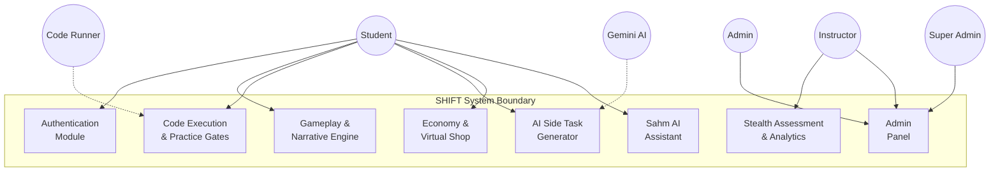

---

## 3. UC-AUTH — Authentication & Registration

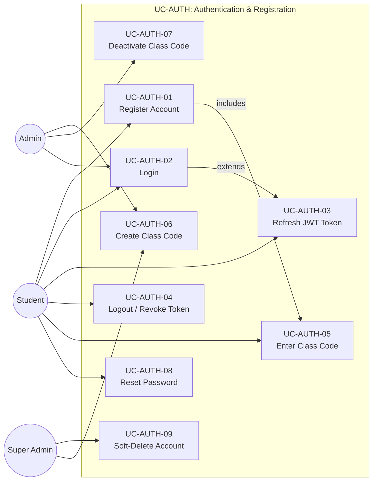

---

## 4. UC-GAME — Core Gameplay & Narrative

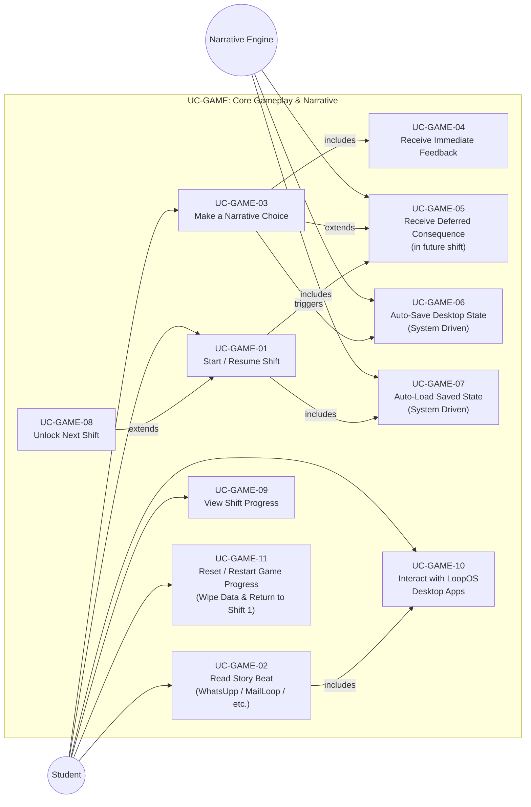

---

## 5. UC-CODE — Practice Gates & Code Submission

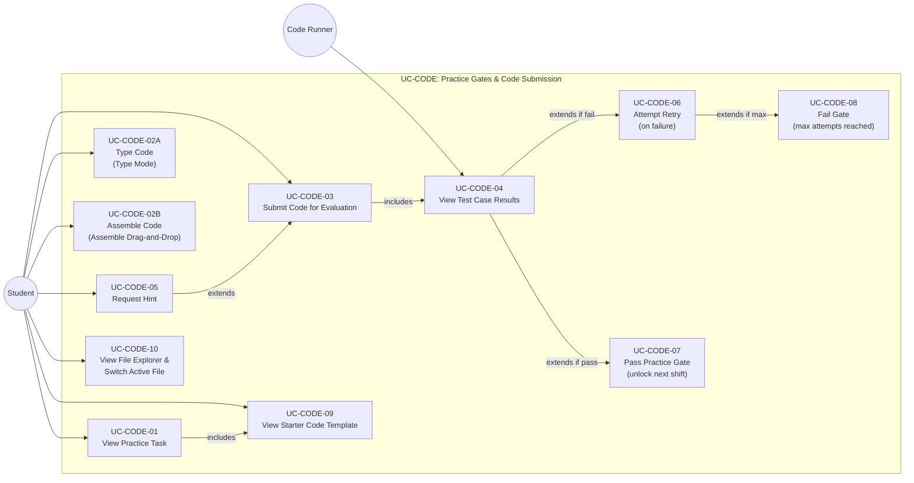

---

## 6. UC-SIDE — AI Side Tasks

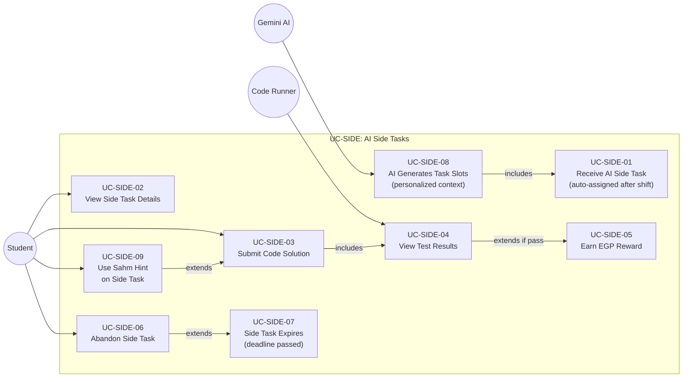

---

## 7. UC-ECO — Economy & Virtual Shop

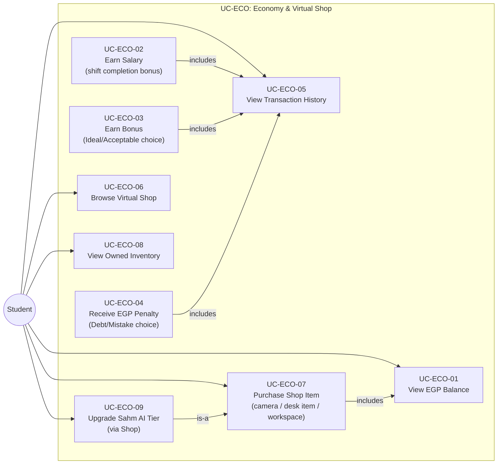

---

## 8. UC-SAHM — Sahm AI Assistant

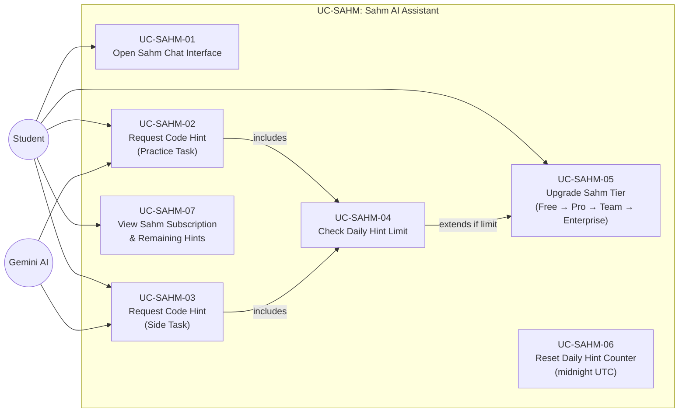

---

## 9. UC-ADMIN — Admin & Teacher Panel

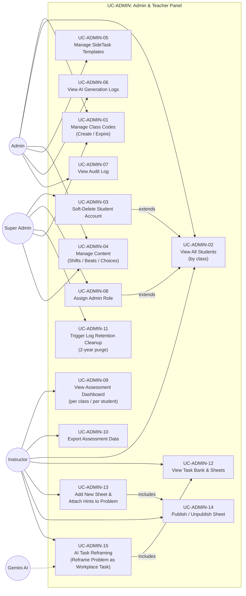

---

## 10. UC-ASSESS — Stealth Assessment & Analytics

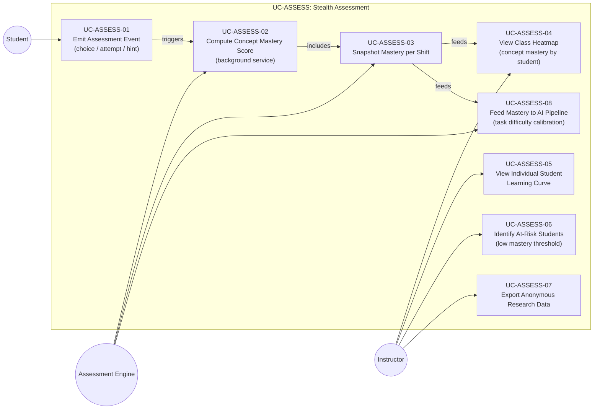

---

## 11. UC-APPS — LoopOS Desktop Apps Suite

### 11.1 UC-DESK — Desktop Interactions & Window Management

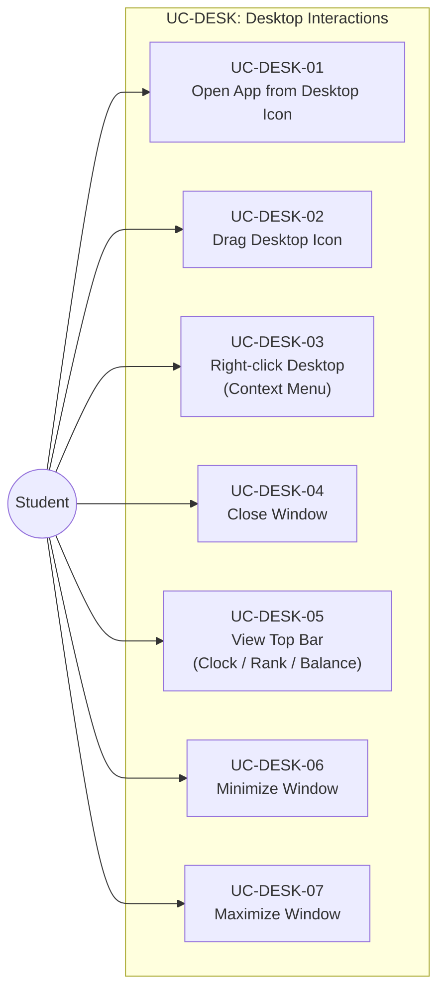

### 11.2 UC-CHAT — WhatsUpp Chat Application

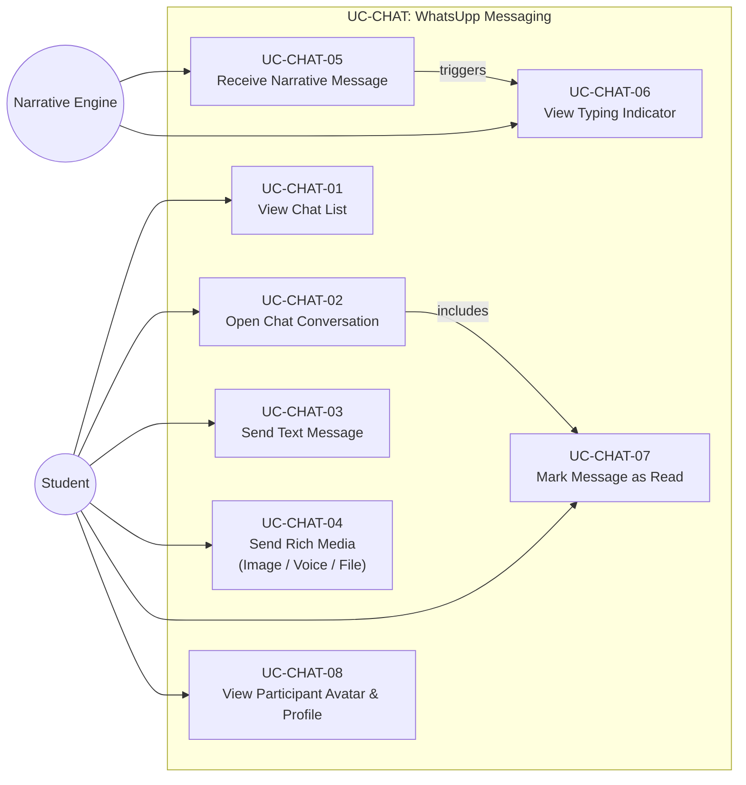

### 11.3 UC-MAIL — MailLoop Email Application

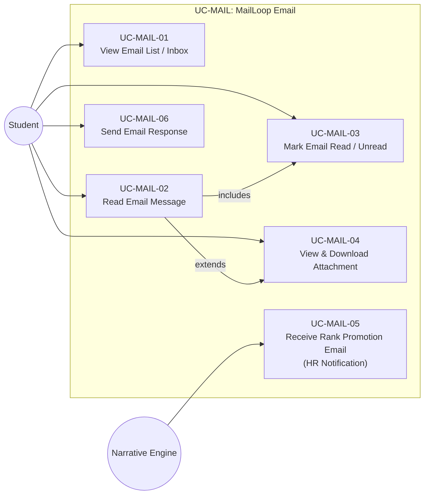

### 11.4 UC-FILES & UC-TERM — File Manager & Terminal

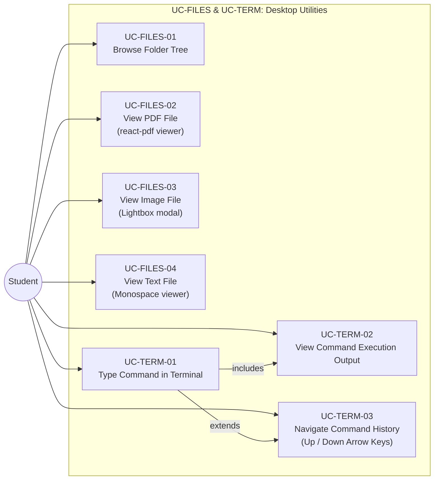

### 11.5 UC-CALL & UC-NOTIF — Video Calls & System Notifications

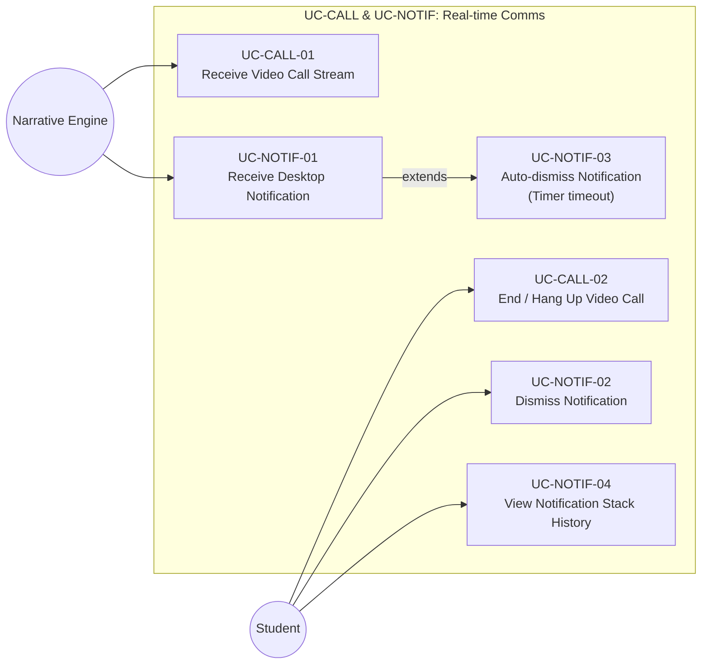

---

## 11. Use Case Specifications (Detailed)

---

### UC-AUTH-01 — Register Account

| Field | Detail |
|---|---|
| **Use Case ID** | UC-AUTH-01 |
| **Name** | Register Account |
| **Actor** | Student |
| **Trigger** | Student visits the SHIFT web app for the first time |
| **Preconditions** | Student has a valid university email and a class code issued by their instructor |
| **Postconditions** | `ApplicationUser` and `Player` rows created; JWT issued; student assigned `player` role |
| **Main Flow** | 1. Student enters email, display name, university student ID, and password. 2. System validates uniqueness of email. 3. System SHA-256 hashes the student ID and stores the hash. 4. ASP.NET Identity creates `ApplicationUser` with hashed password. 5. System creates linked `Player` row (status: `Intern`, rank: `Intern`). 6. System creates `PlayerEconomy` row with `balance = 0`. 7. System prompts for class code entry (→ UC-AUTH-05). 8. JWT access token + refresh token issued. |
| **Alternate Flow** | Email already registered → show error "Email already in use". |
| **Exception** | Invalid class code → registration blocked until valid code entered. |
| **Related Tables** | `ApplicationUser`, `Player`, `PlayerEconomy`, `RefreshToken`, `ClassCode` |

---

### UC-AUTH-02 — Login

| Field | Detail |
|---|---|
| **Use Case ID** | UC-AUTH-02 |
| **Name** | Login |
| **Actor** | Student, Admin, Super Admin |
| **Trigger** | User submits login credentials |
| **Preconditions** | Account exists and `is_active = 1` |
| **Postconditions** | JWT access token and refresh token issued; `RefreshToken` row inserted |
| **Main Flow** | 1. User enters email + password. 2. ASP.NET Identity validates password hash. 3. System checks `lockout_end` (if locked, deny). 4. System issues JWT (15-min expiry) and generates SHA-256 refresh token hash. 5. `RefreshToken` row inserted with `expires_at = +7 days`. 6. User redirected to LoopOS desktop. |
| **Alternate Flow** | Wrong password → increment `access_failed_count`; after 5 fails → lockout for 15 min. |
| **Related Tables** | `ApplicationUser`, `RefreshToken` |

---

### UC-GAME-01 — Start / Resume Shift

| Field | Detail |
|---|---|
| **Use Case ID** | UC-GAME-01 |
| **Name** | Start / Resume Shift |
| **Actor** | Student |
| **Trigger** | Student clicks a shift on the LoopOS desktop or it auto-loads after login |
| **Preconditions** | Player's rank and mastery score meet `Shift.unlock_condition`; previous shift completed |
| **Postconditions** | `PlayerShiftProgress` row upserted with `status = 'in_progress'`; pending consequences from `ConsequenceQueue` injected into narrative |
| **Main Flow** | 1. System evaluates `Shift.unlock_condition` JSON against player's current rank and mastery. 2. System queries `ConsequenceQueue` for `player_id` WHERE consequence beat `shift_id` = this shift AND `status = 'pending'`. 3. Pending consequence beats are pre-pended (start) or appended (end) to the shift narrative. 4. `ConsequenceQueue` rows updated to `status = 'fired'`. 5. Narrative engine begins streaming story beats sequentially. 6. `PlayerShiftProgress` created or updated. |
| **Alternate Flow** | Existing save state available → System automatically loads `PlayerSave.desktop_state` (→ UC-GAME-07). |
| **Related Tables** | `Shift`, `PlayerShiftProgress`, `ConsequenceQueue`, `Consequence`, `StoryBeat`, `PlayerSave` |

---

### UC-GAME-03 — Make a Narrative Choice

| Field | Detail |
|---|---|
| **Use Case ID** | UC-GAME-03 |
| **Name** | Make a Narrative Choice |
| **Actor** | Student |
| **Trigger** | A `StoryBeat` with `has_choices = 1` is displayed and the student selects one of 4 options |
| **Preconditions** | Player is in an active shift; beat with choices has been rendered |
| **Postconditions** | `PlayerChoice` row logged; EGP adjusted; consequence queued if applicable; `AssessmentEvent` emitted |
| **Main Flow** | 1. Frontend displays 4 choice buttons from `Choice` rows linked to the beat. 2. Student clicks one choice. 3. System inserts immutable `PlayerChoice` record. 4. System applies `Choice.egp_delta` → updates `PlayerEconomy.balance` and inserts `Transaction` row. 5. System shows `Choice.immediate_feedback` toast notification. 6. If `Choice.consequence_id IS NOT NULL` → insert `ConsequenceQueue` row (`status = 'pending'`). 7. System emits `AssessmentEvent` (type: `choice_submission`, tier, concept tag). 8. Narrative engine advances to the next beat. |
| **Alternate Flow** | Player selects Debt/Mistake tier → EGP penalty applied; negative `Transaction` logged. |
| **Related Tables** | `Choice`, `PlayerChoice`, `PlayerEconomy`, `Transaction`, `ConsequenceQueue`, `Consequence`, `AssessmentEvent` |

---

### UC-GAME-11 — Reset / Restart Game Progress

| Field | Detail |
|---|---|
| **Use Case ID** | UC-GAME-11 |
| **Name** | Reset / Restart Game Progress |
| **Actor** | Student |
| **Trigger** | Student selects "Reset Progress / Restart Game" in LoopOS System Settings |
| **Preconditions** | Student is logged in and has active gameplay history/progress (e.g. at Shift 2, 3, or 4) |
| **Postconditions** | All per-player runtime records (`PlayerShiftProgress`, `PlayerChoice`, `ConsequenceQueue`, `PlayerSideTask`, `PlayerInventory`) wiped; `Player.rank` reset to `Intern`; `PlayerEconomy.balance` reset to 0 EGP; player restarted at Shift 1 |
| **Main Flow** | 1. Student opens LoopOS System Settings and clicks "Restart Game from Beginning". 2. System displays a confirmation modal warning that all progress, choices, inventory items, and EGP balance will be permanently erased. 3. Student confirms the reset action. 4. System executes a database transaction deleting all `PlayerShiftProgress`, `PlayerChoice`, `ConsequenceQueue`, `PlayerSideTask`, `PlayerInventory`, and non-system `Transaction` records for `player_id`. 5. System updates `Player.rank = 'Intern'` and resets `PlayerEconomy.balance = 0`. 6. System creates a new initial `PlayerShiftProgress` for Shift 1 (`status = 'in_progress'`). 7. System auto-saves initial state (UC-GAME-06) and redirects student to Shift 1 intro beat. |
| **Alternate Flow** | Student cancels confirmation prompt → reset sequence is aborted and current progress remains unchanged. |
| **Related Tables** | `Player`, `PlayerShiftProgress`, `PlayerChoice`, `ConsequenceQueue`, `PlayerSideTask`, `PlayerInventory`, `PlayerEconomy`, `Transaction` |

---

### UC-CODE-03 — Submit Code for Evaluation

| Field | Detail |
|---|---|
| **Use Case ID** | UC-CODE-03 |
| **Name** | Submit Code for Evaluation |
| **Actor** | Student, Code Runner |
| **Trigger** | Student clicks "Run & Submit" in LoopCode IDE |
| **Preconditions** | Player is at a practice gate (`PlayerShiftProgress.status = 'gate_pending'`); task is active |
| **Postconditions** | `PracticeAttempt` row inserted; test results stored as JSON; gate cleared or retry enabled |
| **Main Flow** | 1. Student writes C code in LoopCode IDE. 2. Student submits code. 3. System sends code to sandboxed Code Runner. 4. Code Runner executes against all `TestCase` rows for the task. 5. Results returned as `TestCaseResult[]` JSON. 6. `PracticeAttempt` row inserted with `test_results`, `tier`, `time_spent_sec`, `hint_used`. 7. `AssessmentEvent` emitted (type: `practice_attempt`). 8. If all visible tests pass → compute tier → if Ideal/Acceptable → gate cleared → `PlayerShiftProgress.status = 'completed'` → EGP reward applied. 9. If tests fail → increment `gate_attempts`. |
| **Alternate Flow** | `max_attempts` reached → UC-CODE-08 (gate locked). |
| **Exception** | Code Runner timeout (>5 sec) → mark attempt as `Mistake` tier, no EGP awarded. |
| **Related Tables** | `PracticeAttempt`, `PracticeTask`, `TestCase`, `PlayerShiftProgress`, `PlayerEconomy`, `Transaction`, `AssessmentEvent` |

---

### UC-SIDE-01 — Receive AI Side Task

| Field | Detail |
|---|---|
| **Use Case ID** | UC-SIDE-01 |
| **Name** | Receive AI Side Task |
| **Actor** | Student (passive), Gemini AI |
| **Trigger** | Player completes a shift gate or reaches required rank threshold |
| **Preconditions** | Active `SideTaskTemplate` exists matching player's rank; player has no expired uncompleted task |
| **Postconditions** | `PlayerSideTask` row created with AI-filled slot values; `AiGenerationLog` row inserted |
| **Main Flow** | 1. System selects a `SideTaskTemplate` matching `rank_required = player.rank`. 2. System calls Gemini API with `slots_schema` JSON + Egyptian cultural context prompt. 3. AI returns filled slot values (e.g., product name, price, quantity). 4. System validates response against `slots_schema`. 5. `AiGenerationLog` inserted (prompt, response, latency, tokens). 6. System resolves `title_template` and `description_template` with slot values. 7. `PlayerSideTask` inserted with `status = 'active'`, `deadline_at = +72h`, computed `egp_reward`. |
| **Alternate Flow** | AI validation fails → retry up to 3 times → if all fail, fallback to pre-written template slots. |
| **Related Tables** | `PlayerSideTask`, `SideTaskTemplate`, `AiGenerationLog`, `Player` |

---

### UC-ECO-06 — Purchase Shop Item

| Field | Detail |
|---|---|
| **Use Case ID** | UC-ECO-06 |
| **Name** | Purchase Shop Item |
| **Actor** | Student |
| **Trigger** | Student clicks "Buy" on a shop item in the virtual shop |
| **Preconditions** | Item `is_available = 1`; player rank meets `rank_required`; `PlayerEconomy.balance >= item.price`; item not already owned |
| **Postconditions** | `PlayerInventory` row created; `Transaction` row (debit) inserted; balance updated |
| **Main Flow** | 1. Student browses `ShopItem` catalogue (filtered by `is_available` and `rank_required`). 2. Student selects an item and confirms purchase. 3. System verifies balance sufficiency (within a DB transaction). 4. System deducts `item.price` from `PlayerEconomy.balance`. 5. System inserts negative `Transaction` row (`transaction_type = 'purchase'`). 6. System inserts `PlayerInventory` row. 7. Item becomes accessible on LoopOS desktop (wallpaper, desk decoration, etc.). |
| **Alternate Flow** | Insufficient balance → show error with current balance and item price. |
| **Exception** | Item already owned (UNIQUE constraint) → show "Already owned" badge. |
| **Related Tables** | `ShopItem`, `PlayerInventory`, `PlayerEconomy`, `Transaction` |

---

### UC-ADMIN-04 — Manage Content (Shifts / Beats / Choices)

| Field | Detail |
|---|---|
| **Use Case ID** | UC-ADMIN-04 |
| **Name** | Manage Narrative Content |
| **Actor** | Admin, Super Admin |
| **Trigger** | Content update needed (new chapter, bug fix in dialogue, consequence authoring) |
| **Preconditions** | Actor has `admin` or `super_admin` role |
| **Postconditions** | `Shift`, `StoryBeat`, `Choice`, or `Consequence` rows created/updated; audit logged |
| **Main Flow** | 1. Admin opens content management panel. 2. Admin selects shift to edit or creates a new shift. 3. Admin adds/edits `StoryBeat` rows (sets `beat_type`, `app`, `content_json`, `sequence_order`). 4. For choice beats, admin defines up to 4 `Choice` rows (tier, feedback, egp_delta). 5. If a choice has a deferred consequence: admin creates a `StoryBeat` with `beat_type = 'consequence'` and `shift_id = target_shift`; then creates a `Consequence` row (`beat_id`, `inject_position`); then links `Choice.consequence_id`. 6. All changes logged to `AuditLog`. |
| **Related Tables** | `Shift`, `StoryBeat`, `Choice`, `Consequence`, `AuditLog` |

---

### UC-ASSESS-01 — Emit Assessment Event

| Field | Detail |
|---|---|
| **Use Case ID** | UC-ASSESS-01 |
| **Name** | Emit Assessment Event |
| **Actor** | Student (implicit), Assessment Engine |
| **Trigger** | Any meaningful gameplay action occurs |
| **Preconditions** | Player is in an active session |
| **Postconditions** | `AssessmentEvent` row inserted; mastery computation queued |
| **Event Types** | `choice_submission`, `practice_attempt`, `hint_request`, `side_task_submission`, `desktop_interaction`, `consequence_trigger`, `gate_cleared`, `shift_completed` |
| **Main Flow** | 1. Gameplay action fires a domain event internally. 2. Event handler packages `player_id`, `event_type`, `concept_tag`, `tier`, `payload` JSON, `session_id`. 3. Event queued in .NET `System.Threading.Channels` for batch insert. 4. Background worker batch-inserts into `AssessmentEvent` table (avoids blocking HTTP request). 5. After every shift completion, Assessment Engine recomputes `ConceptMasterySnapshot`. |
| **Related Tables** | `AssessmentEvent`, `ConceptMasterySnapshot`, `Player` |

---

### UC-CHAT-01 — WhatsUpp Chat Messaging & Rich Media

| Field | Detail |
|---|---|
| **Use Case ID** | UC-CHAT-01 |
| **Name** | WhatsUpp Chat Messaging & Rich Media |
| **Actor** | Student, Narrative Engine |
| **Trigger** | Story beat rendered in WhatsUpp or Student sends message |
| **Preconditions** | Active shift session; WhatsUpp desktop window open |
| **Postconditions** | Message appended to chat stream; typing indicator rendered; read status updated |
| **Main Flow** | 1. Narrative Engine pushes story beat (`app = 'WhatsUpp'`). 2. Frontend renders typing indicator (`UC-CHAT-06`) for sender avatar (`UC-CHAT-08`). 3. Message payload displayed (Text, Image, Voice note player, or File download attachment). 4. Student reads message and status toggles to Read (`UC-CHAT-07`). 5. If interactive beat, student sends text/response choice (`UC-CHAT-03`). |
| **Related Tables** | `StoryBeat`, `AssessmentEvent` |

---

### UC-MAIL-01 — MailLoop Email & HR Rank Notifications

| Field | Detail |
|---|---|
| **Use Case ID** | UC-MAIL-01 |
| **Name** | MailLoop Email & HR Rank Notifications |
| **Actor** | Student, Narrative Engine |
| **Trigger** | HR rank promotion unlocked or email beat received |
| **Preconditions** | Player completes shift requirement / rank promotion condition |
| **Postconditions** | Official email delivered to Inbox; attachments downloadable; player rank updated |
| **Main Flow** | 1. Player reaches new rank threshold (e.g. Fresh → Experienced Junior). 2. Narrative Engine delivers HR Rank Promotion Email with official company letterhead. 3. Student views inbox (`UC-MAIL-01`), opens email (`UC-MAIL-02`), and downloads attached contract/badge (`UC-MAIL-04`). 4. System updates `Player.rank`. |
| **Related Tables** | `StoryBeat`, `Player`, `AssessmentEvent` |

---

### UC-CODE-02B — LoopCode Assemble Mode (Drag-and-Drop C Blocks)

| Field | Detail |
|---|---|
| **Use Case ID** | UC-CODE-02B |
| **Name** | Assemble Code (Drag-and-Drop Mode) |
| **Actor** | Student |
| **Trigger** | Student switches LoopCode IDE tab to "Assemble Mode" |
| **Preconditions** | Practice task active; task supports scaffolded assembly |
| **Postconditions** | Drag-and-drop code blocks compiled into valid C code string in editor |
| **Main Flow** | 1. Student selects "Assemble Mode" toggle in LoopCode toolbar. 2. UI presents draggable C code snippet blocks (variables, loops, conditions). 3. Student drags blocks into target drop zones in sequence. 4. Code editor updates real-time assembled C code. 5. Student submits code for evaluation (→ UC-CODE-03). |
| **Related Tables** | `PracticeTask`, `PracticeAttempt` |

---

### UC-ADMIN-13 — Teacher Sheet Management & Task Bank

| Field | Detail |
|---|---|
| **Use Case ID** | UC-ADMIN-13 |
| **Name** | Teacher Sheet Management & Task Bank |
| **Actor** | Instructor |
| **Trigger** | Instructor accesses Admin Dashboard content tab |
| **Preconditions** | User authenticated with `Instructor` role |
| **Postconditions** | New problem sheet created; hints attached; sheet status set to published |
| **Main Flow** | 1. Instructor browses Task Bank repository (`UC-ADMIN-12`). 2. Instructor clicks "Add New Sheet" (`UC-ADMIN-13`). 3. Instructor enters programming problems, test cases, and attach hints (`UC-SAHM-01`). 4. Instructor toggles "Publish Sheet" (`UC-ADMIN-14`). 5. Problems become available for student assignment. |
| **Related Tables** | `PracticeTask`, `TestCase`, `AuditLog` |

---

### UC-ADMIN-15 — AI Task Reframing (Workplace Transformation)

| Field | Detail |
|---|---|
| **Use Case ID** | UC-ADMIN-15 |
| **Name** | AI Task Reframing (Workplace Scenario Transformation) |
| **Actor** | Instructor, Gemini AI |
| **Trigger** | Instructor clicks "Reframe Problem as Company Task" |
| **Preconditions** | Raw academic problem sheet selected from database |
| **Postconditions** | Problem statement rewritten into LoopCorp workplace narrative task |
| **Main Flow** | 1. System reads academic problem sheet from database. 2. Instructor requests AI reframing. 3. System prompts Gemini AI pipeline with Egyptian corporate context persona. 4. AI transforms dry academic problem (e.g. "sort array") into immersive company task (e.g. "sort client transactions for LoopBank"). 5. Reframed task previewed and saved to `SideTaskTemplate` / `PracticeTask`. |
| **Related Tables** | `SideTaskTemplate`, `PracticeTask`, `AiGenerationLog` |

---

## Appendix — Actor × Use Case Matrix

| Use Case | Student | Instructor | Admin | Super Admin | Narrative Engine | Code Runner | Gemini AI | Assessment Engine |
|---|:---:|:---:|:---:|:---:|:---:|:---:|:---:|:---:|
| UC-AUTH-01 Register | ✅ | | | | | | | |
| UC-AUTH-02 Login | ✅ | ✅ | ✅ | ✅ | | | | |
| UC-AUTH-05 Enter Class Code | ✅ | | | | | | | |
| UC-AUTH-06 Create Class Code | | | ✅ | ✅ | | | | |
| UC-GAME-01 Start/Resume Shift | ✅ | | | | ✅ | | | |
| UC-GAME-03 Make Choice | ✅ | | | | | | | |
| UC-GAME-04 Receive Consequence | ✅ | | | | ✅ | | | |
| UC-GAME-06 Auto-Save Desktop State | | | | | ✅ | | | |
| UC-GAME-07 Auto-Load Saved State | | | | | ✅ | | | |
| UC-GAME-11 Reset Game Progress | ✅ | | | | | | | |
| UC-DESK-01 Desktop Interactions & Window Controls | ✅ | | | | | | | |
| UC-CHAT-03 WhatsUpp Messaging & Media | ✅ | | | | ✅ | | | |
| UC-MAIL-02 MailLoop Email & HR Promotion | ✅ | | | | ✅ | | | |
| UC-CODE-01 View Practice Task | ✅ | | | | | | | |
| UC-CODE-02B Assemble Code (Drag-Drop) | ✅ | | | | | | | |
| UC-CODE-03 Submit Code | ✅ | | | | | ✅ | | |
| UC-CODE-07 Pass Practice Gate | ✅ | | | | | | | |
| UC-FILES-02 View File (PDF / Image / Text) | ✅ | | | | | | | |
| UC-TERM-01 Type Terminal Command | ✅ | | | | | | | |
| UC-CALL-01 Receive Video Call Stream | ✅ | | | | ✅ | | | |
| UC-SIDE-01 Receive AI Side Task | ✅ | | | | | | ✅ | |
| UC-SIDE-03 Submit Side Task | ✅ | | | | | ✅ | | |
| UC-ECO-01 View Balance | ✅ | | | | | | | |
| UC-ECO-06 Purchase Shop Item | ✅ | | | | | | | |
| UC-ECO-08 Upgrade Sahm | ✅ | | | | | | | |
| UC-SAHM-02 Request Code Hint | ✅ | | | | | | ✅ | |
| UC-ADMIN-01 Manage Class Codes | | | ✅ | ✅ | | | | |
| UC-ADMIN-04 Manage Content | | | ✅ | ✅ | | | | |
| UC-ADMIN-09 Assessment Dashboard | | ✅ | | | | | | |
| UC-ADMIN-13 Manage Task Bank & Sheets | | ✅ | | | | | | |
| UC-ADMIN-15 AI Task Reframing | | ✅ | | | | | ✅ | |
| UC-ASSESS-01 Emit Assessment Event | ✅ | | | | | | | ✅ |
| UC-ASSESS-02 Compute Mastery | | | | | | | | ✅ |
| UC-ASSESS-04 View Heatmap | | ✅ | | | | | | |

---

*Document: SHIFT Use Cases v1.0 | Helwan University CS Department, 2026*
*Derived from: SHIFT_SRS_v1.0.pdf, SHIFT_ER_Diagram.md v2.2 & Use Cases.pdf*
