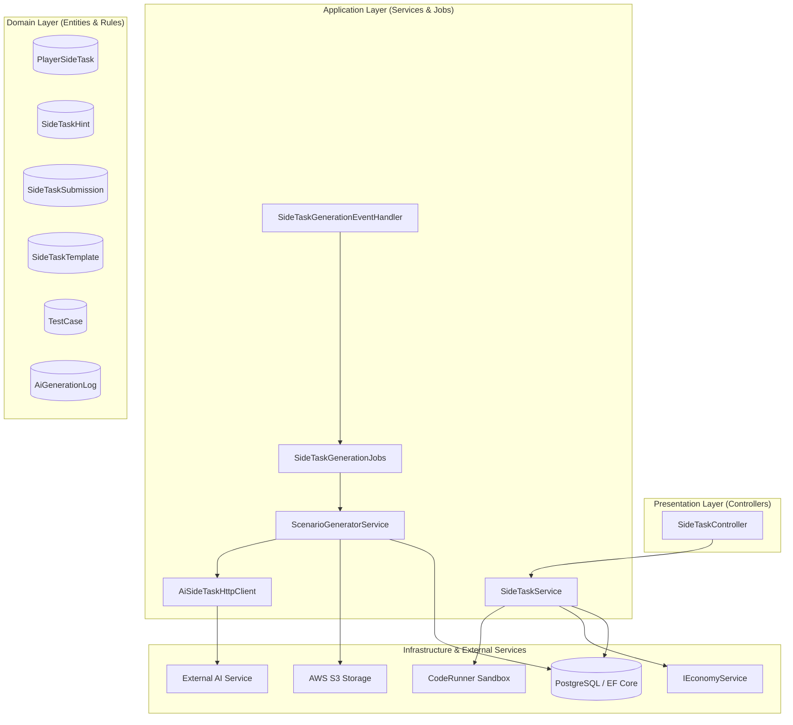
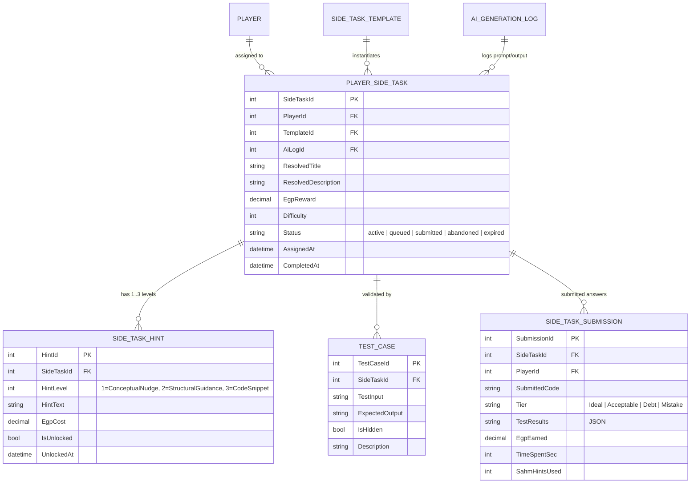
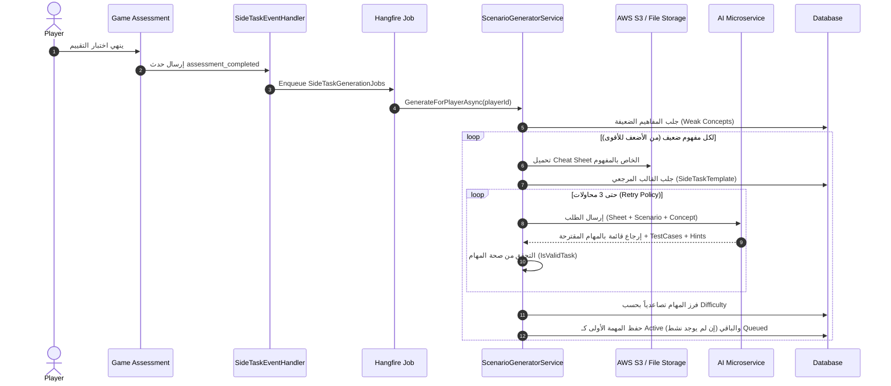
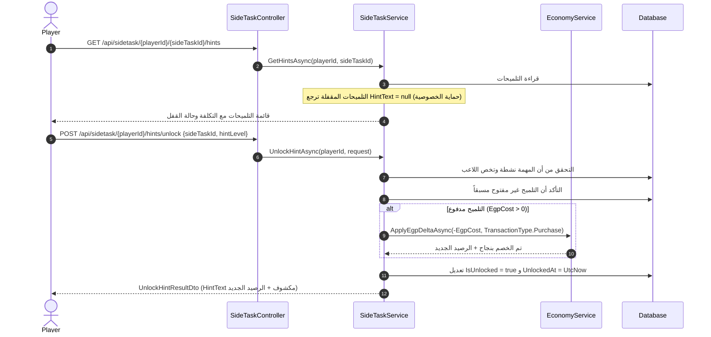

# توثيق نظام المهام الجانبية (Side Task System Documentation)

يقدم هذا المستند دليلاً شاملاً وتفصيلياً لنظام **المهام الجانبية (Side Task System)** في مشروع **LoopGame**؛ موضحاً المعمارية البرمجية، دورة الحياة الكاملة للمهمة (Lifecycle)، نظام توليد المهام بالذكاء الاصطناعي (AI Generation)، نظام التلميحات المتدرجة (Hints System)، التقييم وتنفيذ الأكواد، والتكامل مع النظام المالي (Economy) وقواعد البيانات.

---

## فهرس المحتويات (Table of Contents)
1. [نظرة عامة والهدف من النظام (Overview & Purpose)](#1-نظرة-عامة-والهدف-من-النظام-overview--purpose)
2. [المعمارية ومكونات النظام (System Architecture & Components)](#2-المعمارية-ومكونات-النظام-system-architecture--components)
3. [مخطط الكيانات وقاعدة البيانات (Database Schema & Entities)](#3-مخطط-الكيانات-وقاعدة-البيانات-database-schema--entities)
4. [دورة حياة المهمة وتدفق العمليات (End-to-End Workflow & Lifecycle)](#4-دورة-حياة-المهمة-وتدفق-العمليات-end-to-end-workflow--lifecycle)
   - [أ. مرحلة التوليد بالذكاء الاصطناعي (AI Generation Flow)](#أ-مرحلة-التوليد-بالذكاء-الاصطناعي-ai-generation-flow)
   - [ب. ترتيب الصعوبة وطابور المهام (Difficulty Sorting & Task Queuing)](#ب-ترتيب-الصعوبة-وطابور-المهام-difficulty-sorting--task-queuing)
   - [ج. نظام التلميحات المتدرجة (Progressive Hint Unlocking)](#ج-نظام-التلميحات-المتدرجة-progressive-hint-unlocking)
   - [د. تسليم الكود والتقييم (Code Submission & Grading)](#د-تسليم-الكود-والتقييم-code-submission--grading)
   - [هـ. الانسحاب والخصم المالي (Abandon Task & Penalty)](#هـ-الانسحاب-والخصم-المالي-abandon-task--penalty)
   - [و. الترقية التلقائية للمهمة التالية (Auto Promotion of Next Task)](#و-الترقية-التلقائية-للمهمة-التالية-auto-promotion-of-next-task)
5. [توثيق واجهات برمجة التطبيقات (API Reference & DTOs)](#5-توثيق-واجهات-برمجة-التطبيقات-api-reference--dtos)
6. [نظام الحماية ومعاملات الأمان (Transactions & Concurrency Safety)](#6-نظام-الحماية-ومعاملات-الأمان-transactions--concurrency-safety)
7. [قائمة الأخطاء وحالات الفشل (Error Handling & Error Codes)](#7-قائمة-الأخطاء-وحالات-الفشل-error-handling--error-codes)

---

## 1. نظرة عامة والهدف من النظام (Overview & Purpose)

نظام **Side Task** هو نظام تعليمي تكيفي (Adaptive Learning System) داخل لعبة **LoopGame**، يهدف إلى:
1. **استهداف نقاط الضعف الفردية**: بمجرد إنهاء اللاعب لاختبار تقييمي (`assessment_completed`)، يكتشف النظام المفاهيم البرمجية (Concepts) التي واجه اللاعب صعوبة فيها.
2. **توليد مهام برمجية ديناميكية مخصصة**: بالاعتماد على نماذج الذكاء الاصطناعي (AI Generation) وملفات الشرح (Cheat Sheets) المخزنة على AWS S3، يتم توليد تحديات برمجية مناسبة مع حالات اختبار (Test Cases) وتلميحات مسبقة الصنع (Pre-generated Hints).
3. **التدرج في الصعوبة**: يتم فرز المهام وتعيينها من الأسهل للأصعب، حيث تصبح المهمة الأسهل نشطة أولاً (`Active`) بينما تنتظر باقي المهام في الطابور (`Queued`).
4. **الربط بالاقتصاد الافتراضي (Economy/EGP)**: يربح اللاعب عملة (EGP) بناءً على دقة حله وسرعته، ويدفع مقابل التلميحات المتقدمة، أو يدفع غرامة عند الانسحاب.

---

## 2. المعمارية ومكونات النظام (System Architecture & Components)

ينقسم النظام عبر الطبقات المعمارية النظيفة (Clean Architecture) كما يلي:



### المكونات الرئيسية:
- **`SideTaskController`**: يوفر الـ Endpoints لاستعراض المهمة النشطة (`GetActiveTask`)، تسليم الحل والتقييم (`SubmitSideTask`)، الانسحاب من المهمة (`AbandonTask`)، تعيين مهمة يدوياً (`AssignTask`)، استعراض التلميحات (`GetHints`) وفتح التلميحات بالدفع (`UnlockHint`).
- **`SideTaskService`**: يدير منطق الأعمال الخاص بعرض المهمة النشطة، فتح التلميحات مع خصم الرصيد، تقييم الأكواد، معالجة الانسحاب، وترقية المهام التالية.
- **`ScenarioGeneratorService`**: خط الإنتاج المسؤول عن قراءة نقاط الضعف، جلب الملفات المرجعية من S3، استدعاء الذكاء الاصطناعي مع سياسة إعادة المحاولة (3 محاولات)، والتحقق من صحة المهام وتخزينها مرتبة بالصعوبة.
- **`SideTaskGenerationEventHandler` & `SideTaskGenerationJobs`**: الاستماع لأحداث `assessment_completed` وتشغيل مهمة التوليد في الخلفية عبر Hangfire دون تعطيل استجابة المستخدم.

---

## 3. مخطط الكيانات وقاعدة البيانات (Database Schema & Entities)



### حالات المهمة (`SideTaskStatus` Enum):
- `Active`: المهمة الحالية التي يعمل عليها اللاعب. (يوجد مهمة نشطة واحدة فقط للاعب في الوقت ذاته).
- `Queued`: مهمة تم توليدها وتنتظر دورها في الطابور بعد إتمام أو إلغاء المهمة الحالية.
- `Submitted`: مهمة تم حلها وتسليمها بنجاح واحتساب نتيجتها.
- `Abandoned`: مهمة قام اللاعب بالانسحاب منها مع تطبيق الغرامة.
- `Expired`: مهمة انتهت صلاحيتها الزمنية (إن وجدت).

---

## 4. دورة حياة المهمة وتدفق العمليات (End-to-End Workflow & Lifecycle)

### أ. مرحلة التوليد بالذكاء الاصطناعي (AI Generation Flow)



### ب. ترتيب الصعوبة وطابور المهام (Difficulty Sorting & Task Queuing)
1. يتم ترتيب المهام الناتجة عن الـ AI تصاعدياً حسب قيمة `Difficulty` (الأسهل أولاً).
2. عند الحفظ في قاعدة البيانات:
   - إذا لم يكن لدى اللاعب أي مهمة `Active` حالياً، تأخذ المهمة الأولى الأسهل حالة `Active`.
   - باقي المهام تأخذ حالة `Queued`.
   - في حال كان لدى اللاعب بالفعل مهمة نشطة سابقة، تدخل جميع المهام الجديدة في حالة `Queued`.

---

### ج. نظام التلميحات المتدرجة (Progressive Hint Unlocking)

لكل مهمة برمجية، يقوم الذكاء الاصطناعي بتوليد حتى **3 مستويات** من التلميحات:

| المستوى (Hint Level) | الاسم (Enum Name) | التكلفة النموذجية (EGP) | نوع المساعدة |
| :--- | :--- | :--- | :--- |
| **Level 1** | `ConceptualNudge` | مجاني (`0 EGP`) | تنبيه أو توجيه مفاهيمي بسيط لفهم الفكرة العامة |
| **Level 2** | `StructuralGuidance` | منخفضة (مثلاً `25 EGP`) | توجيه حول هيكلية الحل أو الخوارزمية المطلوبة |
| **Level 3** | `CodeSnippet` | متوسطة (مثلاً `50 EGP`) | جزء من الكود البرمجي أو مثال تطبيقي مباشر |



> **ملاحظة أمنية (Privacy Guard):** عند استدعاء `GetHints`، يتم إرجاع حقل `HintText` كـ `null` لأي تلميح حالته `IsUnlocked == false`؛ لمنع كشف التلميحات عبر فحص شبكة المتصفح (Network Inspection) قبل شرائها.

---

### د. تسليم الكود والتقييم (Code Submission & Grading)

عند إرسال اللاعب لحل المهمة عبر `SubmitSideTaskAsync`:
1. يتم جلب جميع حالات الاختبار (`TestCase`) للمهمة من قاعدة البيانات.
2. يتم تشغيل الكود في بيئة معزولة وآمنة (`ICodeExecutionService`).
3. يتم احتساب نسبة النجاح (`Pass Rate = Passed / Total`):

| نسبة النجاح (Pass Rate) | الفئة (`ChoiceTier`) | نسبة المكافأة من `EgpReward` |
| :--- | :--- | :--- |
| **100%** | `ChoiceTier.Ideal` | **100%** |
| **75% - 99%** | `ChoiceTier.Acceptable` | **75%** |
| **50% - 74%** | `ChoiceTier.Debt` | **25%** |
| **أقل من 50%** | `ChoiceTier.Mistake` | **0%** |

4. يتم حفظ بيانات التسليم (`SideTaskSubmission`) وتحديث حالة المهمة إلى `Submitted`.
5. في حال وجود مكافأة مالية (`EgpEarned > 0`)، يتم إيداعها في محفظة اللاعب عبر `IEconomyService` بنوع معاملة `TransactionType.SideTask`.
6. يتم استدعاء ترقية المهمة التالية تلقائياً (`ActivateNextQueuedTaskAsync`).

---

### هـ. الانسحاب والخصم المالي (Abandon Task & Penalty)

إذا قرر اللاعب عدم إكمال المهمة النشطة والانسحاب (`AbandonTaskAsync`):
1. يتم التحقق من أن المهمة نشطة (`Status == Active`).
2. يتم تحديث حالتها إلى `SideTaskStatus.Abandoned` وتسجيل تاريخ الانتهاء.
3. يتم خصم غرامة الانسحاب الثابتة (`100 EGP`) عبر:
   ```csharp
   _economy.ApplyEgpDeltaAsync(playerId, -EgpPenalties.Abandonment, TransactionType.Penalty, ...)
   ```
4. يتم استدعاء ترقية المهمة التالية من الطابور (`ActivateNextQueuedTaskAsync`).

---

### و. الترقية التلقائية للمهمة التالية (Auto Promotion of Next Task)

عند انتهاء المهمة النشطة (سواء بـ `Submit` أو `Abandon`):
1. يبحث النظام في جدول `PlayerSideTask` عن المهام الخاصة باللاعب ذات الحالة `Queued`.
2. يختار المهمة ذات أقل `Difficulty` (الأسهل أولاً):
   ```csharp
   var nextTaskId = await _unitOfWork.GetRepository<PlayerSideTask>()
       .FindAll(t => t.PlayerId == playerId && t.Status == SideTaskStatus.Queued)
       .OrderBy(t => t.Difficulty)
       .Select(t => (int?)t.SideTaskId)
       .FirstOrDefaultAsync(ct);
   ```
3. يقوم بتغيير حالة المهمة المختارة فوراً إلى `SideTaskStatus.Active`.

---

## 5. توثيق واجهات برمجة التطبيقات (API Reference & DTOs)

### 1. استرجاع المهمة النشطة الحالية (Get Active Task)
- **Endpoint:** `GET /api/sidetask/{playerId}/active`
- **الوصف:** استرجاع تفاصيل المهمة الجانبية النشطة حالياً للاعب.
- **الاستجابة الناجحة (`200 OK` - `SideTaskDto`):**
```json
{
  "sideTaskId": 42,
  "title": "Reverse Array In-Place",
  "description": "Write a function to reverse an integer array in-place without allocating extra arrays.",
  "egpReward": 150.0,
  "status": "Active",
  "conceptTag": "Arrays"
}
```

---

### 2. تسليم حل الكود (Submit Solution)
- **Endpoint:** `POST /api/sidetask/{playerId}/submit`
- **Request Body (`SideTaskSubmitRequestDto`):**
```json
{
  "sideTaskId": 42,
  "submittedCode": "public static void Solution(int[] arr) { Array.Reverse(arr); }",
  "timeSpentSec": 120,
  "sahmHintsUsed": 1
}
```
- **الاستجابة الناجحة (`200 OK` - `CodeSubmitResponseDto`):**
```json
{
  "tier": "Ideal",
  "testResults": "[{\"TestCaseId\":1,\"Passed\":true,\"ActualOutput\":\"[5,4,3,2,1]\"}]",
  "egpEarned": 150.0
}
```

---

### 3. الانسحاب من المهمة النشطة (Abandon Task)
- **Endpoint:** `POST /api/sidetask/{playerId}/{sideTaskId}/abandon`
- **الوصف:** إلغاء المهمة وتطبيق غرامة الانسحاب (-100 EGP) وترقية المهمة التالية تلقائياً من الطابور.
- **الاستجابة الناجحة (`200 OK` - `AbandonResultDto`):**
```json
{
  "penaltyApplied": -100.0,
  "newBalance": 400.0
}
```

---

### 4. تعيين مهمة يدوياً كخيار بديل (Assign Task Fallback)
- **Endpoint:** `POST /api/sidetask/{playerId}/assign`
- **الوصف:** تعيين مهمة جديدة من القوالب المتاحة لرتبة اللاعب (إذا لم تكن لديه مهمة نشطة).
- **الاستجابة الناجحة (`200 OK`):** بدون محتوى (Empty).

---

### 5. استعراض التلميحات للمهمة النشطة (Get Hints)
- **Endpoint:** `GET /api/sidetask/{playerId}/{sideTaskId}/hints`
- **الوصف:** استرجاع جميع التلميحات المتاحة للمهمة النشطة ومستوياتها وتكلفتها وحالة فتحها.
- **الاستجابة الناجحة (`200 OK`):**
```json
[
  {
    "hintId": 101,
    "hintLevel": 1,
    "hintLevelName": "ConceptualNudge",
    "egpCost": 0.0,
    "isUnlocked": true,
    "hintText": "تأكد من استخدام حلقة for مناسبة للمرور على المصفوفة."
  },
  {
    "hintId": 102,
    "hintLevel": 2,
    "hintLevelName": "StructuralGuidance",
    "egpCost": 25.0,
    "isUnlocked": false,
    "hintText": null
  },
  {
    "hintId": 103,
    "hintLevel": 3,
    "hintLevelName": "CodeSnippet",
    "egpCost": 50.0,
    "isUnlocked": false,
    "hintText": null
  }
]
```

---

### 6. فتح تلميح مدفوع (Unlock Hint)
- **Endpoint:** `POST /api/sidetask/{playerId}/hints/unlock`
- **Request Body (`UnlockHintRequestDto`):**
```json
{
  "sideTaskId": 42,
  "hintLevel": 2
}
```
- **الاستجابة الناجحة (`200 OK` - `UnlockHintResultDto`):**
```json
{
  "hintId": 102,
  "hintText": "يمكنك تعريف متغير ثنائي المؤشرات (Two Pointers) وتحديث مؤشر البداية والنهاية.",
  "egpCost": 25.0,
  "newBalance": 475.0
}
```

---

### 3. ملخص كائنات نقل البيانات (DTOs Summary)

```csharp
// المهمة النشطة للاعب
public record SideTaskDto(
    int SideTaskId,
    string Title,
    string Description,
    decimal EgpReward,
    string Status,
    string ConceptTag
);

// طلب تسليم الكود
public record SideTaskSubmitRequestDto(
    int SideTaskId,
    string SubmittedCode,
    int TimeSpentSec,
    byte SahmHintsUsed
);

// نتيجة الانسحاب
public record AbandonResultDto(
    decimal PenaltyApplied, // -100 EGP
    decimal NewBalance
);

// استعراض تلميح
public record SideTaskHintDto(
    int HintId,
    int HintLevel,
    string HintLevelName,
    decimal EgpCost,
    bool IsUnlocked,
    string? HintText
);

// طلب فتح تلميح
public record UnlockHintRequestDto(
    int SideTaskId,
    int HintLevel
);

// نتيجة فتح التلميح
public record UnlockHintResultDto(
    int HintId,
    string HintText,
    decimal EgpCost,
    decimal NewBalance
);
```

---

## 6. نظام الحماية ومعاملات الأمان (Transactions & Concurrency Safety)

1. **معاملات فتح التلميحات (Transactional Hint Unlocking)**:
   - يتم تغليف خصم الرصيد وتعديل حالة التلميح إلى `IsUnlocked = true` داخل معاملة قاعدة بيانات واحدة (`BeginTransactionAsync` / `CommitAsync`).
   - في حال فشل الخصم أو حدوث أي استثناء، يتم التراجع الفوري (`RollbackAsync`) لمنع خصم أي رصيد دون كشف نص التلميح.
2. **نوع المعاملة المالية (Transaction Type)**:
   - فتح التلميحات يسجل تحت تصنيف `TransactionType.Purchase`.
   - مكافآت الحل تسجل تحت `TransactionType.SideTask`.
   - غرامات الانسحاب تسجل تحت `TransactionType.Penalty`.
3. **القيود في قاعدة البيانات (Check Constraints)**:
   - جدول `player_side_tasks` يطبق قيد التحقق:
     ```sql
     "Status" IN ('active', 'queued', 'submitted', 'abandoned', 'expired')
     ```

---

## 7. قائمة الأخطاء وحالات الفشل (Error Handling & Error Codes)

تستخدم الطبقات نمط `Result<T>` لإرجاع الأخطاء بوضوح دون رمي استثناءات غير مسيطر عليها:

| كود الخطأ (`SideTaskErrors`) | الوصف والسبب |
| :--- | :--- |
| `SideTask.NoActiveTask` | لا توجد مهمة نشطة حالياً للاعب. |
| `SideTask.AlreadyHasActiveTask` | اللاعب لديه مهمة نشطة بالفعل ولا يمكن تعيين مهمة نشطة أخرى. |
| `SideTask.TaskNotFound` | المهمة المطلوبة غير موجودة أو لا تنتمي لهذا اللاعب. |
| `SideTask.TaskAlreadyClosed` | محاولة تسليم أو إلغاء مهمة تم تسليمها أو إغلاقها سابقاً. |
| `SideTask.HintNotFound` | التلميح أو مستوى التلميح المطلوب غير موجود. |
| `SideTask.HintAlreadyUnlocked` | التلميح المطلوب تم فتحه مسبقاً بالفعل. |
| `SideTask.NoWeakConcepts` | لم يتم العثور على أي مفاهيم ضعيفة لتوليد مهام للاعب. |
| `Economy.InsufficientFunds` | رصيد اللاعب من الـ EGP غير كافٍ لشراء التلميح. |
