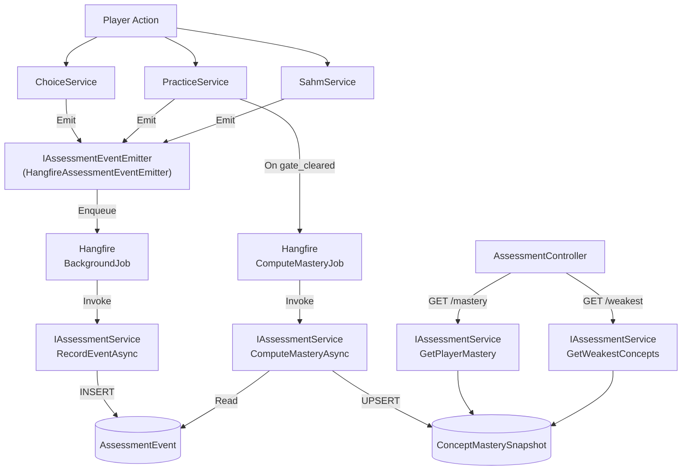

# Assessment Service + Event-Driven Stealth Assessment — Implementation Report

## A. Files Created

| # | File | Purpose |
|---|------|---------|
| 1 | [ConceptMasterySnapshotDto.cs](file:///e:/Projects/LoopGame/LoopGame.Application/Dtos/ConceptMasterySnapshotDto.cs) | Read-only projection DTO for mastery snapshot data |
| 2 | [AssessmentErrors.cs](file:///e:/Projects/LoopGame/LoopGame.Domain/Abstractions/AssessmentErrors.cs) | Typed error constants following the existing `Error` pattern |
| 3 | [AssessmentWeights.cs](file:///e:/Projects/LoopGame/LoopGame.Domain/Constants/AssessmentWeights.cs) | Centralized scoring weights, event types, decay & sigmoid constants |
| 4 | [HangfireAssessmentEventEmitter.cs](file:///e:/Projects/LoopGame/LoopGame.Application/Services/EconomyAndProgressionServices/HangfireAssessmentEventEmitter.cs) | Hangfire-backed replacement for `NoopAssessmentEventEmitter` |
| 5 | [AssessmentJobs.cs](file:///e:/Projects/LoopGame/LoopGame.Application/BackgroundJobs/AssessmentJobs.cs) | Hangfire job class for mastery computation |
| 6 | [AssessmentController.cs](file:///e:/Projects/LoopGame/LoopGame/Controllers/AssessmentController.cs) | Read-only API endpoints for mastery data |

## B. Files Modified

| # | File | Change Summary |
|---|------|---------------|
| 1 | [AssessmentEventDto.cs](file:///e:/Projects/LoopGame/LoopGame.Application/Dtos/AssessmentEventDto.cs) | Extended with optional `SessionId` and `RecordedAt` parameters |
| 2 | [IAssessmentService.cs](file:///e:/Projects/LoopGame/LoopGame.Application/IServices/LearningAndContentServices/IAssessmentService.cs) | Replaced empty stub class with proper `interface` (4 methods) |
| 3 | [AssessmentService.cs](file:///e:/Projects/LoopGame/LoopGame.Application/Services/LearningAndContentServices/AssessmentService.cs) | Full implementation: RecordEvent, ComputeMastery, GetMastery, GetWeakest |
| 4 | [DependencyInjection.cs](file:///e:/Projects/LoopGame/LoopGame.Application/DependencyInjection.cs) | Registered `AssessmentService`, `HangfireAssessmentEventEmitter`, `AssessmentJobs` |
| 5 | [ChoiceService.cs](file:///e:/Projects/LoopGame/LoopGame.Application/Services/LearningAndContentServices/ChoiceService.cs) | Added `IAssessmentEventEmitter` + emits `choice_submission` after SubmitChoice |
| 6 | [PracticeService.cs](file:///e:/Projects/LoopGame/LoopGame.Application/Services/LearningAndContentServices/PracticeService.cs) | Added emitter + emits `practice_attempt`, `gate_cleared`, `shift_completed` + enqueues `ComputeMasteryJob` |
| 7 | [SahmService.cs](file:///e:/Projects/LoopGame/LoopGame.Application/Services/EconomyAndProgressionServices/SahmService.cs) | Replaced hardcoded `"hint_request"` with `AssessmentWeights.EventTypes.HintRequest` + added payload JSON |
| 8 | [Program.cs](file:///e:/Projects/LoopGame/LoopGame/Program.cs) | Added Hangfire configuration with PostgreSQL storage + dev dashboard |
| 9 | [ResultHttpMapping.cs](file:///e:/Projects/LoopGame/LoopGame/Extensions/ResultHttpMapping.cs) | Added Assessment error → HTTP status mappings |
| 10 | [LoopGame.API.csproj](file:///e:/Projects/LoopGame/LoopGame/LoopGame.API.csproj) | Added `Hangfire.Core`, `Hangfire.AspNetCore`, `Hangfire.PostgreSql` packages |
| 11 | [LoopGame.Application.csproj](file:///e:/Projects/LoopGame/LoopGame.Application/LoopGame.Application.csproj) | Added `Hangfire.Core` package |

---

## C. Assessment Architecture



### Data Flow

```
Gameplay Service (e.g. ChoiceService.SubmitChoice)
    ↓ Save PlayerChoice (within gameplay transaction)
    ↓ assessmentEmitter.Emit(dto)  ← fire-and-forget, after save
    ↓
HangfireAssessmentEventEmitter
    ↓ BackgroundJob.Enqueue<IAssessmentService>(RecordEventAsync)
    ↓
Hangfire Worker (separate thread/process)
    ↓ AssessmentService.RecordEventAsync
    ↓
AssessmentEvent INSERT (immutable evidence)
    ↓
On shift completion → Hangfire.Enqueue<AssessmentJobs>(ComputeMasteryJob)
    ↓
AssessmentService.ComputeMasteryAsync
    ↓ Aggregate by ConceptTag
    ↓ Apply weighted scoring
    ↓ Apply recency decay
    ↓ Sigmoid normalize to [0,1]
    ↓
ConceptMasterySnapshot UPSERT
```

---

## D. Events Supported

| Event Type | Emitted By | When |
|-----------|-----------|------|
| `choice_submission` | `ChoiceService.SubmitChoice` | After player choice is persisted |
| `practice_attempt` | `PracticeService.SubmitCode` | After practice code submission is evaluated |
| `gate_cleared` | `PracticeService.SubmitCode` | When gate status becomes `Completed` |
| `shift_completed` | `PracticeService.SubmitCode` | When gate status becomes `Completed` |
| `hint_request` | `SahmService.RequestHintAsync` | After hint counter is incremented and saved |

> [!NOTE]
> `side_task_submission`, `desktop_interaction`, and `consequence_trigger` are defined in `AssessmentWeights.EventTypes` and are valid in the DB check constraint, but no existing service currently generates these events (there is no `SideTaskService` implementation in the Application layer, and `NarrativeService` doesn't have a desktop interaction flow). They can be wired up when those services are built.

---

## E. Hangfire Jobs

### 1. ProcessAssessmentEvent (implicit via `IAssessmentService.RecordEventAsync`)

- **Trigger**: `HangfireAssessmentEventEmitter.Emit()` enqueues `IAssessmentService.RecordEventAsync` directly
- **What it does**: Persists a single `AssessmentEvent` row as immutable evidence
- **Retry-safe**: Yes — `RecordEventAsync` is an INSERT; duplicate rows from retries add slightly more evidence but don't corrupt data (event weighting normalizes this)

### 2. ComputeMasteryJob

- **Trigger**: Enqueued by `PracticeService` when `ShiftProgressStatus.Completed` is reached
- **What it does**: Calls `AssessmentService.ComputeMasteryAsync(playerId, shiftId)` which:
  1. Loads all `AssessmentEvent` rows for the player
  2. Groups by `ConceptTag`
  3. Applies weighted scoring per event type/tier
  4. Applies exponential recency decay (half-life: 7 days)
  5. Normalizes via sigmoid to [0, 1]
  6. Upserts `ConceptMasterySnapshot` rows
- **Retry-safe**: Yes — upserts are idempotent (finds existing snapshot by player+shift+concept, updates in place)

---

## F. Existing Services Changed

### ChoiceService
- Added `IAssessmentEventEmitter` as constructor dependency
- After `SubmitChoice` saves the `PlayerChoice` and updates progress: emits a `choice_submission` assessment event with `{beatId, choiceId}` payload
- **No business logic changed**

### PracticeService
- Added `IAssessmentEventEmitter` and `IBackgroundJobClient` as constructor dependencies
- `InsertPracticeAttempts` now returns the `AttemptId` so it can be included in the event payload
- After `SubmitCode` saves the attempt: emits `practice_attempt` with `{taskId, attemptId, timeSpentSec, testResults}` payload
- When gate is cleared: additionally emits `gate_cleared` and `shift_completed`, and enqueues `ComputeMasteryJob`
- **No business logic changed** — all existing validation, tier calculation, gate status logic preserved exactly

### SahmService
- Replaced hardcoded `"hint_request"` string with `AssessmentWeights.EventTypes.HintRequest` constant
- Added payload JSON with `{concept, hintLevel}` (was previously `null`)
- **No business logic changed** — all hint limits, lazy reset, tier mapping preserved

### SideTaskService
- **Not modified** — no `ISideTaskService` implementation exists in the Application layer. The `side_task_submission` event type is registered and ready for when this service is built.

### NarrativeService
- **Not modified** — `NarrativeService` doesn't have assessment-relevant events that can be reliably determined from its current business logic. Desktop interaction events and consequence triggers are not explicitly tracked in the service.

---

## G. AI Boundary

> [!IMPORTANT]
> **No AI implementation was added.** The architecture explicitly stops at:
> ```
> AssessmentService → ConceptMasterySnapshot → Weakest Concepts / Mastery Data
> ```
> There are:
> - No calls to Gemini, OpenRouter, AIPipe, or any AI service
> - No AI task calibration or side-task generation changes
> - No AI orchestration code
> 
> The `IAssessmentService.GetWeakestConceptsAsync()` method provides the data contract that the future AI layer will consume.

---

## H. Build & Test Results

### Build
```
Build succeeded.
    0 Error(s)
    16 Warning(s) (all pre-existing)
```

### Tests
```
Passed!  - Failed: 3, Passed: 65, Skipped: 0, Total: 68
```

All 3 failures are **pre-existing** `DockerSandboxIntegrationTests` that require a running Docker daemon — completely unrelated to this implementation. All 65 unit tests pass, including all 11 `SahmServiceTests` (which verify the `IAssessmentEventEmitter` integration).

---

## Mastery Calculation Algorithm

```
weight(event) = {
  gate_cleared:       3.0
  practice (Ideal):   2.5
  practice (Accept.): 2.0
  practice (Debt):    0.5
  practice (Mistake): 0.5
  choice (any):       1.5
  hint_request:      -0.3
  side_task:          2.0
}

decay(event) = 2^(-age_days / 7.0)

raw_score = Σ(weight × decay) / Σ(decay)    // for each concept

mastery = σ(raw_score) = 1 / (1 + e^(-1.0 × (raw_score - 5.0)))

mastery ∈ [0.0, 1.0]    // clamped
```
