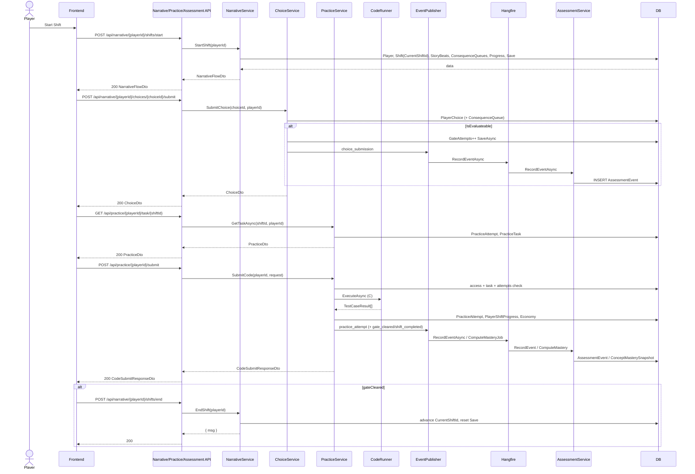

# SHIFT Game — Narrative, Practice & Assessment API Documentation

**Source of truth:** repository implementation (`LoopGame` ASP.NET Core API) as of the inspected codebase.  
**Controllers covered:** `NarrativeController`, `NarrativeAdminController`, `PracticeController`, `AssessmentController`  
**Audience:** LoopOS React Frontend team and Admin tooling integrators  

When this document conflicts with the SRS, Sequence Diagrams, ER Diagram, or Backend Architecture docs, **the code wins**. See [§13 Implementation Notes & Discrepancies](#13-implementation-notes--discrepancies).

---

## 1. Document Overview

### Purpose

Practical reference for integrating the LoopOS player experience and Admin narrative authoring against the **real** backend behavior: routes, auth, DTOs, service flows, database effects, assessment telemetry, and Frontend call order.

### Controllers covered

| Controller | Surface |
| ---------- | ------- |
| `NarrativeController` | Player shift start/save/end, choices |
| `NarrativeAdminController` | Admin shift / beat / choice CRUD |
| `PracticeController` | Player practice task fetch + code submit |
| `AssessmentController` | Read-only mastery snapshots |

### Intended audience

- Frontend engineers building LoopOS narrative + practice flows  
- Admin UI authors managing narrative content  
- Backend engineers verifying Frontend contracts  

### Player vs Admin endpoints

- **Player:** `api/narrative/*`, `api/practice/*`, `api/assessment/*` (assessment is read-only; events are **not** created via HTTP)  
- **Admin:** `api/admin/shifts`, `api/admin/beats`, `api/admin/choices` — requires JWT role `super_admin`

### Backend architecture relevant to these Controllers

```text
Controller
    ↓ Result<T> / Error
Service (NarrativeService | ChoiceService | PracticeService | AssessmentService)
    ↓
Specialists (PracticeAccess, CodeExecution→CodeRunner, TierPolicy, AttemptPolicy,
             PracticeAttemptService, ProgressionService, EconomyService, EventPublisher)
    ↓
IUnitOfWork / Repositories → PostgreSQL
    ↓ (async)
Hangfire → AssessmentService.RecordEventAsync / ComputeMasteryAsync
```

Shared patterns:

- Domain `Result` / `Result<T>` + `Error(Code, Description)`  
- HTTP mapping via `Error.ToActionResult()` → `ApiErrorResponse`  
- JWT Bearer authentication (`Program.cs`)  
- Enums serialized as **strings** (`JsonStringEnumConverter`)

### How Narrative, Practice, and Assessment work together

1. **Narrative** delivers ordered beats (plus fired consequence beats) and records choices. Evaluable choices publish assessment telemetry asynchronously.  
2. **Practice** is the mandatory gate: code runs against test cases (CodeRunner), attempts are stored, gate clears when enough tasks are completed at Ideal/Acceptable.  
3. **Assessment** never accepts raw events from the Frontend. Gameplay services publish `GameEventDto`; Hangfire records `AssessmentEvent` rows and computes `ConceptMasterySnapshot` after gate clear. Assessment HTTP endpoints only **read** mastery.

### Verified high-level gameplay relationship (from code)

```text
Authentication (JWT)
      ↓
POST .../shifts/start   → NarrativeFlowDto for Player.CurrentShiftId (merged beats + resume trim)
      ↓
Render beats client-side; POST .../shifts/{beatId}/save optional checkpoint
      ↓
If HasChoices → GET .../choices → POST .../choices/{choiceId}/submit
      ↓  (if Choice.IsEvaluateable)
Assessment event queued (choice_submission) via Hangfire
      ↓
When narrative complete (client decides) → Practice gate
      ↓
GET api/practice/{playerId}/task/{shiftId}
      ↓
POST api/practice/{playerId}/submit
      ↓
PracticeAttempt + progress update + EGP bonus
      ↓  (async)
Assessment events (practice_attempt; if gate cleared: gate_cleared, shift_completed)
      ↓  (if GateCleared)
Mastery computation enqueued
      ↓
POST .../shifts/end   (requires IsGateCleared on CurrentShiftId)
      ↓
Player.CurrentShiftId advanced → Start next shift
```

**Verified differences from the illustrative SRS diagram:** there is no separate “get current beat” API — `StartShift` / `Save` return the full remaining beat list. Player narrative start/save/end take **no `shiftId` route param** — they always operate on `Player.CurrentShiftId`. Assessment events are never submitted by the Frontend. Practice gate clearance is multi-task (`Shift.NumberOfTasks`), not a single Ideal submit.

---

## 2. Controller Overview

| Controller               | Purpose | Main Consumer | Authorization |
| ------------------------ | ------- | ------------- | ------------- |
| `NarrativeController`      | Start/resume/save/end **current** shift; list & submit choices | Player (LoopOS) | `[Authorize]` — any authenticated user; **no Player role check**; `playerId` is a route param (not from JWT); shift comes from `Player.CurrentShiftId` |
| `NarrativeAdminController` | CRUD shifts, beats, choices | Admin / content author | `[Authorize(Roles = "super_admin")]` |
| `PracticeController`       | Get next practice task; submit code | Player (LoopOS) | `[Authorize]` — any authenticated user; `playerId` route param |
| `AssessmentController`     | Read concept mastery / weakest concepts | Player or dashboards | **No `[Authorize]`** on controller — currently anonymous |

### Responsibilities

- **NarrativeController** — runtime narrative flow for the player’s `CurrentShiftId` (start/save/end never take a client-supplied shift id).  
- **NarrativeAdminController** — static content management; does not create player progress.  
- **PracticeController** — practice gate orchestration (access → execute → tier → attempt → progress → economy → events).  
- **AssessmentController** — read projections of `ConceptMasterySnapshot` only.

---

## 3. API Conventions

### Base API route

There is no global path prefix beyond controller routes:

- Narrative player: `api/narrative`  
- Narrative admin: `api/admin`  
- Practice player: `api/practice`  
- Assessment: `api/assessment`

### Authentication mechanism

- JWT Bearer (`Authorization: Bearer <access_token>`)  
- Configured in `Program.cs` with issuer/audience/signing key from `JwtSettings`  
- Login/register live under `AuthController` (outside this document’s scope)

### JWT / role claims

Roles used in Identity (from `AuthService`): `"player"`, `"admin"`, `"super_admin"`.

| Controller | Enforced |
| ---------- | -------- |
| Narrative / Practice player | Authenticated only — **not** restricted to `"player"` |
| NarrativeAdmin | Role must be `"super_admin"` |
| Assessment | None |

**Important:** `playerId` is still taken from the **URL**, not from `ClaimTypes.NameIdentifier`. Controllers do **not** verify that the JWT user owns that `playerId` (unlike Economy/Shop). Frontend must send the correct player id; backend TODO comments acknowledge this gap.

### Common response / result pattern

Success path (most endpoints):

```text
HTTP 200 OK
Response Body exists — raw DTO / list (NOT wrapped in { success, data })
```

Failure path (via `Handle` + `ToActionResult`):

```json
{
  "code": "Narrative.ShiftNotFound",
  "description": "No shift exists with the given identifier."
}
```

Optional field-level validation (`ApiBehaviorExtensions`):

```json
{
  "code": "Validation.Failed",
  "description": "...",
  "errors": {
    "Title": ["The Title field is required."]
  }
}
```

`Result` / `Result<T>` are **server-side only** — they are never serialized to the client.

### Distinguish body presence

| Pattern | Body |
| ------- | ---- |
| `Ok(result.Value)` | Response Body exists |
| `NoContent()` (admin deletes) | No Response Body |
| `BadRequest(result.Error)` on `EndShift` failure | Response Body exists (`Error` record: `code`, `description`) |

### HTTP status codes actually mapped (`ResultHttpMapping`)

| Status | When |
| ------ | ---- |
| 200 | Success with body |
| 204 | Admin delete success |
| 400 | Default for unmapped domain errors + model validation |
| 401 | JWT missing/invalid (framework) — **not** from domain Result mapping for these controllers |
| 403 | `Forbidden.Access` (choice submit shift mismatch; practice `NoActiveShift` / `TaskNotInShift` use this code) |
| 404 | Specific narrative/choice/assessment not-found codes listed in mapping |
| 409 | Narrative conflicts (duplicate shift/beat, delete guards, etc.); `Choice.ShiftMismatch` (GetChoices / related choice access) |
| 500 | Unhandled exceptions (e.g. null refs in `SubmitChoice` if entities missing) |

Unmapped practice codes such as `NotFound.Task`, `TasksCompleted.Task`, `Practice.MaxAttemptsReached`, `Forbidden.AccessGame` currently fall through to **400**.

### Validation / Not Found / Unauthorized

- Model binding failures → `400` + `Validation.Failed`  
- Domain not-found → mapped code → usually `404` for Narrative/Choice/Assessment named errors  
- Missing/invalid JWT on `[Authorize]` controllers → `401`  
- Wrong role on NarrativeAdmin → `403`  
- AssessmentController currently has **no** auth challenge

---

## 4. NarrativeController — Player Endpoints

**Class:** `[Authorize]` + `[Route("api/narrative")]`  
**Services:** `INarrativeService`, `IChoiceService`

---

## 4.1 `POST /api/narrative/{playerId}/shifts/start`

### Purpose

Starts or resumes the player’s **current** shift (`Player.CurrentShiftId`): builds the merged narrative flow (pending consequences + narrative beats), creates progress/save on first start, and returns beats remaining from the player’s save point.

### Authorization

- Authentication required: **Yes** (`[Authorize]`)  
- Required role: **None** (any authenticated user)  
- Additional: shift is always taken from `Player.CurrentShiftId` (no `shiftId` in the route)

### URL

```http
POST /api/narrative/{playerId}/shifts/start
```

### Parameters

| Parameter | Location | Type | Required | Description |
| --------- | -------- | ---- | -------- | ----------- |
| `playerId` | route | int | Yes | Player id (not taken from JWT) |

### Request Body

```text
No Request Body
```

### Internal Backend Flow

```text
NarrativeController.StartShift
    ↓
NarrativeService.StartShift(playerId)
    ↓
ValidatePlayerAccess → Player; fail if player missing
    ↓
Load Shift entity where ShiftId == Player.CurrentShiftId
    ↓
GetNarrativeBeats (BeatType.Narrative, ordered by SequenceOrder, include Choices)
    ↓
GetPendingConsequences (ConsequenceQueue pending for player+shift)
    ↓
CategorizeConsequencesByInjectPosition → mark queues Status=fired, FiredAt=UtcNow
    ↓
MergeBeats: [start consequences] + [narrative] + [end consequences]
    ↓
If no PlayerShiftProgress: INSERT Progress (InProgress) + PlayerSave (first merged beat)
Else: trim mergedBeats from PlayerSave.BeatId onward
    ↓
SaveAsync
    ↓
Return NarrativeFlowDto
```

### Services Used

| Service | Method | Responsibility |
| ------- | ------ | -------------- |
| `NarrativeService` | `StartShift` | Access check, merge flow for `CurrentShiftId`, progress/save, DTO |
| (repositories via `IUnitOfWork`) | — | Player, Shift, StoryBeat, ConsequenceQueue, PlayerShiftProgress, PlayerSave |

### Database Interaction

| Entity/Table | Operation | Purpose |
| ------------ | --------- | ------- |
| `Player` | SELECT | Access + `CurrentShiftId` |
| `Shift` | SELECT | Shift metadata for current shift |
| `StoryBeat` | SELECT | Narrative beats + choices |
| `ConsequenceQueue` | SELECT + UPDATE | Pending → fired |
| `Consequence` / linked `StoryBeat` | SELECT | Consequence beat content |
| `PlayerShiftProgress` | SELECT / INSERT | First-time progress |
| `PlayerSave` | SELECT / INSERT | Auto-save at start |

Does **not** create AssessmentEvents. Does **not** clear practice gate.

### Response Body

```json
{
  "shiftId": 1,
  "shift": {
    "shiftId": 1,
    "shiftNumber": 1,
    "chapterNumber": 1,
    "title": "Onboarding Day",
    "description": "Meet the team",
    "conceptTag": "Basics",
    "isCapstone": false
  },
  "beats": [
    {
      "beatId": 10,
      "beatKey": "shift1_intro",
      "beatType": "Narrative",
      "sequenceOrder": 1,
      "app": "WhatsUpp",
      "senderName": "Sara",
      "contentJson": {
        "text": "Welcome to Loop.",
        "avatar": null,
        "sound_effect": null,
        "choices": null
      },
      "desktopEvent": null,
      "delaySeconds": 0,
      "hasChoices": false,
      "createdAt": "2026-09-01T12:00:00Z",
      "choices": []
    }
  ]
}
```

Enums are string names. `contentJson` property names use snake_case JSON (`text`, `avatar`, `sound_effect`, `choices`). `desktopEvent` uses `event_type`, `app_name`, `notification_title`, `payload`.

### Response Meaning

| Field | Meaning |
| ----- | ------- |
| `shiftId` | Active shift (`Player.CurrentShiftId`) |
| `shift` | Shift metadata for UI chrome |
| `beats` | Ordered list to play **from current save** (already trimmed on resume). Includes fired consequence beats at start/end |

### HTTP Responses

| Status | Meaning | Response Body |
| ------ | ------- | ------------- |
| 200 | Flow loaded | `NarrativeFlowDto` |
| 400 | Unmapped failures | `ApiErrorResponse` |
| 401 | Missing/invalid JWT | framework |
| 404 | `Choice.PlayerNotFound` (via access check) | `ApiErrorResponse` |
| 404 | `Narrative.ShiftNotFound` (no shift for `CurrentShiftId`) | `ApiErrorResponse` |

### Frontend Usage

Call after login when entering the current shift (and on resume). Do **not** pass a `shiftId` — the backend uses `Player.CurrentShiftId`. Render `beats` in order. If `hasChoices` / choices present, call GetChoices / SubmitChoice. Call Save as the player advances. There is **no** separate “next beat” endpoint.

---

## 4.2 `POST /api/narrative/{playerId}/shifts/{beatId}/save`

### Purpose

Persists the player’s current beat checkpoint on **`Player.CurrentShiftId`** and returns the remaining narrative beats from that beat onward (standard narrative beats only — **does not** re-merge consequences).

### Authorization

Same as StartShift (`[Authorize]`; shift resolved from `Player.CurrentShiftId`).

### URL

```http
POST /api/narrative/{playerId}/shifts/{beatId}/save
```

### Parameters

| Parameter | Location | Type | Required | Description |
| --------- | -------- | ---- | -------- | ----------- |
| `playerId` | route | int | Yes | Player id |
| `beatId` | route | int | Yes | Must belong to `Player.CurrentShiftId` |

### Request Body

```text
No Request Body
```

### Internal Backend Flow

```text
NarrativeController.Save
    ↓
NarrativeService.Save(playerId, beatId)
    ↓
ValidatePlayerAccess
    ↓
shiftId = Player.CurrentShiftId
    ↓
Verify StoryBeat exists for (beatId, shiftId)
    ↓
Upsert PlayerSave.BeatId
    ↓
SaveAsync
    ↓
GetNarrativeBeats(shiftId) → skip until saved beat
    ↓
Return NarrativeFlowDto (no consequence re-injection)
```

### Services Used

| Service | Method | Responsibility |
| ------- | ------ | -------------- |
| `NarrativeService` | `Save` | Checkpoint + remaining beats for current shift |

### Database Interaction

| Entity/Table | Operation | Purpose |
| ------------ | --------- | ------- |
| `Player` | SELECT | Access + `CurrentShiftId` |
| `StoryBeat` | SELECT | Validate beat |
| `PlayerSave` | INSERT or UPDATE | Checkpoint |
| `Shift` | SELECT | Response shift DTO |
| `StoryBeat` | SELECT | Remaining narrative beats |

### Response Body

Same shape as `NarrativeFlowDto` in §4.1. Beat list is **narrative-only** from save point (consequence beats not re-merged).

### HTTP Responses

| Status | Meaning | Response Body |
| ------ | ------- | ------------- |
| 200 | Saved | `NarrativeFlowDto` |
| 401 | Unauthorized | — |
| 404 | Beat/player not found | `ApiErrorResponse` |

### Frontend Usage

Call when the player finishes consuming a beat (or on deliberate autosave). Pass only `playerId` + `beatId` — no `shiftId` in the URL. Replace local beat queue with returned `beats`.

---

## 4.3 `POST /api/narrative/{playerId}/shifts/end`

### Purpose

Advances the player from their **current** shift to the next shift after the practice gate is cleared.

### Authorization

`[Authorize]`. Operates on `Player.CurrentShiftId` (no `shiftId` route param).

### URL

```http
POST /api/narrative/{playerId}/shifts/end
```

### Parameters

| Parameter | Location | Type | Required | Description |
| --------- | -------- | ---- | -------- | ----------- |
| `playerId` | route | int | Yes | Player id |

### Request Body

```text
No Request Body
```

### Internal Backend Flow

```text
NarrativeController.EndShift
    ↓
NarrativeService.EndShift(playerId)
    ↓
ValidatePlayerAccess
    ↓
Load PlayerShiftProgress for (player, CurrentShiftId)
    ↓
Require IsGateCleared == true else Narrative.ShiftNotCompleted
    ↓
Find Shift where ShiftNumber == CurrentShift.ShiftNumber + 1
    ↓
Player.CurrentShiftId = nextShift.ShiftId
    ↓
PlayerSave.BeatId = 1   (hardcoded)
    ↓
SaveAsync
    ↓
{ msg: "End Shift Success!" }
```

**Controller note:** failures use `BadRequest(result.Error)` (always HTTP **400**), **not** `ToActionResult` — so codes that would normally be 404/409 still return 400 here.

### Services Used

| Service | Method | Responsibility |
| ------- | ------ | -------------- |
| `NarrativeService` | `EndShift` | Gate check + advance current shift |

### Database Interaction

| Entity/Table | Operation | Purpose |
| ------------ | --------- | ------- |
| `Player` | SELECT + UPDATE | Advance `CurrentShiftId` |
| `PlayerShiftProgress` | SELECT | Gate clearance check for current shift |
| `Shift` | SELECT | Next shift by `ShiftNumber + 1` |
| `PlayerSave` | UPDATE | Reset `BeatId` to `1` |

### Response Body

```json
{
  "msg": "End Shift Success!"
}
```

### HTTP Responses

| Status | Meaning | Response Body |
| ------ | ------- | ------------- |
| 200 | Advanced | `{ "msg": "End Shift Success!" }` |
| 400 | Any failure in this action (including not found / not completed) | `Error` (`code`, `description`) |
| 401 | Unauthorized | — |

### Frontend Usage

Call only after practice reports `gateCleared: true` (and ideally after salary/economy UX). No `shiftId` in the URL — backend ends whatever `CurrentShiftId` is. Then call `POST .../shifts/start` again; the new current shift is already set on the player (response does **not** return the next shift id — read from profile/start response if needed).

`BeatId = 1` reset may not match the next shift’s first story beat id — treat as implementation quirk (see §13).

---

## 4.4 `GET /api/narrative/{playerId}/beats/{beatId}/choices`

### Purpose

Returns the choice options for a beat, after verifying the beat belongs to the player’s current shift.

### Authorization

`[Authorize]`. Service checks player exists and `player.CurrentShiftId == beat.ShiftId`.

### URL

```http
GET /api/narrative/{playerId}/beats/{beatId}/choices
```

### Parameters

| Parameter | Location | Type | Required | Description |
| --------- | -------- | ---- | -------- | ----------- |
| `playerId` | route | int | Yes | Player id |
| `beatId` | route | int | Yes | Story beat id |

### Request Body

```text
No Request Body
```

### Internal Backend Flow

```text
NarrativeController.GetChoices
    ↓
ChoiceService.GetChoices(beatId, playerId)
    ↓
Validate ids > 0
    ↓
Load Player; load StoryBeat + Choices
    ↓
Ensure CurrentShiftId == Beat.ShiftId
    ↓
Map Choices → List<ChoiceDto>
```

### Services Used

| Service | Method | Responsibility |
| ------- | ------ | -------------- |
| `ChoiceService` | `GetChoices` | Access + list choices |

### Database Interaction

| Entity/Table | Operation | Purpose |
| ------------ | --------- | ------- |
| `Player` | SELECT | Existence + current shift |
| `StoryBeat` | SELECT | Beat + Choices |

### Response Body

```json
[
  {
    "choiceId": 101,
    "beatId": 10,
    "choiceIndex": 1,
    "choiceText": "Ask for clarification",
    "tier": "Ideal",
    "consequenceId": 5,
    "immediateFeedback": "Good call."
  }
]
```

`ChoiceDto` does **not** expose `isEvaluateable` (entity field exists but is omitted from the response DTO).

### HTTP Responses

| Status | Meaning | Response Body |
| ------ | ------- | ------------- |
| 200 | OK | `ChoiceDto[]` |
| 400 | `Choice.InvalidId` | `ApiErrorResponse` |
| 401 | Unauthorized | — |
| 404 | Player/beat not found | `ApiErrorResponse` |
| 409 | Shift mismatch | `ApiErrorResponse` |

### Frontend Usage

When rendering a beat with `hasChoices: true` (or non-empty `choices` on the beat), fetch this list (or use choices already embedded on the beat from StartShift) and present buttons. Prefer SubmitChoice with `choiceId`.

---

## 4.5 `POST /api/narrative/{playerId}/choices/{choiceId}/submit`

### Purpose

Records the player’s selection, optionally queues a deferred consequence, and optionally emits an assessment event for evaluable choices.

### Authorization

`[Authorize]`. Service compares `choice.Beat.ShiftId` to `player.CurrentShiftId`; mismatch returns `Forbidden.Access` → **403**.

### URL

```http
POST /api/narrative/{playerId}/choices/{choiceId}/submit
```

### Parameters

| Parameter | Location | Type | Required | Description |
| --------- | -------- | ---- | -------- | ----------- |
| `playerId` | route | int | Yes | Player id |
| `choiceId` | route | int | Yes | Choice id |

### Request Body

```text
No Request Body
```

### Internal Backend Flow

```text
NarrativeController.SubmitChoice
    ↓
ChoiceService.SubmitChoice(choiceId, playerId)
    ↓
Load Player (+ ShiftProgresses); load Choice (+ Beat.Shift)
    ↓
If Beat.ShiftId ≠ CurrentShiftId → Forbidden.Access
    ↓
INSERT PlayerChoice (PlayerId, ChoiceId, BeatId, Tier)
    ↓
If ConsequenceId set → INSERT ConsequenceQueue (pending)
    ↓
If IsEvaluateable:
      GateAttempts++ on current PlayerShiftProgress
      SaveAsync
      EventPublisher → choice_submission → Hangfire RecordEventAsync
Else:
      SaveAsync is NOT called in current code
    ↓
Return ChoiceDto
```

### Services Used

| Service | Method | Responsibility |
| ------- | ------ | -------------- |
| `ChoiceService` | `SubmitChoice` | Persist choice, queue consequence, telemetry |
| `IEventPublisher` | `Publish` | Fire-and-forget assessment enqueue |
| `AssessmentEventHandler` | `Handle` | Hangfire `RecordEventAsync` |

### Database Interaction

| Entity/Table | Operation | Purpose |
| ------------ | --------- | ------- |
| `Player` | SELECT | Access + progress nav |
| `Choice` / `StoryBeat` / `Shift` | SELECT | Choice + concept tag |
| `PlayerChoice` | INSERT | Immutable choice evidence |
| `ConsequenceQueue` | INSERT | Deferred consequence (if any) |
| `PlayerShiftProgress` | UPDATE | `GateAttempts++` when evaluable |
| `AssessmentEvent` | INSERT (async) | When evaluable |

### Assessment Event?

**Yes**, only when `Choice.IsEvaluateable == true`:

- EventType: `choice_submission`  
- ConceptTag: `choice.Beat.Shift.ConceptTag`  
- Tier: choice tier string  
- Payload: `{ beatId, choiceId }`

### Response Body

```json
{
  "choiceId": 101,
  "beatId": 10,
  "choiceIndex": 1,
  "choiceText": "Ask for clarification",
  "tier": "Ideal",
  "consequenceId": 5,
  "immediateFeedback": "Good call."
}
```

Does **not** return the next beat. Frontend continues local beat list / calls Save.

### HTTP Responses

| Status | Meaning | Response Body |
| ------ | ------- | ------------- |
| 200 | Submitted | `ChoiceDto` |
| 401 | Unauthorized | — |
| 403 | Shift/choice mismatch (`Forbidden.Access`) | `ApiErrorResponse` |
| 500 | Possible if player/choice null (no explicit null checks) | — |

### Frontend Usage

On choice click → submit → show `immediateFeedback` if present → continue narrative. Do not expect next-beat payload. Consequences appear on a **future** `StartShift` when their target shift is started.

---

## 5. NarrativeAdminController — Admin Endpoints

**Class:** `[Authorize(Roles = "super_admin")]` + `[Route("api/admin")]`  
**Services:** `INarrativeService`, `IChoiceService`

All mutating endpoints operate on **content** tables. They do not create `PlayerShiftProgress` / runtime state (except delete guards that read those tables).

---

## 5.1 `GET /api/admin/shifts`

### Purpose

List all shifts ordered by chapter then shift number.

### Authorization

Role: **`super_admin`**

### URL

```http
GET /api/admin/shifts
```

### Parameters

```text
No parameters.
```

### Request Body

```text
No Request Body
```

### Internal Backend Flow

```text
NarrativeAdminController.GetAllShifts
    ↓
NarrativeService.GetAllShifts
    ↓
FindAll Shift → OrderBy ChapterNumber, ShiftNumber → Adapt ShiftDto list
```

### Services Used

| Service | Method | Responsibility |
| ------- | ------ | -------------- |
| `NarrativeService` | `GetAllShifts` | List shifts |

### Database Interaction

| Entity/Table | Operation | Purpose |
| ------------ | --------- | ------- |
| `Shift` | SELECT | Full catalog |

### Response Body

```json
[
  {
    "shiftId": 1,
    "shiftNumber": 1,
    "chapterNumber": 1,
    "title": "Onboarding Day",
    "description": "Meet the team",
    "conceptTag": "Basics",
    "isCapstone": false
  }
]
```

`NumberOfTasks` / `UnlockCondition` are **not** included in `ShiftDto`.

### HTTP Responses

| Status | Meaning | Response Body |
| ------ | ------- | ------------- |
| 200 | OK | `ShiftDto[]` |
| 401/403 | Auth/role | — |

---

## 5.2 `GET /api/admin/shifts/{shiftId}`

### Purpose

Full shift detail including narrative and consequence beats (with choices).

### Authorization

`super_admin`

### URL

```http
GET /api/admin/shifts/{shiftId}
```

### Parameters

| Parameter | Location | Type | Required | Description |
| --------- | -------- | ---- | -------- | ----------- |
| `shiftId` | route | int | Yes | Shift id |

### Request Body

```text
No Request Body
```

### Internal Backend Flow

```text
GetShift → Find Shift including StoryBeats.Choices
    ↓
Mapster Shift → ShiftDetailDto
  NarrativeBeats = BeatType.Narrative ordered by SequenceOrder
  ConsequenceBeats = BeatType.Consequence
```

### Database Interaction

| Entity/Table | Operation | Purpose |
| ------------ | --------- | ------- |
| `Shift` | SELECT | Detail |
| `StoryBeat` | SELECT | Beats |
| `Choice` | SELECT | Nested choices |

### Response Body

```json
{
  "shiftId": 1,
  "shiftNumber": 1,
  "chapterNumber": 1,
  "title": "Onboarding Day",
  "description": "Meet the team",
  "conceptTag": "Basics",
  "isCapstone": false,
  "unlockCondition": {
    "prerequisite_shift_id": null,
    "min_rank": null,
    "required_concept": null,
    "min_mastery_score": null
  },
  "createdAt": "2026-09-01T12:00:00Z",
  "narrativeBeats": [],
  "consequenceBeats": []
}
```

### HTTP Responses

| Status | Meaning | Response Body |
| ------ | ------- | ------------- |
| 200 | OK | `ShiftDetailDto` |
| 404 | `Narrative.ShiftNotFound` | `ApiErrorResponse` |
| 401/403 | Auth | — |

---

## 5.3 `POST /api/admin/shifts`

### Purpose

Create a shift (content only — no player progress rows).

### Authorization

`super_admin`

### URL

```http
POST /api/admin/shifts
```

### Parameters

```text
No parameters.
```

### Request Body

```json
{
  "shiftNumber": 2,
  "chapterNumber": 1,
  "title": "First Ticket",
  "description": "Handle a bug report",
  "conceptTag": "Variables",
  "numberOfTasks": 2,
  "isCapstone": false,
  "unlockCondition": {
    "prerequisite_shift_id": 1,
    "min_rank": null,
    "required_concept": null,
    "min_mastery_score": null
  }
}
```

### Internal Backend Flow

```text
Validate title / chapter / shift numbers
    ↓
Reject duplicate (ChapterNumber, ShiftNumber)
    ↓
Adapt CreateShiftDto → Shift; trim title/description; CreatedAt=UtcNow
    ↓
INSERT + Save → MapToShiftDetailDto
```

### Database Interaction

| Entity/Table | Operation | Purpose |
| ------------ | --------- | ------- |
| `Shift` | SELECT (dup check) + INSERT | Create content |

### Response Body

`ShiftDetailDto` (beats empty on create).

### HTTP Responses

| Status | Meaning | Response Body |
| ------ | ------- | ------------- |
| 200 | Created | `ShiftDetailDto` |
| 400 | Validation (`ShiftTitleRequired`, invalid numbers) | `ApiErrorResponse` |
| 409 | `DuplicateShiftNumber` | `ApiErrorResponse` |
| 401/403 | Auth | — |

**Soft-delete:** none — hard insert only.

---

## 5.4 `PUT /api/admin/shifts/{shiftId}`

### Purpose

Update editable shift metadata. Does not modify player runtime state.

### Authorization

`super_admin`

### URL

```http
PUT /api/admin/shifts/{shiftId}
```

### Parameters

| Parameter | Location | Type | Required | Description |
| --------- | -------- | ---- | -------- | ----------- |
| `shiftId` | route | int | Yes | Shift id |

### Request Body

```json
{
  "shiftNumber": 2,
  "chapterNumber": 1,
  "title": "First Ticket (edited)",
  "conceptTag": "Variables",
  "description": "Updated blurb",
  "numberOfTasks": 3,
  "isCapstone": false,
  "unlockCondition": null,
  "clearUnlockCondition": false
}
```

### Internal Backend Flow

```text
FindWithTracking Shift
    ↓
Validate title/numbers; uniqueness if numbers change
    ↓
Apply Title, Description, ChapterNumber, ShiftNumber, IsCapstone, UnlockCondition
    ↓
(ClearUnlockCondition true → UnlockCondition = null)
    ↓
UPDATE + reload with beats → ShiftDetailDto
```

**Implementation note:** `UpdateShiftDto.ConceptTag` and `NumberOfTasks` are **not applied** in `NarrativeService.UpdateShift` today.

### Database Interaction

| Entity/Table | Operation | Purpose |
| ------------ | --------- | ------- |
| `Shift` | SELECT + UPDATE | Metadata |

### Response Body

`ShiftDetailDto`

### HTTP Responses

| Status | Meaning | Response Body |
| ------ | ------- | ------------- |
| 200 | Updated | `ShiftDetailDto` |
| 404 | Not found | `ApiErrorResponse` |
| 400 | Invalid fields | `ApiErrorResponse` |
| 409 | Duplicate numbers | `ApiErrorResponse` |

---

## 5.5 `DELETE /api/admin/shifts/{shiftId}`

### Purpose

Delete a shift only if it has **no** player progress and **no** story beats.

### Authorization

`super_admin`

### URL

```http
DELETE /api/admin/shifts/{shiftId}
```

### Parameters

| Parameter | Location | Type | Required | Description |
| --------- | -------- | ---- | -------- | ----------- |
| `shiftId` | route | int | Yes | Shift id |

### Request Body

```text
No Request Body
```

### Internal Backend Flow

```text
Load Shift + StoryBeats + ShiftProgresses
    ↓
If progress count > 0 → ShiftHasPlayerProgress (409)
If beats count > 0 → ShiftHasStoryBeats (409)
    ↓
Delete Shift → Save
    ↓
204 No Content
```

### Database Interaction

| Entity/Table | Operation | Purpose |
| ------------ | --------- | ------- |
| `Shift` | SELECT + DELETE | Remove if safe |
| `PlayerShiftProgress` | SELECT (via nav) | Guard |
| `StoryBeat` | SELECT (via nav) | Guard |

### Response Body

```text
No Response Body
```

### HTTP Responses

| Status | Meaning | Response Body |
| ------ | ------- | ------------- |
| 204 | Deleted | No body |
| 404 | Not found | `ApiErrorResponse` |
| 409 | Has progress or beats | `ApiErrorResponse` |

No soft-delete.

---

## 5.6 `GET /api/admin/beats/{beatId}`

### Purpose

Fetch one story beat with choices.

### Authorization

`super_admin`

### URL

```http
GET /api/admin/beats/{beatId}
```

### Parameters

| Parameter | Location | Type | Required | Description |
| --------- | -------- | ---- | -------- | ----------- |
| `beatId` | route | int | Yes | Beat id |

### Request Body

```text
No Request Body
```

### Internal Backend Flow

Load `StoryBeat` + `Choices` → `BeatDto` or `BeatNotFound`.

### Response Body

`BeatDto` (see §4.1 beat object).

### HTTP Responses

| Status | Meaning | Response Body |
| ------ | ------- | ------------- |
| 200 | OK | `BeatDto` |
| 404 | Not found | `ApiErrorResponse` |

---

## 5.7 `POST /api/admin/beats`

### Purpose

Create a Narrative or Consequence beat. Consequence beats also create a `Consequence` row with `InjectPosition`.

### Authorization

`super_admin`

### URL

```http
POST /api/admin/beats
```

### Request Body

**Narrative example:**

```json
{
  "shiftId": 1,
  "beatKey": "shift1_choice_mail",
  "beatType": "Narrative",
  "sequenceOrder": 3,
  "app": "MailLoop",
  "senderName": "HR",
  "contentJson": {
    "text": "You have a new email.",
    "avatar": null,
    "sound_effect": null,
    "choices": [
      { "index": 1, "text": "Open it" }
    ]
  },
  "desktopEvent": {
    "event_type": "notification",
    "app_name": "MailLoop",
    "notification_title": "New mail",
    "payload": null
  },
  "delaySeconds": 0.5,
  "hasChoices": true,
  "injectPosition": null
}
```

**Consequence example:**

```json
{
  "shiftId": 2,
  "beatKey": "debt_from_shift1",
  "beatType": "Consequence",
  "sequenceOrder": null,
  "app": "WhatsUpp",
  "senderName": "Manager",
  "contentJson": {
    "text": "About yesterday's decision...",
    "avatar": null,
    "sound_effect": null,
    "choices": null
  },
  "desktopEvent": null,
  "delaySeconds": 0,
  "hasChoices": false,
  "injectPosition": "start"
}
```

### Internal Backend Flow

```text
Validate shift exists, BeatKey unique, ContentJson.Text non-empty
    ↓
Narrative: SequenceOrder required + unique per shift
Consequence: SequenceOrder must be null; InjectPosition in {start,end}
    ↓
Transaction:
  INSERT StoryBeat
  If Consequence → INSERT Consequence(BeatId, InjectPosition)
Commit
    ↓
Return BeatDto (+ Choices)
```

### Database Interaction

| Entity/Table | Operation | Purpose |
| ------------ | --------- | ------- |
| `Shift` | SELECT | Parent exists |
| `StoryBeat` | SELECT + INSERT | Create + uniqueness |
| `Consequence` | INSERT | For consequence beats |

### Response Body

`BeatDto`

### HTTP Responses

| Status | Meaning | Response Body |
| ------ | ------- | ------------- |
| 200 | Created | `BeatDto` |
| 400 | Validation (key/content/order/inject) | `ApiErrorResponse` |
| 404 | Shift not found | `ApiErrorResponse` |
| 409 | Duplicate key / sequence conflict | `ApiErrorResponse` |

Ordering: narrative `SequenceOrder` is authoritative for playback order.

---

## 5.8 `PUT /api/admin/beats/{beatId}`

### Purpose

Update editable beat fields with ordering / queue guards. Does not rewrite historical `PlayerChoice` / `AssessmentEvent`.

### Authorization

`super_admin`

### URL

```http
PUT /api/admin/beats/{beatId}
```

### Request Body

```json
{
  "shiftId": 1,
  "beatType": "Narrative",
  "sequenceOrder": 4,
  "app": "VideoCall",
  "senderName": "Lead",
  "contentJson": {
    "text": "Updated copy",
    "avatar": null,
    "sound_effect": null,
    "choices": null
  },
  "desktopEvent": null,
  "delaySeconds": 1,
  "hasChoices": true,
  "injectPosition": null,
  "reorderSiblings": false
}
```

`BeatKey` is immutable (ignored by mapping). `ReorderSiblings` is accepted on the DTO but **not used** in service logic.

### Internal Backend Flow

Validate target shift; block moving consequence beats with pending queues; validate sequence uniqueness; transaction updates beat (+ Consequence.InjectPosition if applicable).

### Database Interaction

| Entity/Table | Operation | Purpose |
| ------------ | --------- | ------- |
| `StoryBeat` | SELECT + UPDATE | Content |
| `Shift` | SELECT | Target shift |
| `ConsequenceQueue` | SELECT | Move guards |
| `Consequence` | UPDATE | InjectPosition |

### Response Body

`BeatDto`

### HTTP Responses

| Status | Meaning | Response Body |
| ------ | ------- | ------------- |
| 200 | Updated | `BeatDto` |
| 400 | Validation | `ApiErrorResponse` |
| 404 | Beat/shift not found | `ApiErrorResponse` |
| 409 | Sequence conflict / cannot move consequence | `ApiErrorResponse` |

---

## 5.9 `PUT /api/admin/beats/{beatId}/assign-shift/{shiftId}`

### Purpose

Move an existing beat to another shift (sets `StoryBeat.ShiftId`).

### Authorization

`super_admin`

### URL

```http
PUT /api/admin/beats/{beatId}/assign-shift/{shiftId}
```

### Parameters

| Parameter | Location | Type | Required | Description |
| --------- | -------- | ---- | -------- | ----------- |
| `beatId` | route | int | Yes | Beat |
| `shiftId` | route | int | Yes | Target shift |

### Request Body

```text
No Request Body
```

### Internal Backend Flow

Reject if already in shift; validate target; block consequence with pending queues; check narrative sequence conflict; UPDATE `ShiftId`.

### Database Interaction

| Entity/Table | Operation | Purpose |
| ------------ | --------- | ------- |
| `StoryBeat` | SELECT + UPDATE | Reassign |
| `Shift` | SELECT | Target exists |
| `ConsequenceQueue` | SELECT | Guard |

### Response Body

`BeatDto`

### HTTP Responses

| Status | Meaning | Response Body |
| ------ | ------- | ------------- |
| 200 | Moved | `BeatDto` |
| 404 | Beat/shift missing | `ApiErrorResponse` |
| 409 | Already in shift / sequence / active queues | `ApiErrorResponse` |

---

## 5.10 `DELETE /api/admin/beats/{beatId}`

### Purpose

Hard-delete a beat if no pending consequence queues block it. Choices and consequence rows cascade via EF configuration.

### Authorization

`super_admin`

### URL

```http
DELETE /api/admin/beats/{beatId}
```

### Request Body

```text
No Request Body
```

### Internal Backend Flow

Load beat + choices + consequence; guard pending queues; DELETE beat; Save → **204**.

### Database Interaction

| Entity/Table | Operation | Purpose |
| ------------ | --------- | ------- |
| `StoryBeat` | SELECT + DELETE | Remove |
| `Choice` | CASCADE | Via FK |
| `Consequence` | CASCADE | Via FK |
| `ConsequenceQueue` | SELECT | Guard |

### Response Body

```text
No Response Body
```

### HTTP Responses

| Status | Meaning | Response Body |
| ------ | ------- | ------------- |
| 204 | Deleted | No body |
| 404 | Not found | `ApiErrorResponse` |
| 409 | Active consequence queues | `ApiErrorResponse` |

---

## 5.11 `POST /api/admin/choices`

### Purpose

Create one or more choices (max 4 per request and per beat total).

### Authorization

`super_admin`

### URL

```http
POST /api/admin/choices
```

### Request Body

```json
[
  {
    "beatId": 10,
    "choiceIndex": 1,
    "choiceText": "Ask for clarification",
    "tier": "Ideal",
    "isEvaluateable": true,
    "consequenceId": 5,
    "immediateFeedback": "Good call."
  }
]
```

### Internal Backend Flow

```text
Reject empty / >4 list
    ↓
Validate each ChoiceIndex 1–4, non-empty text
    ↓
Reject intra-list duplicate (BeatId, ChoiceIndex)
    ↓
Per beat: exists, HasChoices==true, existing+new ≤ 4, no index clash
    ↓
Validate ConsequenceId exists if set
    ↓
INSERT choices → Save → List<ChoiceDto>
```

### Database Interaction

| Entity/Table | Operation | Purpose |
| ------------ | --------- | ------- |
| `StoryBeat` | SELECT | Validation |
| `Consequence` | SELECT | Optional FK |
| `Choice` | INSERT | Create |

### Response Body

`ChoiceDto[]` (note: response omits `isEvaluateable`).

### HTTP Responses

| Status | Meaning | Response Body |
| ------ | ------- | ------------- |
| 200 | Created | `ChoiceDto[]` |
| 400 | Validation / not allowed / empty | `ApiErrorResponse` |
| 404 | Beat not found | `ApiErrorResponse` |

---

## 5.12 `PUT /api/admin/choices/{choiceId}`

### Purpose

Update editable choice fields.

### Authorization

`super_admin`

### URL

```http
PUT /api/admin/choices/{choiceId}
```

### Request Body

```json
{
  "choiceText": "Reworded option",
  "tier": "Acceptable",
  "consequenceId": null,
  "immediateFeedback": "Okay.",
  "isEvaluateable": true
}
```

JSON property for tier is **`tier`** (lowercase) on `UpdateChoiceDto`.

**Implementation note:** `IsEvaluateable` on the update DTO is **not applied** in `ChoiceService.UpdateChoice`.

### Internal Backend Flow

Find choice; validate text/consequence; update text, consequenceId, immediateFeedback, tier; Save.

### Database Interaction

| Entity/Table | Operation | Purpose |
| ------------ | --------- | ------- |
| `Choice` | SELECT + UPDATE | Edit |
| `Consequence` | SELECT | Optional validation |

### Response Body

`ChoiceDto`

### HTTP Responses

| Status | Meaning | Response Body |
| ------ | ------- | ------------- |
| 200 | Updated | `ChoiceDto` |
| 400 | Invalid id/text | `ApiErrorResponse` |
| 404 | Choice / invalid consequence | `ApiErrorResponse` |

There is **no** admin delete-choice endpoint in this controller.

---

## 6. PracticeController — Player Practice Flow

**Class:** `[Authorize]` + `[Route("api/practice")]`  
**Service:** `IPracticeService` → orchestrates access, CodeRunner, tier, attempts, progression, economy, events.

---

## 6.1 `GET /api/practice/{playerId}/task/{shiftId}`

### Purpose

Returns the **next** practice task for a shift: after the highest completed task order, load `TaskOrder == lastCompleted + 1`. Hidden test cases are stripped.

### Authorization

`[Authorize]` only (no ownership check vs JWT).

### URL

```http
GET /api/practice/{playerId}/task/{shiftId}
```

> Comment in controller mentions `{taskId}`; **actual route parameter is `shiftId`.**

### Parameters

| Parameter | Location | Type | Required | Description |
| --------- | -------- | ---- | -------- | ----------- |
| `playerId` | route | int | Yes | Player id |
| `shiftId` | route | int | Yes | Shift whose tasks to traverse |

### Request Body

```text
No Request Body
```

### Internal Backend Flow

```text
PracticeController.GetTask
    ↓
PracticeService.GetTaskAsync(shiftId, playerId)
    ↓
Load completed PracticeAttempts for player+shift (IsCompleted), order by SubmittedAt
    ↓
taskOrder = last completed Task.TaskOrder (or null if none)
    ↓
Find PracticeTask where ShiftId && TaskOrder == taskOrder + 1
    ↓
If null → PracticeErrors.TasksCompleted
    ↓
Filter TestCases where !IsHidden
    ↓
Return PracticeDto
```

**Critical behavior:** when the player has **no** completed attempts, `taskOrder` is `null`, so `TaskOrder == null + 1` does not match task 1 in the usual EF translation — the endpoint returns **`TasksCompleted`**. Frontend/integration must be aware; see §13.

This endpoint does **not** call `PracticeAccessService` (unlike Submit).

### Services Used

| Service | Method | Responsibility |
| ------- | ------ | -------------- |
| `PracticeService` | `GetTaskAsync` | Next task + visible tests |

### Database Interaction

| Entity/Table | Operation | Purpose |
| ------------ | --------- | ------- |
| `PracticeAttempt` | SELECT | Completed progression |
| `PracticeTask` | SELECT | Next task + tests |

### Response Body

```json
{
  "taskId": 7,
  "shiftId": 1,
  "taskOrder": 1,
  "title": "Print Hello",
  "description": "Write a C program that prints Hello",
  "starterCode": "#include <stdio.h>\nint main() {\n  \n}",
  "conceptTag": "Basics",
  "difficulty": "Standard",
  "maxAttempts": 5,
  "egpReward": 10,
  "createdAt": "2026-09-01T12:00:00Z",
  "shiftNumber": 1,
  "testCases": [
    {
      "testCaseId": 1,
      "taskId": 7,
      "sideTaskId": null,
      "testInput": "",
      "expectedOutput": "Hello",
      "isHidden": false,
      "description": "Sample"
    }
  ]
}
```

### How the Player obtains a Practice Task

After narrative for the shift, Frontend calls this GET with `playerId` + `shiftId`. Use returned `taskId` for submit. Repeat after each successful completion until `TasksCompleted` (or handle the first-task quirk).

### HTTP Responses

| Status | Meaning | Response Body |
| ------ | ------- | ------------- |
| 200 | Next task | `PracticeDto` |
| 400 | `TasksCompleted.Task` (and other unmapped practice errors) | `ApiErrorResponse` |
| 401 | Unauthorized | — |

### Frontend Usage

Show IDE with `starterCode`, visible tests, track `taskId` / `timeSpentSec` / hints for submit.

---

## 6.2 `POST /api/practice/{playerId}/submit`

### Purpose

Submit code for evaluation: run all test cases (including hidden), compute tier, store attempt, update gate progress, grant EGP bonus, emit assessment events, optionally enqueue mastery.

### Authorization

`[Authorize]`. Access service enforces task belongs to `Player.CurrentShift`.

### URL

```http
POST /api/practice/{playerId}/submit
```

### Parameters

| Parameter | Location | Type | Required | Description |
| --------- | -------- | ---- | -------- | ----------- |
| `playerId` | route | int | Yes | Player id |

### Request Body

```json
{
  "taskId": 7,
  "submittedCode": "#include <stdio.h>\nint main(){printf(\"Hello\");return 0;}",
  "timeSpentSec": 120,
  "hintUsed": false
}
```

### Internal Backend Flow

```text
PracticeController.SubmitCode
    ↓
PracticeService.SubmitCode
    ↓
PracticeAccessService.ValidateAccessAsync
  → Player + CurrentShift.PracticeTasks + ShiftProgresses
  → fail if no player / no active shift / task not in shift / no progress
    ↓
Load PracticeTask + ALL TestCases + Shift
    ↓
MaxAttemptsPolicy.CheckCanAttempt
  → MaxAttempts==0 unlimited
  → fail if already IsCompleted for task
  → fail if attempt count >= MaxAttempts
    ↓
CodeExecutionService.ExecuteAsync → HTTP POST CodeRunner /execute (language=c)
    ↓
PracticeTierCalculationPolicy.Calculate
  → all pass: Ideal | some: Debt | none/empty: Mistake
  → (Acceptable not produced by current policy)
    ↓
PracticeAttemptService.RecordAttemptAsync (IsCompleted if Ideal|Acceptable)
    ↓
SaveAsync (persist attempt so progression can see it)
    ↓
ProgressionService.ProcessSubmissionAsync
  → GateAttempts++
  → if Ideal|Acceptable and distinct completed tasks count == Shift.NumberOfTasks (>0):
       IsGateCleared=true, Status=Completed, PayShiftSalaryAsync
  → else if incorrect: Status=GatePending
    ↓
EconomyService.ApplyEgpDeltaAsync (Bonus for this attempt — always called)
    ↓
SaveAsync
    ↓
Publish practice_attempt event
    ↓
If GateCleared: publish gate_cleared + shift_completed; EnqueueMasteryComputation
    ↓
Return CodeSubmitResponseDto
```

### Services Used

| Service | Method | Responsibility |
| ------- | ------ | -------------- |
| `PracticeAccessService` | `ValidateAccessAsync` | Player/shift/task/progress |
| `MaxAttemptsPolicy` | `CheckCanAttempt` | Attempt limits |
| `CodeExecutionService` | `ExecuteAsync` | Call CodeRunner |
| `PracticeTierCalculationPolicy` | `Calculate` | Tier from results |
| `PracticeAttemptService` | `RecordAttemptAsync` | Persist attempt |
| `ProgressionService` | `ProcessSubmissionAsync` | Gate / salary |
| `EconomyService` | `ApplyEgpDeltaAsync` / `PayShiftSalaryAsync` | Rewards |
| `IEventPublisher` | `Publish` | Assessment telemetry |
| `IAssessmentJobScheduler` | `EnqueueMasteryComputation` | Hangfire mastery |

### Database Interaction

| Entity/Table | Operation | Purpose |
| ------------ | --------- | ------- |
| `Player` | SELECT | Access |
| `Shift` / `PracticeTask` / `TestCase` | SELECT | Task + tests + NumberOfTasks |
| `PlayerShiftProgress` | SELECT + UPDATE | Gate state |
| `PracticeAttempt` | SELECT + INSERT | History + completion |
| Economy / transactions | INSERT/UPDATE | Bonus (+ salary on gate clear) |
| `AssessmentEvent` | INSERT (async) | Telemetry |
| `ConceptMasterySnapshot` | UPSERT (async job) | After gate clear |

### Tier calculation (actual)

| Result | Tier |
| ------ | ---- |
| No results | `Mistake` |
| All tests passed | `Ideal` |
| Some passed | `Debt` |
| None passed | `Mistake` |

`Acceptable` is reserved for future code-quality analysis and is **not** assigned by current policy (but progression treats Acceptable like Ideal if ever set).

### Practice Gate clearance

Cleared when:

1. Tier is Ideal or Acceptable, AND  
2. Distinct completed tasks for the shift (`PracticeAttempt.IsCompleted`) equals `Shift.NumberOfTasks`, AND  
3. `NumberOfTasks > 0`, AND  
4. Gate was not already cleared  

Then: `IsGateCleared`, timestamps, `Status=Completed`, shift salary paid, mastery job enqueued.

### Assessment Events?

| Event | When |
| ----- | ---- |
| `practice_attempt` | Every successful orchestration path after commit |
| `gate_cleared` | When `GateCleared` true |
| `shift_completed` | When `GateCleared` true |

### Response Body

```json
{
  "tier": "Ideal",
  "testResults": "[{\"test_case_id\":1,\"passed\":true,\"actual_output\":\"Hello\",\"execution_time_ms\":3}]",
  "gateCleared": false,
  "egpEarned": 0,
  "newBalance": null,
  "struggleDetected": false,
  "maxAttemptsReached": false
}
```

**Actual population:** service sets `Tier`, `TestResults` (JSON string), `GateCleared`, `StruggleDetected` (`PracticeAttempts` count for task `> 4`). It does **not** set `EgpEarned`, `NewBalance`, or `MaxAttemptsReached` (remain default `0` / `null` / `false` even when max attempts error path uses a different Result failure).

### Failed vs successful submission

| Outcome | Behavior |
| ------- | -------- |
| Access / max attempts / duplicate completed | HTTP error via Result; no success body |
| Code fails tests | Attempt stored (`IsCompleted=false`), status often `GatePending`, EGP bonus still applied, `gateCleared=false` |
| Code passes | Attempt `IsCompleted=true`; may clear gate when all tasks done |
| CodeRunner down | All tests marked failed with error message → typically `Mistake` |

### HTTP Responses

| Status | Meaning | Response Body |
| ------ | ------- | ------------- |
| 200 | Evaluated | `CodeSubmitResponseDto` |
| 400 | Many practice errors (unmapped → 400) | `ApiErrorResponse` |
| 403 | `Forbidden.Access` (`NoActiveShift`, `TaskNotInShift`) | `ApiErrorResponse` |
| 401 | Unauthorized | — |

### Frontend Usage

After submit: parse `testResults` JSON string; if not `gateCleared`, GET next task / allow retry; if `gateCleared`, allow `EndShift`. On max-attempts failure, show domain message from `description`.

---

## 7. AssessmentController

**Class:** `[Route("api/assessment")]` — **no `[Authorize]`**  
**Service:** `IAssessmentService` (read methods only from HTTP)

Assessment events are created **internally** by gameplay (`ChoiceService`, `PracticeService`, Sahm, etc.) via `IEventPublisher` → Hangfire → `RecordEventAsync`. Mastery is computed asynchronously after gate clear (`ComputeMasteryAsync`), not on these GET endpoints.

---

## 7.1 `GET /api/assessment/player/{playerId}/mastery`

### Purpose

Return all concept mastery snapshots for a player (latest ordering by `SnapshottedAt` desc).

### Authorization

None at controller level (anonymous unless global filters exist — none in `Program.cs`).

### URL

```http
GET /api/assessment/player/{playerId}/mastery
```

### Parameters

| Parameter | Location | Type | Required | Description |
| --------- | -------- | ---- | -------- | ----------- |
| `playerId` | route | int | Yes | Player id |

### Request Body

```text
No Request Body
```

### Internal Backend Flow

```text
AssessmentController.GetPlayerMastery
    ↓
AssessmentService.GetPlayerMasteryAsync
    ↓
Verify Player exists
    ↓
SELECT ConceptMasterySnapshot WHERE PlayerId ORDER BY SnapshottedAt DESC
    ↓
Map to ConceptMasterySnapshotDto
```

Does **not** recompute mastery. Does **not** expose raw `AssessmentEvent` rows.

### Services Used

| Service | Method | Responsibility |
| ------- | ------ | -------------- |
| `AssessmentService` | `GetPlayerMasteryAsync` | Read snapshots |

### Database Interaction

| Entity/Table | Operation | Purpose |
| ------------ | --------- | ------- |
| `Player` | SELECT | Existence |
| `ConceptMasterySnapshot` | SELECT | Mastery projections |

### Response Body

```json
[
  {
    "snapshotId": 1,
    "playerId": 42,
    "shiftId": 1,
    "conceptTag": "Basics",
    "masteryScore": 0.73,
    "evidenceCount": 12,
    "snapshottedAt": "2026-09-20T18:00:00Z"
  }
]
```

### What is Player-facing vs internal

| Exposed | Internal (not via this controller) |
| ------- | ----------------------------------- |
| Aggregated mastery scores | Raw `AssessmentEvent` payloads |
| Evidence counts | Weighting / sigmoid / decay math |
| Concept tags | Hangfire job scheduling |

### HTTP Responses

| Status | Meaning | Response Body |
| ------ | ------- | ------------- |
| 200 | OK (may be empty list) | `ConceptMasterySnapshotDto[]` |
| 404 | `Assessment.PlayerNotFound` | `ApiErrorResponse` |

### Frontend Usage

Optional dashboard / Sahm personalization. Not required for core StartShift → Practice → EndShift loop. Poll after gate clear if UI shows mastery (job is async — may lag).

---

## 7.2 `GET /api/assessment/player/{playerId}/weakest-concepts`

### Purpose

Return the player’s weakest concepts (lowest mastery), taking the latest snapshot per concept.

### Authorization

None at controller level.

### URL

```http
GET /api/assessment/player/{playerId}/weakest-concepts?topN=3
```

### Parameters

| Parameter | Location | Type | Required | Description |
| --------- | -------- | ---- | -------- | ----------- |
| `playerId` | route | int | Yes | Player id |
| `topN` | query | int | No | Default **3** |

### Request Body

```text
No Request Body
```

### Internal Backend Flow

Verify player → group snapshots by `ConceptTag` → latest per group → order by `MasteryScore` asc → `Take(topN)`.

### Services Used

| Service | Method | Responsibility |
| ------- | ------ | -------------- |
| `AssessmentService` | `GetWeakestConceptsAsync` | Weakest concepts |

### Database Interaction

| Entity/Table | Operation | Purpose |
| ------------ | --------- | ------- |
| `Player` | SELECT | Existence |
| `ConceptMasterySnapshot` | SELECT | Aggregation |

### Response Body

Same DTO shape as §7.1 (array length ≤ `topN`).

### HTTP Responses

| Status | Meaning | Response Body |
| ------ | ------- | ------------- |
| 200 | OK | `ConceptMasterySnapshotDto[]` |
| 404 | Player not found | `ApiErrorResponse` |

### Frontend Usage

Optional “focus areas” UI. Do not send assessment events from the client.

---

## 8. COMPLETE PLAYER FRONTEND SEQUENCE

Based on **actual** endpoints and service behavior:

```text
0. Player authenticates → JWT
       ↓
1. POST /api/narrative/{playerId}/shifts/start
       → Receive NarrativeFlowDto for CurrentShiftId (full remaining beats, consequences already merged)
       ↓
2. Render beats in order (apps: WhatsUpp, MailLoop, LoopCode, etc.)
       ↓
3. Optional: POST .../shifts/{beatId}/save as player advances
       ↓
4. When beat.hasChoices:
       GET .../beats/{beatId}/choices  (optional if choices already on beat)
       POST .../choices/{choiceId}/submit
       Show immediateFeedback; continue local beat list
       (Assessment event only if choice IsEvaluateable — Frontend cannot see that flag on ChoiceDto)
       ↓
5. After last narrative beat → enter Practice (client-driven; no dedicated “gate open” API)
       ↓
6. GET /api/practice/{playerId}/task/{shiftId}
       → PracticeDto (or TasksCompleted / first-task quirk)
       ↓
7. Player codes → POST /api/practice/{playerId}/submit
       ↓
8. If !gateCleared:
       show results; GET next task or retry same task
       ↓
9. If gateCleared:
       (optional) GET /api/assessment/player/{playerId}/mastery
       POST /api/narrative/{playerId}/shifts/end
       ↓
10. Start next shift (step 1) — CurrentShiftId already advanced by EndShift
```

### Answers to common Frontend questions

| Question | Actual answer |
| -------- | ------------- |
| Which endpoint starts the shift? | `POST .../shifts/start` |
| Does start take a `shiftId`? | **No** — uses `Player.CurrentShiftId` |
| Does start return the first beat only? | No — returns **list** of remaining beats |
| Separate get-beat API? | **No** |
| Choice submit returns next beat? | **No** — returns `ChoiceDto` only |
| How are consequences injected? | On **StartShift** of the target shift (pending → fired, prepend/append) |
| Where is shift state stored? | `Player.CurrentShiftId`, `PlayerShiftProgress`, `PlayerSave.BeatId` |
| When is Practice available? | Not signaled by API — after narrative UX completes |
| How know gate cleared? | `CodeSubmitResponseDto.gateCleared` |
| How know next shift can start? | Gate cleared + successful `EndShift`, then `POST .../shifts/start` |

---

## 9. Player Gameplay Sequence Diagram



---

## 10. Frontend State Management Guidance

| Data | Source Endpoint | Frontend Usage |
| ---- | --------------- | -------------- |
| JWT access token | Auth login/refresh | `Authorization` header |
| `playerId` | Auth / profile | All route params (must match backend player) |
| Current `shiftId` | Profile / `StartShift` response | Practice routes still need it; narrative start/save/end do **not** |
| Beat queue | `StartShift` / `Save` | Render narrative |
| Current `beatId` | Local cursor + Save | Checkpoint |
| Choices | Beat payload / GetChoices | Choice UI |
| Last `ChoiceDto` | SubmitChoice | Feedback text |
| `taskId` | GetTask | Submit body |
| Starter code / tests | GetTask | IDE |
| Attempt result | SubmitCode | Results panel |
| `gateCleared` | SubmitCode | Unlock EndShift |
| Mastery | Assessment GETs | Optional dashboard |

### Authoritative backend data

Treat as source of truth: returned beat lists, `gateCleared`, mastery snapshots, choice feedback. Local narrative index is a cache of the last Start/Save response.

### IDs to preserve

`playerId`, `shiftId` (for practice), `beatId`, `choiceId`, `taskId`.

### After page refresh

1. Ensure JWT valid (refresh if needed)  
2. Resolve `playerId` (from auth/profile — **not** provided by these four controllers)  
3. `POST .../shifts/start` to rebuild beat list from `PlayerSave` for `CurrentShiftId`  
4. If mid-practice, `GET .../task/{shiftId}` (use `shiftId` from start response or profile)  

### After 401

Re-authenticate / refresh token; retry. Do not continue gameplay calls without a token on Narrative/Practice.

### After 403

- NarrativeAdmin: user lacks `super_admin`  
- Choice submit / practice access: wrong shift or task — resync `CurrentShiftId` via start/profile  

### After failed Practice submission

Show `description` from `ApiErrorResponse`. On domain Result failure, no attempt may have been committed (access/max-attempts paths). On 200 with failing tests, attempt **was** stored — allow retry until max attempts / show struggle UX if `struggleDetected`.

---

## 11. Complete Endpoint Quick Reference

| Controller | Method | Route | Role | Request Body | Response | Main Service | Purpose |
| ---------- | ------ | ----- | ---- | ------------ | -------- | ------------ | ------- |
| NarrativeController | POST | `/api/narrative/{playerId}/shifts/start` | Authenticated | None | `NarrativeFlowDto` | `NarrativeService.StartShift` | Start/resume current shift |
| NarrativeController | POST | `/api/narrative/{playerId}/shifts/{beatId}/save` | Authenticated | None | `NarrativeFlowDto` | `NarrativeService.Save` | Checkpoint |
| NarrativeController | POST | `/api/narrative/{playerId}/shifts/end` | Authenticated | None | `{ msg }` | `NarrativeService.EndShift` | Advance current shift |
| NarrativeController | GET | `/api/narrative/{playerId}/beats/{beatId}/choices` | Authenticated | None | `ChoiceDto[]` | `ChoiceService.GetChoices` | List choices |
| NarrativeController | POST | `/api/narrative/{playerId}/choices/{choiceId}/submit` | Authenticated | None | `ChoiceDto` | `ChoiceService.SubmitChoice` | Submit choice |
| NarrativeAdminController | GET | `/api/admin/shifts` | `super_admin` | None | `ShiftDto[]` | `GetAllShifts` | List shifts |
| NarrativeAdminController | GET | `/api/admin/shifts/{shiftId}` | `super_admin` | None | `ShiftDetailDto` | `GetShift` | Shift detail |
| NarrativeAdminController | POST | `/api/admin/shifts` | `super_admin` | `CreateShiftDto` | `ShiftDetailDto` | `CreateShift` | Create shift |
| NarrativeAdminController | PUT | `/api/admin/shifts/{shiftId}` | `super_admin` | `UpdateShiftDto` | `ShiftDetailDto` | `UpdateShift` | Update shift |
| NarrativeAdminController | DELETE | `/api/admin/shifts/{shiftId}` | `super_admin` | None | 204 empty | `DeleteShift` | Delete shift |
| NarrativeAdminController | GET | `/api/admin/beats/{beatId}` | `super_admin` | None | `BeatDto` | `GetStoryBeat` | Get beat |
| NarrativeAdminController | POST | `/api/admin/beats` | `super_admin` | `CreateStoryBeatDto` | `BeatDto` | `CreateStoryBeat` | Create beat |
| NarrativeAdminController | PUT | `/api/admin/beats/{beatId}` | `super_admin` | `UpdateStoryBeatDto` | `BeatDto` | `UpdateStoryBeat` | Update beat |
| NarrativeAdminController | PUT | `/api/admin/beats/{beatId}/assign-shift/{shiftId}` | `super_admin` | None | `BeatDto` | `AssignBeatToShift` | Move beat |
| NarrativeAdminController | DELETE | `/api/admin/beats/{beatId}` | `super_admin` | None | 204 empty | `DeleteStoryBeat` | Delete beat |
| NarrativeAdminController | POST | `/api/admin/choices` | `super_admin` | `CreateChoiceDto[]` | `ChoiceDto[]` | `AddChoice` | Create choices |
| NarrativeAdminController | PUT | `/api/admin/choices/{choiceId}` | `super_admin` | `UpdateChoiceDto` | `ChoiceDto` | `UpdateChoice` | Update choice |
| PracticeController | GET | `/api/practice/{playerId}/task/{shiftId}` | Authenticated | None | `PracticeDto` | `GetTaskAsync` | Next task |
| PracticeController | POST | `/api/practice/{playerId}/submit` | Authenticated | `CodeSubmitRequestDto` | `CodeSubmitResponseDto` | `SubmitCode` | Evaluate code |
| AssessmentController | GET | `/api/assessment/player/{playerId}/mastery` | **None** | None | `ConceptMasterySnapshotDto[]` | `GetPlayerMasteryAsync` | All mastery |
| AssessmentController | GET | `/api/assessment/player/{playerId}/weakest-concepts` | **None** | Query `topN` | `ConceptMasterySnapshotDto[]` | `GetWeakestConceptsAsync` | Weakest concepts |

---

## 12. Frontend Integration Checklist

### Authentication

* [ ] JWT attached to Narrative and Practice requests  
* [ ] Admin tools use a `super_admin` account for `/api/admin/*`  
* [ ] 401 handled (refresh / re-login)  
* [ ] 403 handled (wrong role or shift/task access)  
* [ ] Aware that `playerId` is **not** bound from JWT on these controllers  

### Narrative

* [ ] Start/Resume Shift implemented (`POST .../shifts/start` — **no** `shiftId` in URL)  
* [ ] Beat list rendered from response (not a separate get-beat API)  
* [ ] Choices rendered (`hasChoices` / GetChoices)  
* [ ] Choice submission implemented  
* [ ] Next narrative handled locally (submit does not return next beat)  
* [ ] Save checkpoint implemented (`POST .../shifts/{beatId}/save` — **no** `shiftId`)  
* [ ] Consequences expected on later `StartShift`, not immediately  
* [ ] EndShift only after `gateCleared` (`POST .../shifts/end` — **no** `shiftId`)  

### Practice

* [ ] Practice entered after narrative (client rule)  
* [ ] Practice task loaded (`GET .../task/{shiftId}`)  
* [ ] First-task / `TasksCompleted` behavior validated against backend  
* [ ] Code submission implemented  
* [ ] `testResults` JSON string parsed  
* [ ] Failed attempt UX  
* [ ] Successful attempt → fetch next task  
* [ ] Gate clearance → enable EndShift  

### Assessment

* [ ] No client-side assessment event posting  
* [ ] Optional mastery / weakest-concepts for dashboards  
* [ ] Treat mastery as eventually consistent after gate clear  

---

## 13. Implementation Notes & Discrepancies

| Area | Documentation Says | Actual Code Does | Impact |
| ---- | ------------------ | ---------------- | ------ |
| Auth on player Narrative/Practice | Older internal doc claimed `[Authorize]` commented out | Controllers **do** have `[Authorize]` | Frontend must send JWT |
| Player role gate | SRS/TODO: `[Authorize(Roles="Player")]` | Only authenticated — any role works | Admins can call player routes |
| Admin narrative role | Comments mention `"Admin"` | Attribute is `"super_admin"` | `"admin"` role cannot manage narrative |
| Assessment HTTP auth | Architecture implies protected analytics | **No** `[Authorize]` on `AssessmentController` | Mastery readable anonymously by playerId |
| playerId source | Architecture: from JWT principal | **Route parameter** on all four controllers | IDOR risk if misused; Frontend must pass correct id |
| Narrative start/save/end shiftId | Older routes took `{shiftId}` | Routes use **only** `Player.CurrentShiftId` — no shiftId param | Frontend must not send shiftId; cannot start a non-current shift via these APIs |
| Get next beat | Sequence diagrams often show per-beat fetch | Only Start/Save return beat lists | Frontend owns beat cursor |
| Choice → next beat | Some diagrams return updated flow | Submit returns `ChoiceDto` only | Extra Start/Save not required if client keeps list |
| SubmitChoice persistence | Always persist choice | `SaveAsync` only inside `IsEvaluateable` branch | Non-evaluable choices may not commit |
| ChoiceDto | May expose evaluateable flag | Field omitted from DTO | Frontend cannot know if telemetry fired |
| Practice GetTask first task | Return task order 1 when no attempts | `taskOrder + 1` with null last order → often `TasksCompleted` | First practice fetch may fail until fixed/seeded |
| Practice route param | Comment: `{taskId}` | Route uses `{shiftId}` | Use shift id in URL |
| Tier Acceptable | SRS Ideal/Acceptable pass gate | Policy never emits Acceptable (100% → Ideal) | Acceptable path unused |
| CodeSubmitResponse economy fields | DTO has `egpEarned` / `newBalance` | Not set by `SubmitCode` | Do not trust those fields yet |
| EGP on every attempt | Bonus on success only (design intent varies) | `ApplyEgpDeltaAsync` runs for every successful orchestration | Failed tests still grant task EGP bonus |
| EndShift errors | Mapped via `ToActionResult` | Always `BadRequest` (400) | Status codes differ from other endpoints |
| EndShift save reset | Resume at next shift first beat | Sets `PlayerSave.BeatId = 1` literally | May point at wrong beat id |
| EndShift next shift | Clear chapter-aware lookup | `ShiftNumber == current + 1` only | Cross-chapter numbering assumptions |
| UpdateShift | DTO includes ConceptTag / NumberOfTasks | Service does not apply those fields | Admin cannot update them via this endpoint today |
| UpdateChoice | DTO includes `IsEvaluateable` | Not written to entity | Flag only set on create |
| UnlockCondition | SRS unlock gates before start | `StartShift` does **not** evaluate `UnlockCondition` | Unlock JSON is stored but unused at runtime |
| Assessment create API | Some designs allow posting events | HTTP only reads mastery; writes are internal | Frontend must never POST events |
| Multi-task gate | Single Ideal submit clears gate (older diagrams) | Requires `NumberOfTasks` distinct completed tasks | Configure `Shift.NumberOfTasks` correctly |
| PracticeAdmin | Sometimes grouped with player Practice | Separate controller — **out of scope** here | Use PracticeAdmin for task CRUD |

### Enum quick reference (serialized as strings)

| Enum | Values |
| ---- | ------ |
| `BeatType` | `Narrative`, `Consequence` |
| `BeatApp` | `WhatsUpp`, `MailLoop`, `LoopCode`, `System`, `VideoCall`, `Notification` |
| `ChoiceTier` | `Ideal`, `Acceptable`, `Debt`, `Mistake` |
| `Concept` | `Basics`, `Variables`, `Conditionals`, `Loops`, `Functions`, `Arrays`, `Pointers`, `Strings`, `Structures`, `FileIO` |
| `ShiftProgressStatus` | `InProgress`, `GatePending`, `Completed` |

### Items not determinable from these Controllers alone

```text
Not determinable from the current implementation.
```

- How Frontend obtains `CurrentShiftId` after login (likely Auth/profile endpoints outside this document)  
- Exact CodeRunner deployment URL (configured via HttpClient in DI)  
- Whether production adds a global auth filter later for Assessment  

---

*Generated from repository source inspection of Controllers, Services, DTOs, Result/Error mapping, and related Hangfire assessment pipeline. Prefer this document over outdated SRS/sequence material when integrating the React Frontend.*
